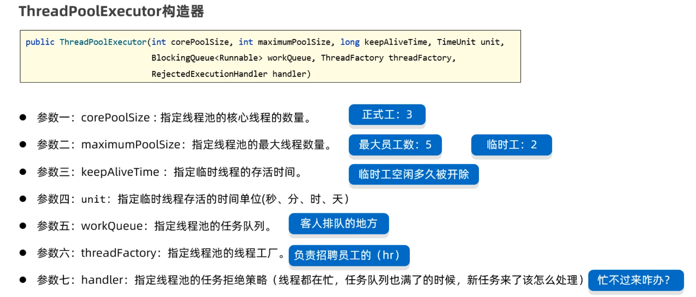

# 进阶语法

## IO流（字节流）

### FileInputStream 字节输入流

#### 读取一个字节

使用FileInputStream读取文件中的字节数据，步骤如下

```java
第一步：创建FileInputStream文件字节输入流管道，与源文件接通。
第二步：调用read()方法开始读取文件的字节数据。
第三步：调用close()方法释放资源
```

代码如下：

```java
/**
 * 目标：掌握文件字节输入流，每次读取一个字节。
 */
public class FileInputStreamTest1 {
    public static void main(String[] args) throws Exception {
        // 1、创建文件字节输入流管道，与源文件接通。
        InputStream is = new FileInputStream(("file-io-app\\src\\itheima01.txt"));

        // 2、开始读取文件的字节数据。
        // public int read():每次读取一个字节返回，如果没有数据了，返回-1.
        int b; // 用于记住读取的字节。
        while ((b = is.read()) != -1){
            System.out.print((char) b);
        }
        
        //3、流使用完毕之后，必须关闭！释放系统资源！
        is.close();
    }
}
```

这里需要注意一个问题：由于一个中文在UTF-8编码方案中是占3个字节，采用一次读取一个字节的方式，读一个字节就相当于读了1/3个汉字，此时将这个字节转换为字符，是会有乱码的。

#### 读取多个字节

使用FileInputStream一次读取多个字节的步骤如下

```java
第一步：创建FileInputStream文件字节输入流管道，与源文件接通。
第二步：调用read(byte[] bytes)方法开始读取文件的字节数据。
第三步：调用close()方法释放资源
```

代码如下：

```java
/**
 * 目标：掌握使用FileInputStream每次读取多个字节。
 */
public class FileInputStreamTest2 {
    public static void main(String[] args) throws Exception {
        // 1、创建一个字节输入流对象代表字节输入流管道与源文件接通。
        InputStream is = new FileInputStream("file-io-app\\src\\itheima02.txt");

        // 2、开始读取文件中的字节数据：每次读取多个字节。
        //  public int read(byte b[]) throws IOException
        //  每次读取多个字节到字节数组中去，返回读取的字节数量，读取完毕会返回-1.

        // 3、使用循环改造。
        byte[] buffer = new byte[3];
        int len; // 记住每次读取了多少个字节。  abc 66
        while ((len = is.read(buffer)) != -1){
            // 注意：读取多少，倒出多少。
            String rs = new String(buffer, 0 , len);
            System.out.print(rs);
        }
        // 性能得到了明显的提升！！
        // 这种方案也不能避免读取汉字输出乱码的问题！！

        is.close(); // 关闭流
    }
}
```

#### 读取全部字节

```java
// 1、一次性读取完文件的全部字节到一个字节数组中去。
// 创建一个字节输入流管道与源文件接通
InputStream is = new FileInputStream("file-io-app\\src\\itheima03.txt");

// 2、准备一个字节数组，大小与文件的大小正好一样大。
File f = new File("file-io-app\\src\\itheima03.txt");
long size = f.length();
byte[] buffer = new byte[(int) size];

int len = is.read(buffer);
System.out.println(new String(buffer));

//3、关闭流
is.close(); 
```

方式二

```java
// 1、一次性读取完文件的全部字节到一个字节数组中去。
// 创建一个字节输入流管道与源文件接通
InputStream is = new FileInputStream("file-io-app\\src\\itheima03.txt");

//2、调用方法读取所有字节，返回一个存储所有字节的字节数组。
byte[] buffer = is.readAllBytes();
System.out.println(new String(buffer));

//3、关闭流
is.close(); 
```

最后，还是要注意一个问题：**一次读取所有字节虽然可以解决乱码问题，但是文件不能过大，如果文件过大，可能导致内存溢出。

### FileOutputStream写字节

使用FileOutputStream往文件中写数据的步骤如下：

```java
第一步：创建FileOutputStream文件字节输出流管道，与目标文件接通。
第二步：调用wirte()方法往文件中写数据
第三步：调用close()方法释放资源
```

代码如下：

```java
/**
 * 目标：掌握文件字节输出流FileOutputStream的使用。
 */
public class FileOutputStreamTest4 {
    public static void main(String[] args) throws Exception {
        // 1、创建一个字节输出流管道与目标文件接通。
        // 覆盖管道：覆盖之前的数据
//        OutputStream os =
//                new FileOutputStream("file-io-app/src/itheima04out.txt");

        // 追加数据的管道
        OutputStream os =
                new FileOutputStream("file-io-app/src/itheima04out.txt", true);

        // 2、开始写字节数据出去了
        os.write(97); // 97就是一个字节，代表a
        os.write('b'); // 'b'也是一个字节
        // os.write('磊'); // [ooo] 默认只能写出去一个字节

        byte[] bytes = "我爱你中国abc".getBytes();
        os.write(bytes);

        os.write(bytes, 0, 15);

        // 换行符
        os.write("\r\n".getBytes());

        os.close(); // 关闭流
    }
}
```

#### 字节流复制文件

代码如下：

```java
/**
 * 目标：使用字节流完成对文件的复制操作。
 */
public class CopyTest5 {
    public static void main(String[] args) throws Exception {
        // 需求：复制照片。
        // 1、创建一个字节输入流管道与源文件接通
        InputStream is = new FileInputStream("D:/resource/meinv.png");
        // 2、创建一个字节输出流管道与目标文件接通。
        OutputStream os = new FileOutputStream("C:/data/meinv.png");

        System.out.println(10 / 0);
        // 3、创建一个字节数组，负责转移字节数据。
        byte[] buffer = new byte[1024]; // 1KB.
        // 4、从字节输入流中读取字节数据，写出去到字节输出流中。读多少写出去多少。
        int len; // 记住每次读取了多少个字节。
        while ((len = is.read(buffer)) != -1){
            os.write(buffer, 0, len);
        }

        os.close();
        is.close();
        System.out.println("复制完成！！");
    }
}
```

### IO流资源释放

#### JDK7以后的资源释放

在JDK7版本为我们提供了一种简化的是否资源的操作，它会自动是否资源。代码写起来也想当简单。

格式如下：

```java
try(资源对象1; 资源对象2;){
    使用资源的代码
}catch(异常类 e){
    处理异常的代码
}
//注意：注意到没有，这里没有释放资源的代码。它会自动是否资源
```

代码如下：

```java
/**
 * 目标：掌握释放资源的方式：try-with-resource
 */
public class Test3 {
    public static void main(String[] args)  {
    	try (
          // 1、创建一个字节输入流管道与源文件接通
          InputStream is = new FileInputStream("D:/resource/meinv.png");
          // 2、创建一个字节输出流管道与目标文件接通。
          OutputStream os = new FileOutputStream("C:/data/meinv.png");
        ){
            // 3、创建一个字节数组，负责转移字节数据。
            byte[] buffer = new byte[1024]; // 1KB.
            // 4、从字节输入流中读取字节数据，写出去到字节输出流中。读多少写出去多少。
            int len; // 记住每次读取了多少个字节。
            while ((len = is.read(buffer)) != -1){
                os.write(buffer, 0, len);
            }
            System.out.println(conn);
            System.out.println("复制完成！！");

        } catch (Exception e) {
            e.printStackTrace();
        }
    }
}
```

## 字符流

### FileReader类

FileReader读取文件的步骤如下：

```java
第一步：创建FileReader对象与要读取的源文件接通
第二步：调用read()方法读取文件中的字符
第三步：调用close()方法关闭流
```

```java
/**
 * 目标：掌握文件字符输入流。
 */
public class FileReaderTest1 {
    public static void main(String[] args)  {
        try (
                // 1、创建一个文件字符输入流管道与源文件接通
                Reader fr = new FileReader("io-app2\\src\\itheima01.txt");
                ){
            // 2、一个字符一个字符的读（性能较差）
//            int c; // 记住每次读取的字符编号。
//            while ((c = fr.read()) != -1){
//                System.out.print((char) c);
//            }
            // 每次读取一个字符的形式，性能肯定是比较差的。

            // 3、每次读取多个字符。（性能是比较不错的！）
            char[] buffer = new char[3];
            int len; // 记住每次读取了多少个字符。
            while ((len = fr.read(buffer)) != -1){
                // 读取多少倒出多少
                System.out.print(new String(buffer, 0, len));
            }
            
        } catch (Exception e) {
            e.printStackTrace();
        }
    }
}
```


### FileWriter类

它可以将程序中的字符数据写入文件

FileWriter往文件中写字符数据的步骤如下：

```java
第一步：创建FileWirter对象与要读取的目标文件接通
第二步：调用write(字符数据/字符数组/字符串)方法读取文件中的字符
第三步：调用close()方法关闭流
```

```java
/**
 * 目标：掌握文件字符输出流：写字符数据出去
 */
public class FileWriterTest2 {
    public static void main(String[] args) {
        try (
                // 0、创建一个文件字符输出流管道与目标文件接通。
                // 覆盖管道
                // Writer fw = new FileWriter("io-app2/src/itheima02out.txt");
                // 追加数据的管道
                FileWriter fw = new FileWriter("io-app2/src/itheima02out.txt", true);
                ){
            // 1、public void write(int c):写一个字符出去
            fw.write('a');
            fw.write(97);
            //fw.write('磊'); // 写一个字符出去
            fw.write("\r\n"); // 换行

            // 2、public void write(String c)写一个字符串出去
            fw.write("我爱你中国abc");
            fw.write("\r\n");

            // 3、public void write(String c ,int pos ,int len):写字符串的一部分出去
            fw.write("我爱你中国abc", 0, 5);
            fw.write("\r\n");

            // 4、public void write(char[] buffer):写一个字符数组出去
            char[] buffer = {'黑', '马', 'a', 'b', 'c'};
            fw.write(buffer);
            fw.write("\r\n");

            // 5、public void write(char[] buffer ,int pos ,int len):写字符数组的一部分出去
            fw.write(buffer, 0, 2);
            fw.write("\r\n");
        } catch (Exception e) {
            e.printStackTrace();
        }
    }
}
```


**FileWriter写完数据之后，必须刷新或者关闭，写出去的数据才能生效。**

比如：下面的代码只调用了写数据的方法，没有关流的方法。当你打开目标文件时，是看不到任何数据的。

```java
//1.创建FileWriter对象
FileWriter fw = new FileWriter("io-app2/src/itheima03out.txt");

//2.写字符数据出去
fw.write('a');
fw.write('b');
fw.write('c');
```

而下面的代码，加上了flush()方法之后，数据就会立即到目标文件中去。

```java
//1.创建FileWriter对象
FileWriter fw = new FileWriter("io-app2/src/itheima03out.txt");

//2.写字符数据出去
fw.write('a');
fw.write('b');
fw.write('c');

//3.刷新
fw.flush(); 
```

下面的代码，调用了close()方法，数据也会立即到文件中去。因为close()方法在关闭流之前，会将内存中缓存的数据先刷新到文件，再关流。

```java
//1.创建FileWriter对象
Writer fw = new FileWriter("io-app2/src/itheima03out.txt");

//2.写字符数据出去
fw.write('a');
fw.write('b');
fw.write('c');

//3.关闭流
fw.close(); //会先刷新，再关流
```


## 缓冲流

### 缓冲字节流

BufferedInputStream   BufferedOutputStream

如果我们用缓冲流复制文件，代码写法如下:

```java
public class BufferedInputStreamTest1 {
    public static void main(String[] args) {
        try (
                InputStream is = new FileInputStream("io-app2/src/itheima01.txt");
                // 1、定义一个字节缓冲输入流包装原始的字节输入流
                InputStream bis = new BufferedInputStream(is);

                OutputStream os = new FileOutputStream("io-app2/src/itheima01_bak.txt");
                // 2、定义一个字节缓冲输出流包装原始的字节输出流
                OutputStream bos = new BufferedOutputStream(os);
        ){
            byte[] buffer = new byte[1024];
            int len;
            while ((len = bis.read(buffer)) != -1){
                bos.write(buffer, 0, len);
            }
            System.out.println("复制完成！！");

        } catch (Exception e) {
            e.printStackTrace();
        }
    }
}
```

### 字符缓冲流

使用BufferedReader读取数据的代码如下

```java
public class BufferedReaderTest2 {
    public static void main(String[] args)  {
        try (
                Reader fr = new FileReader("io-app2\\src\\itheima04.txt");
                // 创建一个字符缓冲输入流包装原始的字符输入流
                BufferedReader br = new BufferedReader(fr);
        ){
//            char[] buffer = new char[3];
//            int len;
//            while ((len = br.read(buffer)) != -1){
//                System.out.print(new String(buffer, 0, len));
//            }
//            System.out.println(br.readLine());
//            System.out.println(br.readLine());
//            System.out.println(br.readLine());
//            System.out.println(br.readLine());

            String line; // 记住每次读取的一行数据
            while ((line = br.readLine()) != null){
                System.out.println(line);
            }
        } catch (Exception e) {
            e.printStackTrace();
        }
    }
}
```

使用BufferedWriter往文件中写入字符数据。

```java
public class BufferedWriterTest3 {
    public static void main(String[] args) {
        try (
                Writer fw = new FileWriter("io-app2/src/itheima05out.txt", true);
                // 创建一个字符缓冲输出流管道包装原始的字符输出流
                BufferedWriter bw = new BufferedWriter(fw);
        ){

            bw.write('a');
            bw.write(97);
            bw.write('磊');
            bw.newLine();

            bw.write("我爱你中国abc");
            bw.newLine();

        } catch (Exception e) {
            e.printStackTrace();
        }
    }
}
```

## 转换流

Java给我们提供了另外两种流InputStreamReader，OutputStreamWriter，这两个流我们把它叫做转换流。它们可以将字节流转换为字符流，并且可以指定编码方案。

#### InputStreamReader

```java
public class InputStreamReaderTest2 {
    public static void main(String[] args) {
        try (
                // 1、得到文件的原始字节流（GBK的字节流形式）
                InputStream is = new FileInputStream("io-app2/src/itheima06.txt");
                // 2、把原始的字节输入流按照指定的字符集编码转换成字符输入流
                Reader isr = new InputStreamReader(is, "GBK");
                // 3、把字符输入流包装成缓冲字符输入流
                BufferedReader br = new BufferedReader(isr);
                ){
            
            String line;
            while ((line = br.readLine()) != null){
                System.out.println(line);
            }

        } catch (Exception e) {
            e.printStackTrace();
        }
    }
}
```

### OutputStreamWriter

```java
public class OutputStreamWriterTest3 {
    public static void main(String[] args) {
        // 指定写出去的字符编码。
        try (
                // 1、创建一个文件字节输出流
                OutputStream os = new FileOutputStream("io-app2/src/itheima07out.txt");
                // 2、把原始的字节输出流，按照指定的字符集编码转换成字符输出转换流。
                Writer osw = new OutputStreamWriter(os, "GBK");
                // 3、把字符输出流包装成缓冲字符输出流
                BufferedWriter bw = new BufferedWriter(osw);
                ){
            bw.write("我是中国人abc");
            bw.write("我爱你中国123");

        } catch (Exception e) {
            e.printStackTrace();
        }
    }
}
```

## 打印流

**PrintStream和PrintWriter的用法是一样的，所以这里就一块演示了。**

```java
public class PrintTest1 {
    public static void main(String[] args) {
        try (
                // 1、创建一个打印流管道
//                PrintStream ps =
//                        new PrintStream("io-app2/src/itheima08.txt", Charset.forName("GBK"));
//                PrintStream ps =
//                        new PrintStream("io-app2/src/itheima08.txt");
                PrintWriter ps =
                        new PrintWriter(new FileOutputStream("io-app2/src/itheima08.txt", true));
                ){
            	
                ps.print(97);	//文件中显示的就是:97
                ps.print('a'); //文件中显示的就是:a
                ps.println("我爱你中国abc");	//文件中显示的就是:我爱你中国abc
                ps.println(true);//文件中显示的就是:true
                ps.println(99.5);//文件中显示的就是99.5
                ps.write(97); //文件中显示a，发现和前面println方法的区别了吗？

        } catch (Exception e) {
            e.printStackTrace();
        }
    }
}
```

### 重定向输出语句

而且System还提供了一个方法，可以修改底层的打印流，这样我们就可以重定向打印语句的输出目的地了。我们玩一下, 直接上代码。

```java
public class PrintTest2 {
    public static void main(String[] args) {
        System.out.println("老骥伏枥");
        System.out.println("志在千里");

        try ( PrintStream ps = new PrintStream("io-app2/src/itheima09.txt"); ){
            // 把系统默认的打印流对象改成自己设置的打印流
            System.setOut(ps);

            System.out.println("烈士暮年");	
            System.out.println("壮心不已");
        } catch (Exception e) {
            e.printStackTrace();
        }
    }
}
```

此时打印语句，将往文件中打印数据，而不在控制台。

## 数据流

这种流在开发中偶尔也会用到。比如，我们想把数据和数据的类型一并写到文件中去，读取的时候也将数据和数据类型一并读出来。这就可以用到数据流，有两个DataInputStream和DataOutputStream.

### DataOutputStream

```java
public class DataOutputStreamTest1 {
    public static void main(String[] args) {
        try (
                // 1、创建一个数据输出流包装低级的字节输出流
                DataOutputStream dos =
                        new DataOutputStream(new FileOutputStream("io-app2/src/itheima10out.txt"));
                ){
            dos.writeInt(97);
            dos.writeDouble(99.5);
            dos.writeBoolean(true);
            dos.writeUTF("黑马程序员666！");

        } catch (Exception e) {
            e.printStackTrace();
        }
    }
}
```

### DataInputStream

```java
public class DataInputStreamTest2 {
    public static void main(String[] args) {
        try (
                DataInputStream dis =
                        new DataInputStream(new FileInputStream("io-app2/src/itheima10out.txt"));
                ){
            int i = dis.readInt();
            System.out.println(i);

            double d = dis.readDouble();
            System.out.println(d);

            boolean b = dis.readBoolean();
            System.out.println(b);

            String rs = dis.readUTF();
            System.out.println(rs);
        } catch (Exception e) {
            e.printStackTrace();
        }
    }
}
```

## 序列化流

序列化流是干什么用的呢？ 我们知道字节流是以字节为单位来读写数据、字符流是按照字符为单位来读写数据、而对象流是以对象为单位来读写数据。也就是把对象当做一个整体，可以写一个对象到文件，也可以从文件中把对象读取出来。

### ObjectOutputStraem

- 第一步：先准备一个User类，必须让其实现Serializable接口。

```java
//注意：对象如果需要序列化，必须实现序列化接口。
public class User implements Serializable {
    private String loginName;
    private String userName;
    private int age;
    // transient 这个成员变量将不参与序列化。
    private transient String passWord;

    public User() {
    }

    public User(String loginName, String userName, int age, String passWord) {
        this.loginName = loginName;
        this.userName = userName;
        this.age = age;
        this.passWord = passWord;
    }

    @Override
    public String toString() {
        return "User{" +
                "loginName='" + loginName + '\'' +
                ", userName='" + userName + '\'' +
                ", age=" + age +
                ", passWord='" + passWord + '\'' +
                '}';
    }
}
```

- 第二步：再创建ObjectOutputStream流对象，调用writeObject方法对象到文件。

```java
public class Test1ObjectOutputStream {
    public static void main(String[] args) {
        try (
                // 2、创建一个对象字节输出流包装原始的字节 输出流。
                ObjectOutputStream oos =
                        new ObjectOutputStream(new FileOutputStream("io-app2/src/itheima11out.txt"));
                ){
            // 1、创建一个Java对象。
            User u = new User("admin", "张三", 32, "666888xyz");

            // 3、序列化对象到文件中去
            oos.writeObject(u);
            System.out.println("序列化对象成功！！");

        } catch (Exception e) {
            e.printStackTrace();
        }
    }
}
```

### ObjectInputStream

接着前面的案例，文件中已经有一个Student对象，现在要使用ObjectInputStream读取出来。称之为反序列化。

```java
public class Test2ObjectInputStream {
    public static void main(String[] args) {
        try (
            // 1、创建一个对象字节输入流管道，包装 低级的字节输入流与源文件接通
            ObjectInputStream ois = new ObjectInputStream(new FileInputStream("io-app2/src/itheima11out.txt"));
        ){
            User u = (User) ois.readObject();
            System.out.println(u);
        } catch (Exception e) {
            e.printStackTrace();
        }
    }
}
```

## 多线程

### Thread

先自定义一个类

```java
public class MyThread extends Thread{
    // 2、必须重写Thread类的run方法
    @Override
    public void run() {
        // 描述线程的执行任务。
        for (int i = 1; i <= 5; i++) {
            System.out.println("子线程MyThread输出：" + i);
        }
    }
}
```

再定义一个测试类，在测试类中创建MyThread线程对象，并启动线程

```java
public class ThreadTest1 {
    // main方法是由一条默认的主线程负责执行。
    public static void main(String[] args) {
        // 3、创建MyThread线程类的对象代表一个线程
        Thread t = new MyThread();
        // 4、启动线程（自动执行run方法的）
        t.start(); 

        for (int i = 1; i <= 5; i++) {
            System.out.println("主线程main输出：" + i);
        }
    }
}
```

### Runnable

先准备一个Runnable接口的实现类

```java
/**
 * 1、定义一个任务类，实现Runnable接口
 */
public class MyRunnable implements Runnable{
    // 2、重写runnable的run方法
    @Override
    public void run() {
        // 线程要执行的任务。
        for (int i = 1; i <= 5; i++) {
            System.out.println("子线程输出 ===》" + i);
        }
    }
}
```

再写一个测试类，在测试类中创建线程对象，并执行线程

```java
public class ThreadTest2 {
    public static void main(String[] args) {
        // 3、创建任务对象。
        MyRunnable target = new MyRunnable();
        // 4、把任务对象交给一个线程对象处理。
        //  public Thread(Runnable target)
        new Thread(target).start();

        for (int i = 1; i <= 5; i++) {
            System.out.println("主线程main输出 ===》" + i);
        }
    }
}
```

#### 匿名内部类

现在我不想写Runnable实现类，于是可以直接创建Runnable接口的匿名内部类对象，传递给Thread对象。

代码如下

```java
public class ThreadTest2_2 {
    public static void main(String[] args) {
        // 1、直接创建Runnable接口的匿名内部类形式（任务对象）
        Runnable target = new Runnable() {
            @Override
            public void run() {
                for (int i = 1; i <= 5; i++) {
                    System.out.println("子线程1输出：" + i);
                }
            }
        };
        new Thread(target).start();

        // 简化形式1：
        new Thread(new Runnable() {
            @Override
            public void run() {
                for (int i = 1; i <= 5; i++) {
                    System.out.println("子线程2输出：" + i);
                }
            }
        }).start();

        // 简化形式2：
        new Thread(() -> {
                for (int i = 1; i <= 5; i++) {
                    System.out.println("子线程3输出：" + i);
                }
        }).start();

        for (int i = 1; i <= 5; i++) {
            System.out.println("主线程main输出：" + i);
        }
    }
}
```

### Callable

它最大的优点就是有返回值。

先准备一个Callable接口的实现类

```java
public class MyCallable implements Callable<String> {

    @Override
    public String call() throws Exception {
        for (int i = 0; i < 100; i++) {
            System.out.println("跟女孩表白" + i);
        }
        //返回值就表示线程运行完毕之后的结果
        return "答应";
    }

}
```

再定义一个测试类，在测试类中创建线程并启动线程，还要获取返回结果

```java
public class ThreadTest3 {
    public static void main(String[] args) throws Exception {
        // 3、创建一个Callable的对象
        Callable<String> call = new MyCallable();
        // 4、把Callable的对象封装成一个FutureTask对象(任务对象）
        // 未来任务对象的作用？
        // 1、是一个任务对象，实现了Runnable对象.
        // 2、可以在线程执行完毕之后，用未来任务对象调用get方法获取线程执行完毕后的结果。
        FutureTask<String> f1  = new FutureTask<>(call);
        // 5、把任务对象交给一个Thread对象
        new Thread(f1).start();


        Callable<String> call2 = new MyCallable();
        FutureTask<String> f2  = new FutureTask<>(call2);
        new Thread(f2).start();

        // 6、获取线程执行完毕后返回的结果。
        // 注意：如果执行到这儿，假如上面的线程还没有执行完毕
        // 这里的代码会暂停，等待上面线程执行完毕后才会获取结果。
        String rs = f1.get();
        System.out.println(rs);

        String rs2 = f2.get();
        System.out.println(rs2);
    }
}
```

注意:  get()方法的调用问题

```bash
get()获取的是call方法的返回值, call方法是在调用start之后才会执行
所以get()方法必须在start()方法调用之后才能调用!!!
```

## 多线程常用方法

演示`getName()`获取线程名称

```java
package com.itheima.d4_thread_api;

public class Demo04 {
    public static void main(String[] args) {
        //创建线程任务对象
        MyRun myRun = new MyRun();

        //创建线程对象t1
        Thread t1 = new Thread(myRun);
        //启动t1线程
        t1.start();
        //获取t1线程的名称
        System.out.println(t1.getName());

        //创建线程对象t2
        Thread t2 = new Thread(myRun);
        //启动t2线程
        t2.start();
        //获取t2线程的名称
        System.out.println(t2.getName());
    }
}
```

演示`currentThread()`获取当前线程对象

```java
public class MyRun implements Runnable {

    @Override
    public void run() {
        //获取当前线程的对象
        Thread t = Thread.currentThread();

        for (int i = 1; i <= 3; i++) {
            System.out.println(t.getName() + "输出：" + i);
        }
    }

}
```


演示`setName(String name)`、`public Thread(Runnable target,String name)`设置线程名称

```java
package com.itheima.d4_thread_api;

public class Demo042 {
    public static void main(String[] args) {
        //创建线程任务对象
        MyRun myRun = new MyRun();

        //创建线程对象t1
        Thread t1 = new Thread(myRun,"小美");
        //利用set方法给线程设置名称
        //t1.setName("小美");
        //启动t1线程
        t1.start();
        //获取t1线程的名称
        System.out.println(t1.getName());

        System.out.println("------------------------------");

        //创建线程对象t2
        Thread t2 = new Thread(myRun,"小黑");
        //利用set方法给线程设置名称
        //t2.setName("小黑");
        //启动t2线程
        t2.start();
        //获取t2线程的名称
        System.out.println(t2.getName());
		
        System.out.println("------------------------------");
        //获取当前线程对象
        Thread t = Thread.currentThread();
        //利用set方法给线程设置名称
        t.setName("小白");

        //获取线程名称
        System.out.println(t.getName());
    }
}
```

演示`sleep(long time)`方法

```java
package com.itheima.d4_thread_api;

public class Demo043 {
    public static void main(String[] args) throws Exception {
        for (int i = 1; i <= 5; i++) {
            System.out.println(i);
            // 休眠5s
            if(i == 3){
                // 会让当前执行的线程暂停5秒，再继续执行
                Thread.sleep(5000);
            }
        }
    }
}
```

```java
//sleep()方法有什么用?
public class Demo044 {

    public static void main(String[] args) {

        while (true){
            //循环发送短信,直到车辆启动成功  / 或者2分钟一直没有启动成功
            //发短信....

            if (启动成功){
                break;
            }
        }

    }
    
}
```

演示`join()`方法

```java
package com.itheima.d4_thread_api;

public class Demo045 {
    public static void main(String[] args) throws Exception {
        // join方法作用：让当前调用这个方法的线程先执行完。
        Thread t1 = new MyThread("1号线程");
        t1.start();
        t1.join();

        Thread t2 = new MyThread("2号线程");
        t2.start();
        t2.join();

        Thread t3 = new MyThread("3号线程");
        t3.start();
        t3.join();
    }
}
```


## 线程安全问题(重点)

### 同步代码块🏊‍

语法

```java
//锁对象 - 任意一个类型的对象都可以
synchronized(锁对象){
    //...访问共享数据的代码...
}
```

使用同步代码块，来解决前面代码里面的线程安全问题。

```java
package com.itheima.d6_synchronized_code;

public class AccountRun implements Runnable {

    //创建一个Object的对象-用来充当锁
    private Object obj = new Object();

    @Override
    public void run() {
        //获取当前线程对象
        Thread t = Thread.currentThread();

        //使用同步代码块将操作共享数据的代码锁起来
        synchronized (obj) {
            //判断余额是否足够
            if (Account.money >= 100000) {
                System.out.println(t.getName() + "来取钱了");
                //更新余额
                Account.money = Account.money - 100000;
                //打印取款信息
                System.out.println(t.getName() + "来取钱后,余额剩余:" + Account.money);
            } else {
                System.out.println(t.getName() + "来取钱：余额不足~");
            }
        }

    }
    
}
```

锁对象：必须是一个唯一的对象（同一个地址）

### 同步方法

接下来，学习同步方法解决线程安全问题。**其实同步方法，就是把整个方法给锁住，一个线程调用这个方法，另一个线程调用的时候就执行不了，只有等上一个线程调用结束，下一个线程调用才能继续执行。**

**语法**

```java
修饰符 synchronized 返回值类型 方法名称(形参列表) {
    操作共享资源的代码
}
```

**代码**

```java
package com.itheima.d7_synchronized_method;

//同步方法的锁对象是固定的、不能更改的 - 锁对象是this
@Override
public synchronized void run() {
    //获取当前线程对象
    Thread t = Thread.currentThread();
    //判断余额是否足够
    if (Account.money >= 100000) {
        System.out.println(t.getName() + "来取钱了");
        //更新余额
        Account.money = Account.money - 100000;
        //打印取款信息
        System.out.println(t.getName() + "来取钱后,余额剩余:" + Account.money);
    } else {
        System.out.println(t.getName() + "来取钱：余额不足~");
    }
}
```

改完之后，再次运行测试类，观察是否会出现不合理的情况。

### Lock锁

**语法**

```java
1.首先在成员变量位子，需要创建一个Lock接口的实现类对象（这个对象就是锁对象）
	private final Lock lk = new ReentrantLock();
2.在需要上锁的地方加入下面的代码
	 lk.lock(); // 加锁
	 //...中间是被锁住的代码...
	 lk.unlock(); //解锁
```

**代码**

```java
package com.itheima.d8_synchronized_lock;

public class AccountRun implements Runnable {

    //定义Lock锁对象
    private final Lock lk = new ReentrantLock();

    //同步方法的锁对象是固定的、不能更改的 - 锁对象是this
    @Override
    public void run() {
        //获取当前线程对象
        Thread t = Thread.currentThread();

        try {
            lk.lock(); //尝试获取锁对象,直到获取成功后才会继续向下执行代码

            //判断余额是否足够
            if (Account.money >= 100000) {
                System.out.println(t.getName() + "来取钱了");
                //更新余额
                Account.money = Account.money - 100000;
                //打印取款信息
                System.out.println(t.getName() + "来取钱后,余额剩余:" + Account.money);
            } else {
                System.out.println(t.getName() + "来取钱：余额不足~");
            }
        } finally {
            lk.unlock();  //释放锁
        }
    }

}
```

## 线程池

**线程池就是一个可以复用线程的技术**。

#### ThreadPoolExecutor创建线程池

下面是它的构造器，参数比较多，不要怕，干就完了^_^。



接下来，用这7个参数的构造器来创建线程池的对象。代码如下

```java
package com.itheima.d10_thread_pool;

ExecutorService pool = new ThreadPoolExecutor(
    3,	//核心线程数有3个
    5,  //最大线程数有5个。   临时线程数=最大线程数-核心线程数=5-3=2
    8,	//临时线程存活的时间8秒。 意思是临时线程8秒没有任务执行，就会被销毁掉。
    TimeUnit.SECONDS,//时间单位（秒）
    new ArrayBlockingQueue<>(4), //任务阻塞队列，没有来得及执行的任务在，任务队列中等待
    Executors.defaultThreadFactory(), //用于创建线程的工厂对象
    new ThreadPoolExecutor.CallerRunsPolicy() //拒绝策略
);
```

线程池执行的任务可以有两种，一种是Runnable任务；一种是callable任务。

#### 线程池执行Runnable任务

先准备一个线程任务类

```java
package com.itheima.d10_thread_pool;

public class MyRunnable implements Runnable{
    @Override
    public void run() {
        //任务是干啥的?
        System.out.println(Thread.currentThread().getName() + " ==> 输出666~~");
        //为了模拟线程一直在执行，这里睡久一点
        try {
            Thread.sleep(Integer.MAX_VALUE);
        } catch (InterruptedException e) {
            e.printStackTrace();
        }
    }
}
```

下面是执行Runnable任务的代码，注意阅读注释，对照着前面的7个参数理解。

```java
ExecutorService pool = new ThreadPoolExecutor(
    3,	//核心线程数有3个
    5,  //最大线程数有5个。      临时线程数=最大线程数-核心线程数=5-3=2
    8,	//临时线程存活的时间8秒。 意思是临时线程8秒没有任务执行，就会被销毁掉。
    TimeUnit.SECONDS,//时间单位（秒）
    new ArrayBlockingQueue<>(4), //任务阻塞队列，没有来得及执行的任务在，任务队列中等待
    Executors.defaultThreadFactory(), //用于创建线程的工厂对象
    new ThreadPoolExecutor.CallerRunsPolicy() //拒绝策略
);

Runnable target = new MyRunnable();
pool.execute(target); // 线程池会自动创建一个新线程，自动处理这个任务，自动执行的！
pool.execute(target); // 线程池会自动创建一个新线程，自动处理这个任务，自动执行的！
pool.execute(target); // 线程池会自动创建一个新线程，自动处理这个任务，自动执行的！
//下面4个任务在任务队列里排队
pool.execute(target);
pool.execute(target);
pool.execute(target);
pool.execute(target);

//下面2个任务，会被临时线程的创建时机
pool.execute(target);
pool.execute(target);
// 到了新任务的拒绝时机了！
pool.execute(target);
```

### 线程池执行Callable任务

先准备一个Callable线程任务

```java
package com.itheima.d10_thread_pool;

public class MyCallable implements Callable<String> {
    private int n;
    public MyCallable(int n) {
        this.n = n;
    }

    // 2、重写call方法
    @Override
    public String call() throws Exception {
        // 描述线程的任务，返回线程执行返回后的结果。
        // 需求：求1-n的和返回。
        int sum = 0;
        for (int i = 1; i <= n; i++) {
            sum += i;
        }
        return Thread.currentThread().getName() + "求出了1-" + n + "的和是：" + sum;
    }
}
```

再准备一个测试类，在测试类中创建线程池，并执行callable任务。

```java
package com.itheima.d10_thread_pool;

public class ThreadPoolTest2 {
    public static void main(String[] args) throws Exception {
        // 1、通过ThreadPoolExecutor创建一个线程池对象。
        ExecutorService pool = new ThreadPoolExecutor(
            3,
            5,
            8,
            TimeUnit.SECONDS, 
            new ArrayBlockingQueue<>(4),
            Executors.defaultThreadFactory(),
            new ThreadPoolExecutor.CallerRunsPolicy());

        // 2、使用线程处理Callable任务。
        Future<String> f1 = pool.submit(new MyCallable(100));
        Future<String> f2 = pool.submit(new MyCallable(200));
        Future<String> f3 = pool.submit(new MyCallable(300));
        Future<String> f4 = pool.submit(new MyCallable(400));

        // 3、执行完Callable任务后，需要获取返回结果。
        System.out.println(f1.get());
        System.out.println(f2.get());
        System.out.println(f3.get());
        System.out.println(f4.get());
    }
}
```


## 网络编程

###  InetAddress类

常用方法

```java
public class InetAddressTest {
    public static void main(String[] args) throws Exception {
        // 1、获取本机IP地址对象的
        InetAddress ip1 = InetAddress.getLocalHost();
        System.out.println(ip1.getHostName());
        System.out.println(ip1.getHostAddress());

        // 2、获取指定IP或者域名的IP地址对象。
        InetAddress ip2 = InetAddress.getByName("www.baidu.com");
        System.out.println(ip2.getHostName());
        System.out.println(ip2.getHostAddress());

        //ping www.baidu.com
        System.out.println(ip2.isReachable(6000));
    }
}
```

## UDP通信代码

UDP是面向无连接的、不需要确认双方是否存在，所以它是不可靠的协议。

### 客户端程序

```java
/**
 * 目标：完成UDP通信快速入门：实现1发1收。
 */
public class Client {
    public static void main(String[] args) throws Exception {
        // 1、创建客户端对象（发韭菜出去的人）
        DatagramSocket socket = new DatagramSocket();

        // 2、创建数据包对象封装要发出去的数据（创建一个韭菜盘子）
       /* public DatagramPacket(byte buf[], int length,
             InetAddress address, int port)
               参数一：封装要发出去的数据。
               参数二：发送出去的数据大小（字节个数）
               参数三：服务端的IP地址（找到服务端主机）
               参数四：服务端程序的端口。
             */
        byte[] bytes = "我是快乐的客户端，我爱你abc".getBytes();
        DatagramPacket packet = new DatagramPacket(bytes, bytes.length
                , InetAddress.getLocalHost(),  6666);

        // 3、开始正式发送这个数据包的数据出去了
        socket.send(packet);

        System.out.println("客户端数据发送完毕~~~");
        socket.close(); // 释放资源！
    }
}
```

### 服务端程序

```java
public class Server {
    public static void main(String[] args) throws Exception {
        System.out.println("----服务端启动----");
        // 1、创建一个服务端对象（创建一个接韭菜的人） 注册端口
        DatagramSocket socket = new DatagramSocket(6666);

        // 2、创建一个数据包对象，用于接收数据的（创建一个韭菜盘子）
        byte[] buffer = new byte[1024 * 64]; // 64KB.
        DatagramPacket packet = new DatagramPacket(buffer, buffer.length);

        // 3、开始正式使用数据包来接收客户端发来的数据
        socket.receive(packet);

        // 4、从字节数组中，把接收到的数据直接打印出来
        // 接收多少就倒出多少
        // 获取本次数据包接收了多少数据。
        int len = packet.getLength();

        String rs = new String(buffer, 0 , len);
        System.out.println(rs);


        socket.close(); // 释放资源
    }
}
```


## UDP通信代码（多发多收）

### 客户端程序

```java
/**
 * 目标：完成UDP通信快速入门：实现客户端反复的发。
 */
public class Client {
    public static void main(String[] args) throws Exception {
        // 1、创建客户端对象（发韭菜出去的人）
        DatagramSocket socket = new DatagramSocket();

        // 2、创建数据包对象封装要发出去的数据（创建一个韭菜盘子）
       /* public DatagramPacket(byte buf[], int length,
             InetAddress address, int port)
               参数一：封装要发出去的数据。
               参数二：发送出去的数据大小（字节个数）
               参数三：服务端的IP地址（找到服务端主机）
               参数四：服务端程序的端口。
             */
        Scanner sc = new Scanner(System.in);
        while (true) {
            System.out.println("请说：");
            String msg = sc.nextLine();

            // 一旦发现用户输入的exit命令，就退出客户端
            if("886".equals(msg)){
                System.out.println("欢迎下次光临！退出成功！");
                socket.close(); // 释放资源
                break; // 跳出死循环
            }

            byte[] bytes = msg.getBytes();
            DatagramPacket packet = new DatagramPacket(bytes, bytes.length
                    , InetAddress.getLocalHost(),  6666);

            // 3、开始正式发送这个数据包的数据出去了
            socket.send(packet);
        }
    }
}
```


###  服务端程序

```java
/**
 * 目标：完成UDP通信快速入门-服务端反复的收
 */
public class Server {
    public static void main(String[] args) throws Exception {
        System.out.println("----服务端启动----");
        //1、创建一个服务端对象（创建一个接韭菜的人） 注册端口
        DatagramSocket socket = new DatagramSocket(6666);

        //2、创建一个数据包对象，用于接收数据的（创建一个韭菜盘子）
        byte[] buffer = new byte[1024 * 64];   //64KB.
        DatagramPacket packet = new DatagramPacket(buffer, buffer.length);

        while (true) {
            // 3、开始正式使用数据包来接收客户端发来的数据
            socket.receive(packet);

            // 4、从字节数组中，把接收到的数据直接打印出来
            // 接收多少就倒出多少
            // 获取本次数据包接收了多少数据。
            int len = packet.getLength();

            String rs = new String(buffer, 0 , len);
            System.out.println(rs);
        }
    }
}
```


## TCP通信（一发一收）

### TCP客户端

代码实现

```java
/**
 *  目标：完成TCP通信快速入门-客户端开发：实现1发1收。
 */
public class TcpClient {
    public static void main(String[] args) throws Exception {
        // 1、创建Socket对象，并同时请求与服务端程序的连接。
        Socket socket = new Socket("127.0.0.1", 8888);

        // 2、从socket通信管道中得到一个字节输出流，用来发数据给服务端程序。
        OutputStream os = socket.getOutputStream();
        // 3、把低级的字节输出流包装成数据输出流
        DataOutputStream dos = new DataOutputStream(os);
        // 4、开始写数据出去了
        dos.writeUTF("在一起，好吗？");
      	
         
        //释放资源
        dos.close();
        socket.close(); 
    }
}
```

4)网络IO和本地IO对比

```java
//本地IO流和网络IO流对比
public void mod() throws IOException {
    //fos由自己new，可以称之为“本地IO流”，write方法就是把数据写到自己电脑硬盘上的某个文件中
    FileOutputStream fos = new FileOutputStream("test.txt");
    fos.write("hello".getBytes());

    System.out.println("--------------------------------------");

    //os不由自己new，而是通过socket对象获取，可以称之为“网络IO流”，write方法可以通过网络跨电脑发送数据
    Socket socket = new Socket("127.0.0.1", 10000);
    OutputStream os = socket.getOutputStream();
    os.write("hello".getBytes());
}
```

### TCP服务端

代码实现

```java
/**
 *  目标：完成TCP通信快速入门-服务端开发：实现1发1收。
 */
public class TcpServer {
    public static void main(String[] args) throws Exception {
        System.out.println("-----服务端启动成功-------");
        // 1、创建ServerSocket的对象，同时为服务端注册端口。
        ServerSocket serverSocket = new ServerSocket(8888);
        // 2、使用serverSocket对象，调用一个accept方法，等待客户端的连接请求
        Socket socket = serverSocket.accept();

        // 3、从socket通信管道中得到一个字节输入流。
        InputStream is = socket.getInputStream();
        // 4、把原始的字节输入流包装成数据输入流
        DataInputStream dis = new DataInputStream(is);
        // 5、使用数据输入流读取客户端发送过来的消息
        String rs = dis.readUTF();
        System.out.println(rs);
		
        //释放资源
        dis.close();
        socket.close();
    }
}
```

网络IO和本地IO对比

```java
public void mod() throws IOException {
    //fis由自己new，可以称之为“本地IO流”，read方法只能从本地硬盘上的某个文件中读取数据
    FileInputStream fis = new FileInputStream("test.txt");
    fis.read();

    System.out.println("---------------------------------------");

    //is不由自己new，而是通过socket对象获取，可以称之为“网络IO流”，read方法是通过网络跨电脑接收数据
    ServerSocket ss = new ServerSocket(10000);
    Socket socket = ss.accept(); //阻塞
    InputStream is = socket.getInputStream();
    is.read();
}
```

### TCP服务端回消息

1)代码实现-服务端

```java
public class TcpServer {

    public static void main(String[] args) throws Exception {
        System.out.println("-----服务端启动成功-------");
        // 1、创建ServerSocket的对象，同时为服务端注册端口。
        ServerSocket serverSocket = new ServerSocket(8888);
        // 2、使用serverSocket对象，调用一个accept方法，等待客户端的连接请求
        Socket socket = serverSocket.accept();

        // 3、从socket通信管道中得到一个字节输入流。
        InputStream is = socket.getInputStream();
        // 4、把原始的字节输入流包装成数据输入流
        DataInputStream dis = new DataInputStream(is);
        // 5、使用数据输入流读取客户端发送过来的消息
        String rs = dis.readUTF();
        System.out.println(rs);

        //回消息
        OutputStream os = socket.getOutputStream();
        DataOutputStream dos = new DataOutputStream(os);
        dos.writeUTF("没感觉!!!");

        //释放资源
        dos.close();
        dis.close();
        socket.close();
    }

}
```

2)代码实现-客户端

```java
public static void main(String[] args) throws Exception {
    // 1、创建Socket对象，并同时请求与服务端程序的连接。
    Socket socket = new Socket("127.0.0.1", 8888);

    // 2、从socket通信管道中得到一个字节输出流，用来发数据给服务端程序。
    OutputStream os = socket.getOutputStream();
    // 3、把低级的字节输出流包装成数据输出流
    DataOutputStream dos = new DataOutputStream(os);
    // 4、开始写数据出去了
    dos.writeUTF("在一起，好吗？");

    //接收服务端回馈的消息
    InputStream is = socket.getInputStream();
    DataInputStream dis = new DataInputStream(is);
    String s = dis.readUTF();
    System.out.println(s);

    //释放资源
    dis.close();
    dos.close();
    socket.close();
}
```

## TCP通信（多发多收）

TCP客户端-实现

```java
/**
 *  目标：完成TCP通信快速入门-客户端开发：实现客户端可以反复的发消息出去
 */
public class Client {
    public static void main(String[] args) throws Exception {
        // 1、创建Socket对象，并同时请求与服务端程序的连接。
        Socket socket = new Socket("127.0.0.1", 8888);

        // 2、从socket通信管道中得到一个字节输出流，用来发数据给服务端程序。
        OutputStream os = socket.getOutputStream();

        // 3、把低级的字节输出流包装成数据输出流
        DataOutputStream dos = new DataOutputStream(os);

        Scanner sc = new Scanner(System.in);
        while (true) {
            System.out.println("请说:");
            String msg = sc.nextLine();

            // 一旦用户输入了886，就退出客户端程序
            if("886".equals(msg)){
                System.out.println("欢迎您下次光临！退出成功!");
                break;
            }

            // 4、开始写数据出去了
            dos.writeUTF(msg);
            dos.flush();
        }
        
        //释放资源
        dos.close();
        socket.close();
    }
}
```

3)TCP服务端-实现

```java
/**
 *  目标：完成TCP通信快速入门-服务端开发：实现服务端反复发消息
 */
public class Server {
    public static void main(String[] args) throws Exception {
        System.out.println("-----服务端启动成功-------");
        // 1、创建ServerSocket的对象，同时为服务端注册端口。
        ServerSocket serverSocket = new ServerSocket(8888);

        // 2、使用serverSocket对象，调用一个accept方法，等待客户端的连接请求
        Socket socket = serverSocket.accept();

        // 3、从socket通信管道中得到一个字节输入流。
        InputStream is = socket.getInputStream();

        // 4、把原始的字节输入流包装成数据输入流
        DataInputStream dis = new DataInputStream(is);

        while (true) {
            try {
                // 5、使用数据输入流读取客户端发送过来的消息
                String rs = dis.readUTF();
                System.out.println(rs);
            } catch (Exception e) {
                System.out.println(socket.getRemoteSocketAddress() + "离线了！");
                dis.close();
                socket.close();
                break;
            }
        }
    }
}
```

### 多线程改进

首先，我们需要写一个服务端的读取数据的线程类，代码如下

```java
public class ServerReaderRun implements Runnable{
    private Socket socket;
    public ServerReaderRun(Socket socket){
        this.socket = socket;
    }
    @Override
    public void run() {
        try {
            InputStream is = socket.getInputStream();
            DataInputStream dis = new DataInputStream(is);
            while (true){
                try {
                    String msg = dis.readUTF();
                    System.out.println(msg);
                } catch (Exception e) {
                    System.out.println("有人下线了：" + socket.getRemoteSocketAddress());
                    dis.close();
                    socket.close();
                    break;
                }
            }
        } catch (Exception e) {
            e.printStackTrace();
        }
    }
}
```

接下来，再改写服务端的主程序代码，代码如下:

```java
/**
 *  目标：完成TCP通信快速入门-服务端开发：要求实现与多个客户端同时通信。
 */
public class Server {
    public static void main(String[] args) throws Exception {
        System.out.println("-----服务端启动成功-------");
        // 1、创建ServerSocket的对象，同时为服务端注册端口。
        ServerSocket serverSocket = new ServerSocket(8888);
		
        while (true) {
            // 2、使用serverSocket对象，调用一个accept方法，等待客户端的连接请求
            Socket socket = serverSocket.accept();
            System.out.println("有人上线了：" + socket.getRemoteSocketAddress());

            // 3、把这个客户端对应的socket通信管道，交给一个独立的线程负责处理。
            ServerReaderRun run = new ServerReaderRun(socket);
            new Thread(run).start();
        }
    }
}
```

## 反射

**反射技术，指的是加载类的字节码到内存，并以编程的方法解刨出类中的各个成分（成员变量、方法、构造器等）。**

### 1 获取类的字节码

比如有一个Student类，获取Student类的字节码代码有三种写法。不管用哪一种方式，获取到的字节码对象其实是同一个。

```java
public class Test1Class{
    public static void main(String[] args){
        Class c1 = Student.class;
        System.out.println(c1.getName()); //获取全类名
        System.out.println(c1.getSimpleName()); //获取简单类名
        
        Class c2 = Class.forName("com.itheima.d2_reflect.Student");
        System.out.println(c1 == c2); //true
        
        Student s = new Student();
        Class c3 = s.getClass();
        System.out.println(c2 == c3); //true
    }
}
```

### 2 获取类的构造器

假设现在有一个Cat类，里面有几个构造方法，代码如下

```java
public class Cat{
    private String name;
    private int age;
    
    public Cat(){
        
    }
    
    private Cat(String name, int age){
        
    }
}
```

1. 接下来，我们写一个测试方法，来测试获取类中所有的构造器

```java
public class Test2Constructor(){
    @Test
    public void testGetConstructors(){
        //1、反射第一步：必须先得到这个类的Class对象
        Class c = Cat.class;
        
        //2、获取类的全部构造器
        Constructor[] constructors = c.getDeclaredConstructors();
        //3、遍历数组中的每一个构造器对象。
        for(Constructor constructor: constructors){
            System.out.prfintln(constructor.getName()+"---> 参数个数："+constructor.getParameterCount());
        }
    }
}
```

2. 刚才演示的是获取Cat类中所有的构造器，接下来，我们演示单个构造器试一试

```java
public class Test2Constructor(){
    @Test
    public void testGetConstructor(){
        //1、反射第一步：必须先得到这个类的Class对象
        Class c = Cat.class;
        
        //2、获取类public修饰的空参数构造器
        Constructor constructor1 = c.getConstructor();
        System.out.println(constructor1.getName()+"---> 参数个数："+constructor1.getParameterCount());
        
        //3、获取private修饰的有两个参数的构造器，第一个参数String类型，第二个参数int类型
        Constructor constructor2 = 
            c.getDeclaredConstructor(String.class,int.class);
        
        System.out.println(constructor2.getName()+"---> 参数个数："+constructor1.getParameterCount());

    }
}
```

反射获取构造器的作用:**初始化对象并返回**。

### 反射获取成员变量&使用

获取成员变量的对象Field


### 反射获取成员方法

接下来我们还是用代码演示一下：假设有一个Cat类，在Cat类中红有若干个成员方法

```java
public class Cat{
    private String name;
    private int age;
    
    public Cat(){
        System.out.println("空参数构造方法执行了");
    }
    
    private Cat(String name, int age){
        System.out.println("有参数构造方法执行了");
        this.name=name;
        this.age=age;
    }
    
    private void run(){
        System.out.println("(>^ω^<)喵跑得贼快~~");
    }
    
    public void eat(){
        System.out.println("(>^ω^<)喵爱吃猫粮~");
    }
    
    private String eat(String name){
        return "(>^ω^<)喵爱吃:"+name;
    }
    
    public void setName(String name){
        this.name=name;
    }
    public String getName(){
        return name;
    }
    public void setAge(int age){
        this.age=age;
    }
     public int getAge(){
        return age;
    }
}
```

接下来，通过反射获取Cat类中所有的成员方法，每一个成员方法都是一个Method对象

```java
public class Test3Method{
    public static void main(String[] args){
        //1、反射第一步：先获取到Class对象
        Class c = Cat.class;
        
        //2、获取类中的全部成员方法
        Method[] methods = c.getDecalaredMethods();
        
        //3、遍历这个数组中的每一个方法对象
        for(Method method : methods){
            System.out.println(method.getName()+"-->"+method.getParameterCount()+"-->"+method.getReturnType());
        }
    }
}
```

下面我们演示一下，把`run()`方法和`eat(String name)`方法执行起来。看分割线之下的代码

```java
public class Test3Method{
    public static void main(String[] args){
        //1、反射第一步：先获取到Class对象
        Class c = Cat.class;
        
        //2、获取类中的全部成员方法
        Method[] methods = c.getDecalaredMethods();
        
        //3、遍历这个数组中的每一个方法对象
        for(Method method : methods){
            System.out.println(method.getName()+"-->"+method.getParameterCount()+"-->"+method.getReturnType());
        }
        
        System.out.println("-----------------------");
        //4、获取private修饰的run方法，得到Method对象
        Method run = c.getDecalaredMethod("run");
        //执行run方法,在执行前需要取消权限检查
        Cat cat = new Cat();
        run.setAccessible(true);
        Object rs1 = run.invoke(cat);
        System.out.println(rs1)
        
        //5、获取private 修饰的eat(String name)方法，得到Method对象
        Method eat = c.getDeclaredMethod("eat",String.class);
        eat.setAccessible(true);
        Object rs2 = eat.invoke(cat,"鱼儿");
        System.out.println(rs2)
    }
}
```

## 注解

### 自定义注解

比如：现在我们自定义一个MyTest注解

```java
public @interface MyTest{
    String aaa();
    boolean bbb() default true;	//default true 表示默认值为true,使用时可以不赋值。
    String[] ccc();
}
```

定义好MyTest注解之后，我们可以使用MyTest注解在类上、方法上等位置做标记。注意使用注解时需要加@符号，如下

```java
//注解不光可以用在方法上，还可以用在类上、变量上、构造器上等位置。
@MyTest1(aaa="牛魔王",ccc={"HTML","Java"})
public class AnnotationTest1{
    @MyTest(aaa="铁扇公主",bbb=false, ccc={"Python","前端","Java"})
    public void test1(){
        
    }
}
```

注意：注解的属性名如何是value的话，并且只有value没有默认值，使用注解时value名称可以省略。比如现在重新定义一个MyTest2注解

```java
public @interface MyTest2{
    String value(); //特殊属性
    int age() default 10;
}
```

定义好MyTest2注解后，再将@MyTest2标记在类上，此时value属性名可以省略，代码如下

```java
@MyTest2("孙悟空") //等价于 @MyTest2(value="孙悟空")
@MyTest1(aaa="牛魔王",ccc={"HTML","Java"})
public class AnnotationTest1{
    
    @MyTest(aaa="铁扇公主",bbb=false, ccc={"Python","前端","Java"})
    public void test1(){
        
    }
}
```

### 元注解

**元注解是修饰注解的注解**

@Target是用来声明注解只能用在那些位置，比如:类上、方法上、成员变量上等

@Retetion是用来声明注解保留周期，比如:源代码时期、字节码时期、运行时期

```java
@Target(ElementType.TYPE)	//声明@MyTest3注解只能用在类上
public @interface MyTest3{
    
}
---------------------------------
//声明@MyTest3注解只能用在类上和方法上
@Target({ElementType.TYPE,ElementType.METHOD})	
public @interface MyTest3{
    
}
```

@Retetion元注解的使用：定义MyTest3注解时，给MyTest3注解添加@Retetion注解来声明MyTest3注解保留的时期

```java
@Retetion是用来声明注解保留周期，比如：源代码时期、字节码时期、运行时期
	@Retetion(RetetionPloicy.SOURCE): 注解保留到源代码时期、字节码中就没有了
	@Retetion(RetetionPloicy.CLASS): 注解保留到字节码中、运行时注解就没有了
	@Retetion(RetetionPloicy.RUNTIME)：注解保留到运行时期
	【自己写代码时，比较常用的是保留到运行时期】
```

### 解析注解

解析注解套路如下

```java
1.如果注解在类上，先获取类的字节码对象，再获取类上的注解
2.如果注解在方法上，先获取方法对象，再获取方法上的注解
3.如果注解在成员变量上，先获取成员变量对象，再获取变量上的注解
总之：注解在谁身上，就先获取谁，再用谁获取谁身上的注解
```

① 先定义一个MyTest4注解

```java
//声明@MyTest4注解只能用在类上和方法上
@Target({ElementType.TYPE,ElementType.METHOD})	
//控制使用了@MyTest4注解的代码中，@MyTest4保留到运行时期
@Retetion(RetetionPloicy.RUNTIME)
public @interface MyTest4{
    String value();
    double aaa() default 100;
    String[] bbb();
}
```

② 定义有一个类Demo

```java
@MyTest4(value="蜘蛛侠",aaa=99.9, bbb={"至尊宝","黑马"})
public class Demo{
    @MyTest4(value="孙悟空",aaa=199.9, bbb={"紫霞","牛夫人"})
    public void test1(){
        
    }
}
```

③ 写一个测试类AnnotationTest3解析Demo类上的MyTest4注解

```java
public class AnnotationTest3{
    @Test
    public void parseClass(){
        //1.先获取Class对象
        Class c = Demo.class;
        
        //2.解析Demo类上的注解
        if(c.isAnnotationPresent(MyTest4.class)){
            //获取类上的MyTest4注解
            MyTest4 myTest4 = (MyTest4)c.getDeclaredAnnotation(MyTest4.class);
            //获取MyTests4注解的属性值
            System.out.println(myTest4.value());
            System.out.println(myTest4.aaa());
            System.out.println(myTest4.bbb());
        }
    }
    
    @Test
    public void parseMethods(){
        //1.先获取Class对象
        Class c = Demo.class;
        
        //2.解析Demo类中test1方法上的注解MyTest4注解
        Method m = c.getDeclaredMethod("test1");
        if(m.isAnnotationPresent(MyTest4.class)){
            //获取方法上的MyTest4注解
            MyTest4 myTest4 = (MyTest4)m.getDeclaredAnnotation(MyTest4.class);
            //获取MyTests4注解的属性值
            System.out.println(myTest4.value());
            System.out.println(myTest4.aaa());
            System.out.println(myTest4.bbb());
        }
    }
}
```


## 动态代理

### 生成动态代理对象

```java
public class ProxyUtil {
    public static Star createProxy(BigStar bigStar){
       /* newProxyInstance(ClassLoader loader,
                Class<?>[] interfaces,
                InvocationHandler h)
                参数1：用于指定一个类加载器
                参数2：指定生成的代理长什么样子，也就是有哪些方法
                参数3：用来指定生成的代理对象要干什么事情
                */
        // Star starProxy = ProxyUtil.createProxy(s);
        // starProxy.sing("好日子") starProxy.dance()
        Star starProxy = (Star) Proxy.newProxyInstance(ProxyUtil.class.getClassLoader(),
                new Class[]{Star.class}, new InvocationHandler() {
                    @Override // 回调方法
                    public Object invoke(Object proxy, Method method, Object[] args) throws Throwable {
                        // 代理对象要做的事情，会在这里写代码
                        if(method.getName().equals("sing")){
                            System.out.println("准备话筒，收钱20万");
                        }else if(method.getName().equals("dance")){
                            System.out.println("准备场地，收钱1000万");
                        }
                        return method.invoke(bigStar, args);
                    }
                });
        
        return starProxy;
    }
}
```

调用我们写好的ProxyUtil工具类，为BigStar对象生成代理对象

```java
public class Test {
    public static void main(String[] args) {
        BigStar s = new BigStar("杨超越");
        Star starProxy = ProxyUtil.createProxy(s);

        String rs = starProxy.sing("好日子");
        System.out.println(rs);

        starProxy.dance();
    }
}
```

### 动态代理应用

#### 不使用代理

现有如下代码

```java
/**
 *  用户业务接口
 */
public interface UserService {
    // 登录功能
    void login(String loginName,String passWord) throws Exception;
    // 删除用户
    void deleteUsers() throws Exception;
    // 查询用户，返回数组的形式。
    String[] selectUsers() throws Exception;
}
```

下面有一个UserService接口的实现类，下面每一个方法中都有计算方法运行时间的代码。

```java
/**
 * 用户业务实现类（面向接口编程）
 */
public class UserServiceImpl implements UserService{
    @Override
    public void login(String loginName, String passWord) throws Exception {
        long time1 = System.currentTimeMillis();
        if("admin".equals(loginName) && "123456".equals(passWord)){
            System.out.println("您登录成功，欢迎光临本系统~");
        }else {
            System.out.println("您登录失败，用户名或密码错误~");
        }
        Thread.sleep(1000);
        long time2 = System.currentTimeMillis();
        System.out.println("login方法耗时："+(time2-time1));
    }

    @Override
    public void deleteUsers() throws Exception{
        long time1 = System.currentTimeMillis();
        System.out.println("成功删除了1万个用户~");
        Thread.sleep(1500);
        long time2 = System.currentTimeMillis();
        System.out.println("deleteUsers方法耗时："+(time2-time1));
    }

    @Override
    public String[] selectUsers() throws Exception{
		long time1 = System.currentTimeMillis();
        System.out.println("查询出了3个用户");
        String[] names = {"张全蛋", "李二狗", "牛爱花"};
        Thread.sleep(500);
		long time2 = System.currentTimeMillis();
        System.out.println("selectUsers方法耗时："+(time2-time1));
        return names;
    }
}
```

#### 使用代理

先在UserService类中把计算耗时的代码删除，代码如下

```java
/**
 * 用户业务实现类（面向接口编程）
 */
public class UserServiceImpl implements UserService{
    @Override
    public void login(String loginName, String passWord) throws Exception {
        if("admin".equals(loginName) && "123456".equals(passWord)){
            System.out.println("您登录成功，欢迎光临本系统~");
        }else {
            System.out.println("您登录失败，用户名或密码错误~");
        }
        Thread.sleep(1000);
    }

    @Override
    public void deleteUsers() throws Exception{
        System.out.println("成功删除了1万个用户~");
        Thread.sleep(1500);
    }

    @Override
    public String[] selectUsers() throws Exception{

        System.out.println("查询出了3个用户");
        String[] names = {"张全蛋", "李二狗", "牛爱花"};
        Thread.sleep(500);

        return names;
    }
}
```

然后为UserService生成一个动态代理对象，在动态代理中调用目标方法，在调用目标方法之前和之后记录毫秒值，并计算方法运行的时间。代码如下

```java
public class ProxyUtil {
    public static UserService createProxy(UserService userService){
        UserService userServiceProxy
            = (UserService) Proxy.newProxyInstance(
            ProxyUtil.class.getClassLoader(),
            new Class[]{UserService.class}, 
            new InvocationHandler() {
                                                                            			@Override
            public Object invoke(                                                                             Object proxy, 
                              Method method, 
                                  Object[] args) throws Throwable {                             if(
                    method.getName().equals("login") ||                                             method.getName().equals("deleteUsers")||
                    method.getName().equals("selectUsers")){
                    //方法运行前记录毫秒值         
                    long startTime = System.currentTimeMillis();
                    //执行方法
                    Object rs = method.invoke(userService, args);
                    //执行方法后记录毫秒值
                    long endTime = System.currentTimeMillis();

                    System.out.println(method.getName() + "方法执行耗时：" + (endTime - startTime)/ 1000.0 + "s");
                    return rs;
               }else {
                    Object rs = method.invoke(userService, args);
                    return rs;                                                                }
           }                                                                 });
        //返回代理对象
        return userServiceProxy;
    }
}
```

在测试类中为UserService创建代理对象

```java
/**
 * 目标：使用动态代理解决实际问题，并掌握使用代理的好处。
 */
public class Test {
    public static void main(String[] args) throws Exception{
        // 1、创建用户业务对象。
        UserService userService = ProxyUtil.createProxy(new UserServiceImpl());

        // 2、调用用户业务的功能。
        userService.login("admin", "123456");
        System.out.println("----------------------------------");

        userService.deleteUsers();
        System.out.println("----------------------------------");

        String[] names = userService.selectUsers();
        System.out.println("查询到的用户是：" + Arrays.toString(names));
        System.out.println("----------------------------------");

    }
}
```

执行结果


