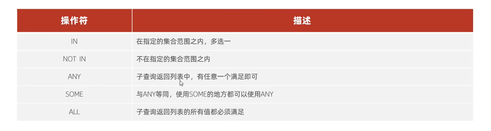

## DDL

DDL允许用户定义数据，也就是创建表、删除表、修改表结构这些操作。通常，DDL由数据库管理员执行。

### 1 建表

```sql
DROP TABLE students;  -- 删表
CREATE TABLE students(
    id   int AUTO_INCREMENT COMMENT 'ID' primary key,
    name varchar(100) NOT NULL null COMMENT '学生名称',
	code varchar(100) NOT NULL COMMENT '学生代码',
	class_id INT(13) NOT NULL REFERENCES classes(id), COMMENT '班级id'
)COMMENT '学生表';

PRIMARY KEY： 主键   REFERENCES：外键    COMMENT： 注释
UNIQUE：必须    AUTO_INCREMENT： int类型自动体征 
```

### 2 主键

```sql
--主键
-- 撤销主键 搞了之后很麻烦 谁没事撤销主键
ALTER TABLE 表名 drop PRIMARY key;

ALTER TABLE students DROP PRIMARY KEY ; 
-- 设置主键
ALTER  TABLE 表名  add  PRIMARY KEY(字段列表);

ALTER TABLE students ADD PRIMARY KEY (id);
-- 重设置主键自动增长开始值
ALTER TABLE students AUTO_INCREMENT = 10;

```

### 3 外键

```sql
--增加外键
ALTER TABLE 需要添加外键的表名 ADD CONSTRAINT  外键名 
FOREIGN KEY(本表字段列表)  REFERENCES  主表名(字段列表);

ALTER TABLE students ADD CONSTRAINT fk_class_id
FOREIGN KEY (class_id) REFERENCES classes (id);

--删除外键
alter table 表名 drop foreign key 外键名;

--建表的时候增加
constraint  外键名  foreign  key(本表字段列表)  references  主表名  (主表字段列表);
```

### 4 索引

```sql
-------增加索引
# 普通索引
alter table table_name add index index_name (column_list);
# UNIQUE索引
alter table table_name add unique index_name (column_list) ;

栗子
ALTER TABLE students ADD INDEX idx_code (code);
-- 多列索引  没必要
ALTER TABLE students ADD INDEX idx_name_code (name, code);
-- 唯一索引
ALTER TABLE students ADD UNIQUE INDEX uni_code (code);

------删除索引
# 删除普通索引 和 UNIQUE索引
alter table table_name drop index index_name ;
```

## DQL

- DQL允许用户查询数据，这也是通常最频繁的数据库日常操作。

### 1 .基本查询

```SQL
SELECT 列名 FROM <表名>;
SELECT * FROM students;
SELECT `NAME`,`CODE` FROM students;
```

### 2 条件查询

```sql
SELECT * FROM <表名> WHERE <条件表达式>
SELECT * FROM students WHERE `code` ='ldc';
SELECT * FROM students WHERE `class_id` ='4';
```

### 3 投影查询

可以给列名映射为另一个名字显示

```sql
SELECT `NAME` AS 姓名,`CODE` AS 代码 FROM students;
```

### 4 排序查询

- ORDER BY,可以指定多个，按先后顺序
- ASC 升序，默认  ；DESC 倒序

```sql
SELECT * FROM students ORDER BY code ,class_id DESC;
```


### 5 分页查询

使用 LIMIT M OFFSET N ，其实就是跳过前N条，然后只取出M条,随着N的增加，效率越来越低。

```sql
SELECT * FROM students ORDER BY code DESC LIMIT 2 OFFSET 2;
LIMIT 2 OFFSET 2; 简写为 LIMIT 2,2;
```

### 6 聚合查询

| 函数  | 说明                                   |
| :---- | :------------------------------------- |
| SUM   | 计算某一列的合计值，该列必须为数值类型 |
| COUNT | 计算查询结果一共有多少条               |
| AVG   | 计算某一列的平均值，该列必须为数值类型 |
| MAX   | 计算某一列的最大值                     |
| MIN   | 计算某一列的最小值                     |

```sql
SELECT COUNT(*) FROM students WHERE `class_id` ='4';
--分组聚合
SELECT COUNT(*) name,code FROM students GROUP  BY code;
```

### 7 多表查询

```sql
SELECT s.id sid,
s.name sname ,
s.code scode,
c.id cid, 
c.name cname,
c.code code 
FROM students s, classes c
WHERE s.class_id=c.id;
```

### 8 连接查询

- 内连接

```sql
SELECT s.id sid,
s.name sname ,
s.code scode,
c.id cid, 
c.name cname,
c.code code 
FROM students s INNER JOIN classes c
ON s.class_id=c.id;
```

- 其他


### 9 联合查询

- 两次查询结果的列必须一样
- UNION 去重
- UNION  ALL  拼接所有

```SQL
SELECT * FROM students WHERE class_id=3
UNION ALL
SELECT * FROM students WHERE class_id=4;
```


## DML

DML为用户提供添加、删除、更新数据的能力，这些是应用程序对数据库的日常操作


### 1 INSERT

```SQL
INSERT INTO <表名> (字段1, 字段2, ...) VALUES (值1, 值2, ...);

INSERT INTO dept (id, name) VALUES (1, '研发部'), (2, '市场部'),(3, '财务部'), (4, '销售部');
```

### 2 UPDATE

```SQL
UPDATE 表名 SET 字段名1 = 值1 , 字段名2 = 值2 , .... [ WHERE 条件 ] ;

--修改id为1的数据, 将name修改为小昭, gender修改为 女
update employee set name = '小昭' , gender = '女' where id = 1;
```

### 3 DELETE

```SQL
DELETE FROM 表名 [ WHERE 条件 ] ;

-- 删除gender为女的员工
delete from employee where gender = '女';
```

## DCL

### 1 查询用户

```sql
select * from mysql.user;
```

结果：


Host代表当前用户访问的主机

### 2 创建用户

```sql
CREATE USER '用户名'@'主机名' IDENTIFIED BY '密码';
```

### 3 修改用户密码

```sql
ALTER USER '用户名'@'主机名' IDENTIFIED WITH mysql_native_password BY '新密码' ;
```

### 4 删除用户

```sql
DROP USER '用户名'@'主机名' ;
```


### 5 权限控制

MySQL中定义了很多种权限，但是常用的就以下几种：

|        权限         |        说明        |
| :-----------------: | :----------------: |
| ALL, ALL PRIVILEGES |      所有权限      |
|       SELECT        |      查询数据      |
|       INSERT        |      插入数据      |
|       UPDATE        |      修改数据      |
|       DELETE        |      删除数据      |
|        ALTER        |       修改表       |
|        DROP         | 删除数据库/表/视图 |
|       CREATE        |   创建数据库/表    |

```sql
 --查询权限
SHOW GRANTS FOR '用户名'@'主机名' ;

-- 授予权限
GRANT 权限列表 ON 数据库名.表名 TO '用户名'@'主机名';
--授予 'wl'@'127.0.0.1' 用户test数据库所有表的所有操作权限
grant all on test.* to 'wl'@'127.0.0.1';

-- 撤销权限
REVOKE 权限列表 ON 数据库名.表名 FROM '用户名'@'主机名';
--撤销 'wl'@'127.0.0.1' 用户的test数据库的所有权限
revoke all on test.* from 'wl'@'127.0.0.1';
```

## 子查询

### 1 标量子查询

- 子查询返回的结果是单个值（数字、字符串、日期等），最简单的形式，这种子查询成为标量子查询。
- 常用的操作符:= 、>、>=、<、<=

```SQL
-- 标量子查询
-- 1. 查询 "销售部" 的所有员工信息
-- a. 查询 "销售部" 部门ID
select id from dept where name = '销售部';

-- b. 根据销售部部门ID, 查询员工信息
select * from emp where dept_id = (select id from dept where name = '销售部');


-- 2. 查询在 "方东白" 入职之后的员工信息
-- a. 查询 方东白 的入职日期
select entrydate from emp where name = '方东白';

-- b. 查询指定入职日期之后入职的员工信息
select * from emp where entrydate > (select entrydate from emp where name = '方东白');
```


### 2 列子查询

- 子查询的结果是一列，这种子查询称为列子查询

- 常用操作符有 IN、NOT IN,、ANY、SOME 、ALL



```SQL
-- 列子查询
-- 1. 查询 "销售部" 和 "市场部" 的所有员工信息
-- a. 查询 "销售部" 和 "市场部" 的部门ID
select id from dept where name = '销售部' or name = '市场部';

-- b. 根据部门ID, 查询员工信息
select * from emp where dept_id in (select id from dept where name = '销售部' or name = '市场部');


-- 2. 查询比 财务部 所有人工资都高的员工信息
-- a. 查询所有 财务部 人员工资
select id from dept where name = '财务部';

select salary from emp where dept_id = (select id from dept where name = '财务部');

-- b. 比 财务部 所有人工资都高的员工信息
select * from emp where salary > all ( select salary from emp where dept_id = (select id from dept where name = '财务部') );


-- 3. 查询比研发部其中任意一人工资高的员工信息
-- a. 查询研发部所有人工资
select salary from emp where dept_id = (select id from dept where name = '研发部');

-- b. 比研发部其中任意一人工资高的员工信息
select * from emp where salary > some ( select salary from emp where dept_id = (select id from dept where name = '研发部') );
```

### 3 行子查询

- 子查询返回的结果是一行（可以是多列)，这种子查询称为行子查询。
- 常用的操作符:= 、>、IN 、NOT IN

```sql
-- 行子查询
-- 1. 查询与 "张无忌" 的薪资及直属领导相同的员工信息 ;
-- a. 查询 "张无忌" 的薪资及直属领导
select salary, managerid from emp where name = '张无忌';

-- b. 查询与 "张无忌" 的薪资及直属领导相同的员工信息 ;
select * from emp where (salary,managerid) = (select salary, managerid from emp where name = '张无忌');
```


### 4 表子查询

- 子查询返回的结果是多行多列，这种子查询称为表子查询。
- 常用的操作符:IN

```sql
-- 表子查询
-- 1. 查询与 "鹿杖客" , "宋远桥" 的职位和薪资相同的员工信息
-- a. 查询 "鹿杖客" , "宋远桥" 的职位和薪资
select job, salary from emp where name = '鹿杖客' or name = '宋远桥';

-- b. 查询与 "鹿杖客" , "宋远桥" 的职位和薪资相同的员工信息
select * from emp where (job,salary) in ( select job, salary from emp where name = '鹿杖客' or name = '宋远桥' );
```

- 还可以把一次查询结果当成一个虚拟表来使用

```sql
-- 2. 查询入职日期是 "2006-01-01" 之后的员工信息 , 及其部门信息
-- a. 入职日期是 "2006-01-01" 之后的员工信息
select * from emp where entrydate > '2006-01-01';

-- b. 查询这部分员工, 对应的部门信息;
select e.*, d.* from (select * from emp where entrydate > '2006-01-01') e left join dept d on e.dept_id = d.id ;
```


## 内置函数

### 1 字符串函数

常用函数

| 函数                     | 功能                                                       |
| ------------------------ | ---------------------------------------------------------- |
| CONCAT(S1,S2,...Sn)      | 字符串拼接，将S1，S2，... Sn拼接成一个字符串               |
| LOWER(str)               | 将字符串str全部转为小写                                    |
| UPPER(str)               | 将字符串str全部转为大写                                    |
| LPAD(str,n,pad)          | 左填充，用字符串pad对str的左边进行填充，达到n个字符 串长度 |
| RPAD(str,n,pad)          | 右填充，用字符串pad对str的右边进行填充，达到n个字符 串长度 |
| TRIM(str)                | 去掉字符串头部和尾部的空格                                 |
| SUBSTRING(str,start,len) | 返回从字符串str从start位置起的len个长度的字符串            |

```sql
A. concat : 字符串拼接
select concat('Hello' , ' MySQL');

B. lower : 全部转小写
select lower('Hello');

C. upper : 全部转大写
select upper('Hello');

D. lpad : 左填充
select lpad('01', 5, '-');

E. rpad : 右填充
select rpad('01', 5, '-');

F. trim : 去除空格
select trim(' Hello MySQL ');

G. substring : 截取子字符串
select substring('Hello MySQL',1,5);

```

### 2 数值函数

| 函数       | 功能                               |
| ---------- | ---------------------------------- |
| CEIL(x)    | 向上取整                           |
| FLOOR(x)   | 向下取整                           |
| MOD(x,y)   | 返回x/y的模                        |
| RAND()     | 返回0~1内的随机数                  |
| ROUND(x,y) | 求参数x的四舍五入的值，保留y位小数 |

### 3 日期函数

| 函数                               | 功能                                               |
| ---------------------------------- | -------------------------------------------------- |
| CURDATE()                          | 返回当前日期                                       |
| CURTIME()                          | 返回当前时间                                       |
| NOW()                              | 返回当前日期和时间                                 |
| YEAR(date)                         | 获取指定date的年份                                 |
| MONTH(date)                        | 获取指定date的月份                                 |
| DAY(date)                          | 获取指定date的日期                                 |
| DATE_ADD(date, INTERVAL expr type) | 返回一个日期/时间值加上一个时间间隔expr后的 时间值 |
| DATEDIFF(date1,date2)              | 返回起始时间date1 和 结束时间date2之间的天 数      |

```sql
A. curdate：当前日期
select curdate();

B. curtime：当前时间
select curtime();

C. now：当前日期和时间
select now();
D. YEAR , MONTH , DAY：当前年、月、日
select YEAR(now());
select MONTH(now());
select DAY(now());

E. date_add：增加指定的时间间隔
select date_add(now(), INTERVAL 70 YEAR );

F. datediff：获取两个日期相差的天数
select datediff('2021-10-01', '2021-12-01');
```

### 4 流程函数

| 函数                                                         | 功能                                                       |
| ------------------------------------------------------------ | ---------------------------------------------------------- |
| IF(value , t , f)                                            | 如果value为true，则返回t，否则返回 f                       |
| IFNULL(value1 , value2)                                      | 如果value1不为空，返回value1，否则 返回value2              |
| CASE WHEN [ val1 ] THEN [res1] ... ELSE [ default ] END      | 如果val1为true，返回res1，... 否 则返回default默认值       |
| CASE [ expr ] WHEN [ val1 ] THEN [res1] ... ELSE [ default ] END | 如果expr的值等于val1，返回 res1，... 否则返回default默认值 |

```sql
--A.if
select if(false, 'Ok', 'Error');

--B. ifnull
select ifnull('Ok','Default'); -- ok
select ifnull('','Default'); -- ""
select ifnull(null,'Default'); -- Default

--C. case when then else end
需求: 查询emp表的员工姓名和工作地址 (北京/上海 ----> 一线城市 , 其他 ----> 二线城市)
                      select
name,
( case workaddress when '北京' then '一线城市' when '上海' then '一线城市' else
'二线城市' end ) as '工作地址'
from emp;

--D. CASE [ expr ] WHEN [ val1 ] THEN [res1] ... ELSE [ default ] END
select
id,
name,
(case when math >= 85 then '优秀' when math >=60 then '及格' else '不及格' end )
'数学',
(case when english >= 85 then '优秀' when english >=60 then '及格' else '不及格'
end ) '英语',
(case when chinese >= 85 then '优秀' when chinese >=60 then '及格' else '不及格'
end ) '语文'
from score;

```


## 事务

### 1 概念

事务 是一组操作的集合，它是一个不可分割的工作单位，事务会把所有的操作作为一个整体一起向系 统提交或撤销操作请求，即这些操作要么同时成功，要么同时失败。


### 2 事务特性

- 原子性（Atomicity）：事务是不可分割的最小操作单元，要么全部成功，要么全部失败。
- 一致性（Consistency）：事务完成时，必须使所有的数据都保持一致状态。 
- 隔离性（Isolation）：数据库系统提供的隔离机制，保证事务在不受外部并发操作影响的独立 环境下运行。 
- 持久性（Durability）：事务一旦提交或回滚，它对数据库中的数据的改变就是永久的。 上述就是事务的四大特性，简称ACID。

### 3 事务的操作

#### 事务控制方式1

- 这种方式，我们是修改了事务的自动提交行为, 把默认的自动提交修改为了手动提 交, 此时我们执行的DML语句都不会提交, 需要手动的执行commit进行提交。

```sql
1). 查看/设置事务提交方式
SELECT @@autocommit ;
SET @@autocommit = 0 ;

2). 提交事务
COMMIT;

3). 回滚事务
ROLLBACK;

```

#### 事务控制方式2

```sql
1). 开启事务
START TRANSACTION 或 BEGIN ;

2). 提交事务
COMMIT;

3). 回滚事务
ROLLBACK;

```

#### 栗子

```sql
-- 开启事务
start transaction
-- 1. 查询张三余额
select * from account where name = '张三';
-- 2. 张三的余额减少1000
update account set money = money - 1000 where name = '张三';
-- 3. 李四的余额增加1000
update account set money = money + 1000 where name = '李四';
-- 如果正常执行完毕, 则提交事务
commit;
-- 如果执行过程中报错, 则回滚事务
-- rollback;

```

### 4 并发事务问题

- 赃读：一个事务读到另外一个事务还没有提交的数据。
- 不可重复读：一个事务先后读取同一条记录，但两次读取的数据不同，称之为不可重复读。
- 幻读：一个事务按照条件查询数据时，没有对应的数据行，但是在插入数据时，又发现这行数据 已经存在，好像出现了 "幻影"。

### 5 事务隔离级别

为了解决并发事务所引发的问题，在数据库中引入了事务隔离级别。主要有以下几种：

| 隔离级别              | 脏读 | 不可重复读 | 幻读 |
| --------------------- | ---- | ---------- | ---- |
| Read uncommitted      | √    | √          | √    |
| Read committed        | ×    | √          | √    |
| Repeatable Read(默认) | ×    | ×          | √    |
| Serializable          | ×    | ×          | ×    |

```sql
1). 查看事务隔离级别
SELECT @@TRANSACTION_ISOLATION;

2). 设置事务隔离级别
SET [ SESSION | GLOBAL ] TRANSACTION ISOLATION LEVEL { READ UNCOMMITTED |
READ COMMITTED | REPEATABLE READ | SERIALIZABLE }

```

注意：事务隔离级别越高，数据越安全，但是性能越低。

## Mybatis

### 基本使用

```xml
<dependency>
            <groupId>org.mybatis.spring.boot</groupId>
            <artifactId>mybatis-spring-boot-starter</artifactId>
            <version>2.3.0</version>
        </dependency>
        <!-- mysql驱动包依赖 -->
        <dependency>
            <groupId>com.mysql</groupId>
            <artifactId>mysql-connector-j</artifactId>
            <scope>runtime</scope>
        </dependency>

        <!-- spring单元测试 (集成了junit) -->
        <dependency>
            <groupId>org.springframework.boot</groupId>
            <artifactId>spring-boot-starter-test</artifactId>
            <scope>test</scope>
        </dependency>

        <dependency>
            <groupId>org.projectlombok</groupId>
            <artifactId>lombok</artifactId>
        </dependency>
        <dependency>
            <!-- Druid连接池依赖 -->
            <groupId>com.alibaba</groupId>
            <artifactId>druid-spring-boot-starter</artifactId>
            <version>1.2.8</version>
        </dependency>
```

连接池连接配置

```pro
spring.datasource.druid.driver-class-name=com.mysql.cj.jdbc.Driver
spring.datasource.druid.url=jdbc:mysql://hodoop102:3306/mybatis
spring.datasource.druid.username=root
spring.datasource.druid.password=root123
#指定mybatis输出日志的位置, 输出控制台
mybatis.configuration.log-impl=org.apache.ibatis.logging.stdout.StdOutImpl
```

### 参数占位符

在Mybatis中提供的参数占位符有两种：${...} 、#{...}

${...}

- 拼接SQL。直接将参数拼接在SQL语句中，存在SQL注入问题
- 使用时机：如果对表名、列表进行动态设置时使用

\# {…}

- 执行SQL时，会将#{…}替换为?，生成预编译SQL，会自动设置参数值
- 使用时机：参数传递，都使用#{…}

### 参数传递

```java
/*
    2 参数问题
       1) 参数的传递  #{必须写东西}
       2) 当前参数只有一个时 #{任意}
       3) 当参数有多个时, #{} 中的名称要和 形参名称一致 (mybatis3.4.0 之前的版本需要加 @Param("id"))
       4) 当参数是一个对象时,#{}要求参数必须和 对象的属性保持一致
       5) 如果是一个map参数, #{} 必须和map 的key 保持一致
    */
    @Delete("delete  from emp where id=#{id}")
    public void  deleteById4(Integer id);

    @Delete("delete  from emp where id=#{id} and username=#{username}")
    public void  deleteByIdAndName( Integer id, String username);

    @Delete("delete  from emp where id=#{id} and username=#{username}")
    public void  deleteByIdAndName2(Emp emp);
    @Delete("delete  from emp where id=#{id} and username=#{username}")
    public void  deleteByIdAndName3(Map map);


 @Insert("insert into emp(username, name, gender, image, job, entrydate, dept_id, create_time, update_time) values (#{username}, #{name}, #{gender}, #{image}, #{job}, #{entrydate}, #{deptId}, #{createTime}, #{updateTime})")
    public void insert(Emp emp);

/**
     * 根据id修改员工信息
     * @param emp
     */
    @Update("update emp set username=#{username}, name=#{name}, gender=#{gender}, image=#{image}, job=#{job}, entrydate=#{entrydate}, dept_id=#{deptId}, update_time=#{updateTime} where id=#{id}")
    public void update(Emp emp);

@Select("select id, username, password, name, gender, image, job, entrydate, dept_id, create_time, update_time from emp where id=#{id}")
    public Emp getById(Integer id);
```

### 主键返回

概念：在数据添加成功后，需要获取插入数据库数据的主键。

```java
 //会自动将生成的主键值，赋值给emp对象的id属性
    @Options(useGeneratedKeys = true,keyProperty = "id")
    @Insert("insert into emp(username, name, gender, image, job, entrydate, dept_id, create_time, update_time) values (#{username}, #{name}, #{gender}, #{image}, #{job}, #{entrydate}, #{deptId}, #{createTime}, #{updateTime})")
    public void insert(Emp emp);
```

测试

```java
@Test
    public void testInsert() {
        //创建员工对象
        Emp emp = new Emp();
        emp.setUsername("tom");
        emp.setName("汤姆");
        emp.setImage("1.jpg");
        emp.setGender((short) 1);
        emp.setJob((short) 1);
        emp.setEntrydate(LocalDate.of(2000, 1, 1));
        emp.setCreateTime(LocalDateTime.now());
        emp.setUpdateTime(LocalDateTime.now());
        emp.setDeptId(1);
        //调用添加方法
        empMapper.insert(emp);
        System.out.println(emp.getId());
    }
```

### 数据字段映射

**开启驼峰命名(推荐)**：如果字段名与属性名符合驼峰命名规则，mybatis会自动通过驼峰命名规则映射

```properties
# 在application.properties中添加：
mybatis.configuration.map-underscore-to-camel-case=true
```

> 要使用驼峰命名前提是 实体类的属性 与 数据库表中的字段名严格遵守驼峰命名。

### 条件查询

SQL语句：

```sql
select id, username, password, name, gender, image, job, entrydate, dept_id, create_time, update_time 
from emp 
where name like '%张%' 
      and gender = 1 
      and entrydate between '2010-01-01' and '2020-01-01 ' 
order by update_time desc;
```

接口方法：

- 方式一

```java
@Mapper
public interface EmpMapper {
    @Select("select * from emp " +
            "where name like '%${name}%' " +
            "and gender = #{gender} " +
            "and entrydate between #{begin} and #{end} " +
            "order by update_time desc")
    public List<Emp> list(String name, Short gender, LocalDate begin, LocalDate end);
}
```

- 方式二（解决SQL注入风险）
  - 使用MySQL提供的字符串拼接函数：concat('%' , '关键字' , '%')

~~~java
@Mapper
public interface EmpMapper {

    @Select("select * from emp " +
            "where name like concat('%',#{name},'%') " +
            "and gender = #{gender} " +
            "and entrydate between #{begin} and #{end} " +
            "order by update_time desc")
    public List<Emp> list(String name, Short gender, LocalDate begin, LocalDate end);
}
~~~

参数名在不同的mybatis 版本中，处理方案还不同：

- mybatis 3.4.1之后,允许不加@Param（保证参数名一致）


> springBoot的父工程对compiler编译插件进行了默认的参数parameters配置，使得在编译时，会在生成的字节码文件中保留原方法形参的名称，所以#{…}里面可以直接通过形参名获取对应的值
>
> 


- mybatis 3.4.0 之前,允许不加版本/单独使用mybatis（使用@Param注解来指定SQL语句中的参数名）


### Mybatis的XML配置文件

如果需要实现复杂的SQL功能，建议使用XML来配置映射语句，也就是将SQL语句写在XML配置文件中。

在Mybatis中使用XML映射文件方式开发，需要符合一定的规范：

1. XML映射文件的名称与Mapper接口名称一致，并且将XML映射文件和Mapper接口放置在相同包下（同包同名）

2. XML映射文件的namespace属性为Mapper接口全限定名一致

3. XML映射文件中sql语句的id与Mapper接口中的方法名一致，并保持返回类型一致。


> \<select>标签：就是用于编写select查询语句的。
>
> resultType属性，指的是查询返回的单条记录所封装的类型。


### 动态SQL

~~~xml
<select id="list" resultType="com.itheima.pojo.Emp">
        select * from emp
        <where>
             <!-- if做为where标签的子元素 -->
             <if test="name != null">
                 and name like concat('%',#{name},'%')
             </if>
             <if test="gender != null">
                 and gender = #{gender}
             </if>
             <if test="begin != null and end != null">
                 and entrydate between #{begin} and #{end}
             </if>
        </where>
        order by update_time desc
</select>
~~~

```xml
 <!--更新操作-->
    <update id="update">
        update emp
        <!-- 使用set标签，代替update语句中的set关键字 -->
        <set>
            <if test="username != null">
                username=#{username},
            </if>
            <if test="name != null">
                name=#{name},
            </if>
            <if test="gender != null">
                gender=#{gender},
            </if>
            <if test="image != null">
                image=#{image},
            </if>
            <if test="job != null">
                job=#{job},
            </if>
            <if test="entrydate != null">
                entrydate=#{entrydate},
            </if>
            <if test="deptId != null">
                dept_id=#{deptId},
            </if>
            <if test="updateTime != null">
                update_time=#{updateTime}
            </if>
        </set>
        where id=#{id}
    </update>
```

#### foreach

sql

```sql
delete from emp where id in (1,2,3);
```


```xml
<foreach collection="集合名称" item="集合遍历出来的元素/项" separator="每一次遍历使用的分隔符" 
         open="遍历开始前拼接的片段" close="遍历结束后拼接的片段">
</foreach>
```

```xml
<?xml version="1.0" encoding="UTF-8" ?>
<!DOCTYPE mapper
        PUBLIC "-//mybatis.org//DTD Mapper 3.0//EN"
        "https://mybatis.org/dtd/mybatis-3-mapper.dtd">
<mapper namespace="com.wl.mapper.EmpMapper">
    <!--删除操作-->
    <delete id="deleteByIds">
        delete from emp where id in
        <foreach collection="ids" item="id" separator="," open="(" close=")">
            #{id}
        </foreach>
    </delete>
</mapper> 
```

```java
@Mapper
public interface EmpMapper {
    //批量删除
    public void deleteByIds(List<Integer> ids);
}
```

#### include

在xml映射文件中配置的SQL，有时可能会存在很多重复的片段，此时就会存在很多冗余的代码

SQL片段： 抽取重复的代码

```xml
<sql id="commonSelect">
 	select id, username, password, name, gender, image, job, entrydate, dept_id, create_time, update_time from emp
</sql>
```

然后通过`<include>` 标签在原来抽取的地方进行引用。操作如下：

```xml
<select id="list" resultType="com.itheima.pojo.Emp">
    <include refid="commonSelect"/>
    <where>
        <if test="name != null">
            name like concat('%',#{name},'%')
        </if>
        <if test="gender != null">
            and gender = #{gender}
        </if>
        <if test="begin != null and end != null">
            and entrydate between #{begin} and #{end}
        </if>
    </where>
    order by update_time desc
</select>
```

### 分页查询

当使用了PageHelper分页插件进行分页，就无需再Mapper中进行手动分页了。 在Mapper中我们只需要进行正常的列表查询即可。在Service层中，调用Mapper的方法之前设置分页参数，在调用Mapper方法执行查询之后，解析分页结果，并将结果封装到PageBean对象中返回。

1、在pom.xml引入依赖

```xml
<dependency>
    <groupId>com.github.pagehelper</groupId>
    <artifactId>pagehelper-spring-boot-starter</artifactId>
    <version>1.4.2</version>
</dependency>
```

2、EmpMapper

```java
@Mapper
public interface EmpMapper {
    //获取当前页的结果列表
    @Select("select * from emp")
    public List<Emp> page(Integer start, Integer pageSize);
}
```

3、EmpServiceImpl

```java
@Override
public PageBean page(Integer page, Integer pageSize) {
    // 设置分页参数
    PageHelper.startPage(page, pageSize); 
    // 执行分页查询
    List<Emp> empList = empMapper.list(name,gender,begin,end); 
    // 获取分页结果
    Page<Emp> p = (Page<Emp>) empList;   
    //封装PageBean
    PageBean pageBean = new PageBean(p.getTotal(), p.getResult()); 
    return pageBean;
}
```


