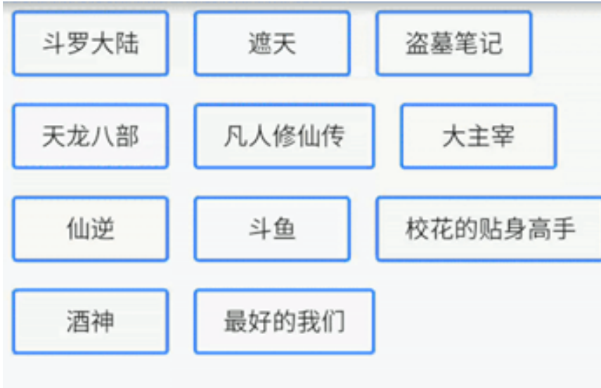

## 环境配置

### 使用夜神模拟器

```bash
cd D:\Program Files\Nox\bin
nox_adb.exe connect 127.0.0.1:62001 
```

##容器组件

容器组件Container包含一个子widget，自身具备alignment、padding等属性，方便布局过程中摆放child。

常用属性

| 属性名               | 类型               | 说明                                                         |
| -------------------- | ------------------ | ------------------------------------------------------------ |
| key                  | key                | Container唯一标识符，用于查找更新                            |
| alignment            | AlignmentGeometry  | 控制child的对齐方式，如果Container或者Container的父节点尺寸大于child的尺寸，该属性设置会起作用，有很多种对齐方式 |
| padding              | EdgeInsetsGeometry | Decoration内部的空白区，如果有child，child位于padding内部    |
| color                | Color              | 用来设置Container背景色，如果foregroudDecoration设置的话，可能会覆盖color效果 |
| decoration           | Decoration         | 绘制在child后面的修饰，设置了Decoration的话，就不能设置color属性，否则会报错，此时应该在Decoration中进行颜色的设置 |
| foregroundDecoration | Decoration         | 绘制在child前面的装饰                                        |
| width                | double             | Container的宽度，设置为double.infinity可以强制在宽度上撑满，不设置，则根据child和父节点两者一起布局 |
| height               | double             | Container的高度，设置为double.infinity可以强制在高度上撑满   |
| constraints          | BoxConstraints     | 添加到child上额外的约束条件                                  |
| margin               | EdgeInsetsGeometry | 围绕在Decoration和child之外的空白区域，不属于内容区域        |
| transform            | Matrix4            | 设置Container的变换矩阵，类型为Matrix4                       |
| child                | Widget             | Container中的内容Widget                                      |
|                      |                    |                                                              |

```dart
import 'package:flutter/material.dart';

void main() {
  runApp(MaterialApp(
    home: Scaffold(
      appBar: AppBar(title: const Text("你好Flutter")),
      body: const MyApp(),
    ),
  ));
}

// 代码块 statelessW
class MyApp extends StatelessWidget {
  const MyApp({Key? key}) : super(key: key);
  @override
  Widget build(BuildContext context) {
    return Center(
      child: Container(
        alignment: Alignment.center,
        height: 200,
        width: 200,
        decoration: const BoxDecoration(
          color: Colors.yellow,
        ),
        child: const Text(
          "你好Flutter",
          style: TextStyle(fontSize: 20),
        ),
      ),
    );
  }
}
```

背景渐变等属性

```dart

class MyApp extends StatelessWidget {
  const MyApp({Key? key}) : super(key: key);

  @override
  Widget build(BuildContext context) {
    return Center(
      child: Container(
        margin: const EdgeInsets.fromLTRB(0, 60, 0, 0),
        alignment: Alignment.center, //配置Container容器内元素的方位
        width: 200,
        height: 200,
        // transform:Matrix4.translationValues(0, -40, 0),// 位移
        // transform:Matrix4.rotationZ(0.2),// 旋转
        transform: Matrix4.skewY(.2),
        decoration: BoxDecoration(
            color: Colors.yellow, //背景颜色
            border: Border.all(
                //边框
                color: Colors.red,
                width: 2),
            borderRadius: BorderRadius.circular(10), //配置圆角 也可以实现圆形
            boxShadow: const [
              //配置阴影效果
              BoxShadow(color: Colors.blue, blurRadius: 20.0)
            ],
            // LinearGradient 背景线性渐变 RadialGradient径向渐变
            gradient:
                const LinearGradient(colors: [Colors.red, Colors.yellow])),
        child: const Text(
          "你好Flutter",
          style: TextStyle(color: Colors.black, fontSize: 20),
        ),
      ),
    );
  }
}
```

##文本组件

###4.1 Text

文本组件Text负责显示文本和定义显示样式。

常用属性

| 属性名          | 类型          | 默认值            | 说明                                                         |
| --------------- | ------------- | ----------------- | ------------------------------------------------------------ |
| data            | String        |                   | 数据为要显示的文本                                           |
| maxLines        | int           | 0                 | 文本显示的最大行数                                           |
| style           | TextStyle     | null              | 文本样式，可定义文本的字体大小、颜色、粗细等                 |
| textAlign       | TextAlign     | TextAlign.center  | 文本水平方向对齐方式，取值右center、end、justify、left、right、start、values |
| textDirection   | TextDirection | TextDirection.ltr | 有些文本书写方向从左到右，如英语、中文，有些则是从右到左，比如乌尔都语。从左到右使用TextDirection.ltr，从右到左使用TextDirection.rtl |
| textScaleFactor | double        | 1.0               | 字体缩放系数，比如设置为1.5，那么字体会放大1.5倍             |
| textSpan        | TextSpan      | null              | 文本块，TextSpan里可以包含文本内容及样式                     |

###4.2 RichText

富文本组件RichText使用多个不同风格的widget显示文本，要显示的文本使用TextSpan对象树来描述，每个对象都有一个用于该子树的关联样式。文本可能多行，也可能显示在同一行，取决于布局约束。

常用属性

| 属性名          | 类型          | 默认值            | 说明                                                         |
| --------------- | ------------- | ----------------- | ------------------------------------------------------------ |
| text            | TextSpan      | -                 | 要显示的的文本                                               |
| textAlign       | TextAlign     | TextAlign.start   | 文本水平方向对齐方式，取值右center、end、justify、left、right、start、values |
| textDirection   | TextDirection | TextDirection.ltr | 有些文本书写方向从左到右，如英语、中文，有些则是从右到左，比如乌尔都语。从左到右使用TextDirection.ltr，从右到左使用TextDirection.rtl |
| softWrap        | bool          | true              | 是否自动换行                                                 |
| overflow        | TextOverflow  | TextOverflow.clip | 内容超出文本范围处理方式，默认截断处理                       |
| textScaleFactor | double        | 1.0               | 文本缩放比例，默认100%比例显示                               |
| maxLines        | int           | -                 | 最大显示行数                                                 |

```dart
class MyApp extends StatelessWidget {
  const MyApp({Key? key}) : super(key: key);
  @override
  Widget build(BuildContext context) {
    return Center(
      child: Container(
        alignment: Alignment.center,
        height: 200,
        width: 200,
        decoration: BoxDecoration(
            color: Colors.yellow,
            gradient: const LinearGradient(
//LinearGradient 背景线性渐变 RadialGradient径向渐变
              colors: [Colors.red, Colors.orange],
            ),
            boxShadow: const [
              //卡片阴影
              BoxShadow(
                color: Colors.blue,
                offset: Offset(2.0, 2.0),
                blurRadius: 10.0,
              )
            ],
            border: Border.all(color: Colors.black, width: 1)),
        transform: Matrix4.rotationZ(.2),
        child: const Text('各位同学大家hhdsad',
            textAlign: TextAlign.left,
            overflow: TextOverflow.ellipsis,
            // overflow:TextOverflow.fade ,
            maxLines: 2,
            style: TextStyle(
                fontSize: 26.0,
                color: Colors.black,
              // color:Color.fromARGB(a, r, g, b)
                fontWeight: FontWeight.w800,
                fontStyle: FontStyle.italic,
                decoration: TextDecoration.lineThrough,
                decorationColor: Colors.white,
                decorationStyle: TextDecorationStyle.dashed,
                letterSpacing: 5.0)),
      ),
    );
  }
}
```

##.图片组件

>* 图标 https://www.iconfont.cn/
>* 头像 https://www.randomuser.me/photos

图片组件Image显示图像的组件，有多种构造函数：

>* new Image：从ImageProvider获取图像
>* new Image.asset：加载资源图片
>* new Image.file：加载本地图片文件
>* new Image.network：加载网络图片
>* new Image.memory：加载Uint8List资源图片

常用属性

| 属性名             | 类型          | 说明                                                         |
| ------------------ | ------------- | ------------------------------------------------------------ |
| image              | ImageProvider | 抽象类，需要自己实现获取图片数据的操作                       |
| width/height       | double        | Image显示区域的宽度和高度设置，这里需要把Image和图片两个区分开。图片本身有大小，Image Widget是图片的容器，本身也有大小。宽度和高度的配置经常和fitshu'x |
| fit                | BoxFit        | 图片填充模式，具体取值见 **BoxFit取值表**                    |
| color              | Color         | 图片颜色                                                     |
| colorBlendMode     | BlendMode     | 在对图片进行手动处理的时候，可能用到图层混合，如改变图片颜色，此属性可以对颜色进行混合处理，有多种模式 |
| alignment          | Alignment     | 控制图片的摆放位置，比如图片放置在右下角则为Alignment.bottomRight |
| repeat             | ImageRepeat   | 此属性可以设置图片的重复模式。moRepeat为不重复，Repeat为x和y方向重复，repeatX为x方向重复，repeatY为y方向重复 |
| centerSlice        | Rect          | 当图片需要被拉伸显示时，centerSlice定义的矩形区域会被拉伸，可以理解为我们在图片内部定义9个点用作拉伸，9个点为"上","下","左","右","上中","下中","左中","右中","正中" |
| matchTextDirection | bool          | matchTextDirection与Derection配合使用。TextDirectio有两个值分别为：TextDirection.ltr从左到右展示图片，TextDirection.rtl为从右到左展示图片 |
| gaplessPlayback    | bool          | 当ImageProvider发生变化后，重新加载图片的过程中，原图片的展示是否保留。值为true则保留，值为false则不保留，直接等待下一张图片加载 |

BoxFit取值及描述

| 取值             | 描述                                                         |
| ---------------- | ------------------------------------------------------------ |
| BoxFit.fill      | 全图显示，显示可能拉伸，充满                                 |
| BoxFit.contain   | 全图显示，显示原比例，不需充满                               |
| BoxFit.cover     | 显示可能拉伸，可能裁剪，充满                                 |
| BoxFit.fitWidth  | 显示可能拉伸，可能裁剪，宽度充满                             |
| BoxFit.fitHeight | 显示可能拉伸，可能裁剪，高度充满                             |
| BoxFit.none      | 原始大小                                                     |
| BoxFit.scaleDown | 效果和BoxFit.contain差不多，但是该属性不允许显示超过原图大小(可小不可大) |
|                  |                                                              |

```dart
// pubspec.yaml 配置
flutter:
  assets:
      - images/a.jpeg
          
//加载本地图片
class LoaclImage extends StatelessWidget {
  const LoaclImage({Key? key}) : super(key: key);

  @override
  Widget build(BuildContext context) {
    return Container(
      height: 150,
      width: 150,
      decoration: const BoxDecoration(
        color: Colors.yellow,
      ),
      child: Image.asset("images/a.jpeg",fit: BoxFit.cover,),
    );
  }
}
```

远程图片

```dart
class MyApp extends StatelessWidget {
  const MyApp({Key? key}) : super(key: key);
  @override
  Widget build(BuildContext context) {
    return Center(
        child: Container(
      // alignment: Alignment.centerRight,
      margin: const EdgeInsets.fromLTRB(0, 20, 0, 0),
      height: 150,
      width: 150,
      decoration: const BoxDecoration(color: Colors.yellow),
      child: Image.network(
        "https://www.itying.com/themes/itying/images/ionic4.png",
        // alignment:Alignment.centerLeft
        // scale:2
        // fit: BoxFit.cover,
        // repeat:ImageRepeat.repeatY
      ),
    ));
  }
}

//实现一个圆形图片 使用 ClipOval
class ClipImage extends StatelessWidget {
  const ClipImage({Key? key}) : super(key: key);

  @override
  Widget build(BuildContext context) {
    return ClipOval(
      child: Image.network(
        "https://www.itying.com/images/201906/goods_img/1120_P_1560842352183.png",
        width: 150,
        height: 150,
        fit: BoxFit.cover,
      ),
    );
  }
}

//Container实现一个圆形图片
class Circular extends StatelessWidget {
  const Circular({Key? key}) : super(key: key);
  @override
  Widget build(BuildContext context) {
    return Container(
      height: 150,
      width: 150,
      decoration: BoxDecoration(
          color: Colors.yellow,
          borderRadius: BorderRadius.circular(75),
          image: const DecorationImage(
              image: NetworkImage(
                  "https://www.itying.com/themes/itying/images/ionic4.png"),
              fit: BoxFit.cover)),
    );
  }
}
```


##图标及按钮组件

###5.1 图标组件

图标组件Icon展示图标的组件，该组件不可交互，要实现交互图标，可以考虑使用IconButton组件。图标相关组件有以下几个：

>* IconButton：可交互的Icon
>* Icons：框架自带Icon集合
>* IconTheme：Icon主题
>* ImageIcon：通过AssetImages或者其他图片显示Icon

####常用属性

| 属性名        | 类型          | 默认值            | 说明                                                         |
| ------------- | ------------- | ----------------- | ------------------------------------------------------------ |
| color         | Color         | null              | 图标的颜色，例如Colors.green[500]                            |
| icon          | IconData      | null              | 展示的具体图标，可使用Icons图标列表中的任意一个图标即可，如Icons.phone表示一个电话的图标 |
| style         | TextStyle     | null              | 文本样式，可定义文本的字体大小、颜色、粗细等                 |
| size          | Double        | 24.0              | 图标的大小，注意需要带上小数位                               |
| textDirection | TextDirection | TextDirection.ltr | Icon组件里也可以添加文本内容。有些文本书写的方向是从左到右，有些则是从右到左。从左到右使用TextDirection.ltr，从右到左使用TextDirection.rtl |

```dart
class MyApp extends StatelessWidget {
  const MyApp({Key? key}) : super(key: key);
  @override
  Widget build(BuildContext context) {
    return Center(
        child: Column(
      children: const [
        Icon(Icons.search, color: Colors.red, size: 40),
        SizedBox(height: 10),
        Icon(Icons.home),
        SizedBox(height: 10),
        Icon(Icons.category),
        SizedBox(height: 10),
        Icon(Icons.shop),
        SizedBox(height: 10),
      ],
    ));
  }
}
```


### Flutter中借助阿里巴巴图标库自定义字体图标

```dart
// 配置
fonts:
    - family: ityingIcon   #指定一个字体名 根据自己的需求定义
      fonts:
        - asset: fonts/iconfont.ttf     
    - family: flutterIcon
      fonts:
        - asset: fonts/szotmkIconfont.ttf
            
            
// 自定义 import 'package:flutter/material.dart';

class ItyingIcon{
  static const IconData book=IconData(
    0x3447,
    fontFamily:"ityingIcon",
    matchTextDirection:true
  );
  static const IconData weixin=IconData(
    0xf0106,
    fontFamily:"ityingIcon",
    matchTextDirection:true
  );
  static const IconData cart=IconData(
      0xf0179,
      fontFamily:"ityingIcon",
      matchTextDirection:true
   );
   static const IconData yonghu=IconData(
      0xe633,
      fontFamily:"flutterIcon",
      matchTextDirection:true
   );
    static const IconData address=IconData(
      0xe64e,
      fontFamily:"flutterIcon",
      matchTextDirection:true
   );

    static const IconData category=IconData(
      0xe71b,
      fontFamily:"flutterIcon",
      matchTextDirection:true
   );
}

```

使用

```dart

class MyHomePage extends StatelessWidget {
  const MyHomePage({Key? key}) : super(key: key);
  @override
  Widget build(BuildContext context) {
    return Column(
      children: const [
        SizedBox(height: 20),
        Icon(
          Icons.home,
          size: 40,
          color: Colors.red,
        ),
        SizedBox(height: 20),
        Icon(Icons.settings),
        SizedBox(height: 20),
        Icon(Icons.search),
        SizedBox(height: 20),
        Icon(Icons.personal_injury_outlined),
        SizedBox(height: 20),
        Icon(
          Icons.category,
          size: 60,
          color: Colors.blue,
        ),
        Icon(
          Icons.category,
          size: 60,
          color: Colors.blue,
        ),
        Icon(
          Icons.shop,
          size: 60,
          color: Colors.red,
        ),
        SizedBox(height: 40),
        Icon(
          ItyingIcon.book,
          size: 40,
          color: Colors.orange,
        ),
        SizedBox(height: 20),
        Icon(
          ItyingIcon.weixin,
          size: 40,
          color: Colors.green,
        ),
        SizedBox(height: 20),
        Icon(
          ItyingIcon.yonghu,
          size: 30,
          color: Colors.black,
        ),
        SizedBox(height: 20),
        Icon(ItyingIcon.address),
        SizedBox(height: 20),
        Icon(ItyingIcon.category),
      ],
    );
  }
}

```

##列表控件

列表是最常见的需求。在Flutter中，用ListView来显示列表项，支持垂直和水平方向展示，通过一个属性我们就可以控制其方向，列表有以下几类：

>* 水平的列表
>* 垂直的列表
>* 数据量非常大的列表
>* 矩阵式的列表

###6.1 基础列表组件

基础列表组件为ListView组件。

####常用属性

| 属性名          | 类型               | 默认值        | 说明                                                         |
| --------------- | ------------------ | ------------- | ------------------------------------------------------------ |
| scrollDirection | Axix               | Axis.vertical | 列表的排列方向，Axis.vertical为垂直方向，是默认值，Axis.horizontal为水平方向 |
| padding         | EdgInsetsGeometry  | -             | 列表内部的空白区域，如果有child，child位于padding内部        |
| reverse         | bool               | false         | 组件排列方向                                                 |
| children        | List&lt;Widget&gt; | -             | 列表元素，注意List元素全部为Widget类型                       |

```dart

class MyHomePage extends StatelessWidget {
  const MyHomePage({Key? key}) : super(key: key);
  @override
  Widget build(BuildContext context) {
    return ListView(
      children: const [
        SizedBox(height: 20),
        Icon(
          Icons.home,
          size: 40,
          color: Colors.red,
        ),
        SizedBox(height: 20),
        Icon(Icons.settings),
        SizedBox(height: 20),
        Icon(Icons.search),
        SizedBox(height: 20),
        Icon(Icons.personal_injury_outlined),
        SizedBox(height: 20),
        Icon(
          Icons.category,
          size: 60,
          color: Colors.blue,
        ),
        Icon(
          Icons.category,
          size: 60,
          color: Colors.blue,
        ),
        Icon(
          Icons.shop,
          size: 60,
          color: Colors.red,
        ),
        SizedBox(height: 40),
        Icon(
          ItyingIcon.book,
          size: 40,
          color: Colors.orange,
        ),
        SizedBox(height: 20),
        Icon(
          ItyingIcon.weixin,
          size: 40,
          color: Colors.green,
        ),
        SizedBox(height: 20),
        Icon(
          ItyingIcon.yonghu,
          size: 30,
          color: Colors.black,
        ),
        SizedBox(height: 20),
        Icon(ItyingIcon.address),
        SizedBox(height: 20),
        Icon(ItyingIcon.category),
        SizedBox(height: 20),
        Icon(
          ItyingIcon.weixin,
          size: 40,
          color: Colors.green,
        ),
        SizedBox(height: 20),
        Icon(
          ItyingIcon.yonghu,
          size: 30,
          color: Colors.black,
        ),
        SizedBox(height: 20),
        Icon(ItyingIcon.address),
        SizedBox(height: 20),
        Icon(ItyingIcon.category),
      ],
    );
  }
}

```

```dart
class MyHomePage extends StatelessWidget {
  const MyHomePage({Key? key}) : super(key: key);
  @override
  Widget build(BuildContext context) {
    return ListView(
      children: const <Widget>[
        ListTile(title: Text("我是一个列表")),
        Divider(),
        ListTile(title: Text("我是一个列表")),
        Divider(),
        ListTile(title: Text("我是一个列表")),
        Divider(),
        ListTile(title: Text("我是一个列表")),
        Divider(),
        ListTile(title: Text("我是一个列表")),
        Divider(),
        ListTile(title: Text("我是一个列表")),
        Divider(),
        ListTile(title: Text("我是一个列表")),
        Divider(),
        ListTile(title: Text("我是一个列表")),
        Divider(),
        ListTile(title: Text("我是一个列表")),
        Divider(),
        ListTile(title: Text("我是一个列表")),
        Divider(),
        ListTile(title: Text("我是一个列表")),
        Divider(),
      ],
    );
  }
}
```

#### 菜单列表

```dart
class MyHomePage extends StatelessWidget {
  const MyHomePage({Key? key}) : super(key: key);
  @override
  Widget build(BuildContext context) {
    return ListView(
      children: const <Widget>[
        ListTile(leading: Icon(Icons.home), title: Text("首页")),
        Divider(),
        ListTile(
          leading: Icon(Icons.assignment, color: Colors.red),
          title: Text("全部订单"),
        ),
        Divider(),
        ListTile(
          leading: Icon(Icons.payment, color: Colors.green),
          title: Text("待付款"),
        ),
        ListTile(
          leading: Icon(Icons.favorite, color: Colors.lightGreen),
          title: Text("我的收藏"),
          trailing:Icon(Icons.chevron_right_sharp) ,
        ),
        Divider(),
        ListTile(
          leading: Icon(Icons.people, color: Colors.black54),
          title: Text("在线客服"),
          trailing:Icon(Icons.chevron_right_sharp) ,
        ),
        Divider(),
      ],
    );
  }
}

```

#### 图文列表

```dart
class MyHomePage extends StatelessWidget {
  const MyHomePage({Key? key}) : super(key: key);
  @override
  Widget build(BuildContext context) {
    return ListView(
      padding: const EdgeInsets.all(10),
      children: <Widget>[
        Image.network("https://www.itying.com/images/flutter/1.png"),
        Container(
          padding: const EdgeInsets.fromLTRB(0, 6, 0, 0),
          height: 44,
          child: const Text(
            "我是一个标题",
            textAlign: TextAlign.center,
            style: TextStyle(fontSize: 22)),
        ),
        Image.network("https://www.itying.com/images/flutter/3.png"),
         Container(
          padding: const EdgeInsets.fromLTRB(0, 6, 0, 0),
          height: 44,
          child: const Text(
            "我是一个标题",
            textAlign: TextAlign.center,
            style: TextStyle(fontSize: 22)),
        ),
        Image.network("https://www.itying.com/images/flutter/2.png"),
         Container(
          padding: const EdgeInsets.fromLTRB(0, 6, 0, 0),
          height: 44,
          child: const Text(
            "我是一个标题",
            textAlign: TextAlign.center,
            style: TextStyle(fontSize: 22)),
        ),
        Image.network("https://www.itying.com/images/flutter/4.png"),
         Container(
          padding: const EdgeInsets.fromLTRB(0, 6, 0, 0),
          height: 44,
          child: const Text(
            "我是一个标题",
            textAlign: TextAlign.center,
            style: TextStyle(fontSize: 22)),
        ),
        Image.network("https://www.itying.com/images/flutter/5.png"),
         Container(
          padding: const EdgeInsets.fromLTRB(0, 6, 0, 0),
          height: 44,
          child: const Text(
            "我是一个标题",
            textAlign: TextAlign.center,
            style: TextStyle(fontSize: 22)),
        ),
        Image.network("https://www.itying.com/images/flutter/6.png"),
      ],
    );
  }
}
```


###6.2 水平列表组件

水平列表组件即为水平方向排列的组件，列表内部元素以水平方向排列。把ListView组件的scrollDirection属性设置为Axis.horizontal即可。

```DART

class MyHomePage extends StatelessWidget {
  const MyHomePage({Key? key}) : super(key: key);
  @override
  Widget build(BuildContext context) {
    return SizedBox(
      height: 120,
      child: ListView(
        scrollDirection: Axis.horizontal, //水平列表
        padding: const EdgeInsets.all(10),
        children: <Widget>[
          Container(
            width: 120,
            decoration: const BoxDecoration(color: Colors.white),
            child: Column(
              children: [
                   SizedBox(
                    height: 80,
                    child: Image.network("https://www.itying.com/images/flutter/1.png",fit: BoxFit.cover,),
                   ),
                   const Text("文字")
              ],
            ),
          ),
          Container(
            width: 120,
            decoration: const BoxDecoration(color: Colors.yellow),
          ),
          Container(
            height: 120,
            width: 120,
            decoration: const BoxDecoration(color: Colors.orange),
          ),
          Container(
            width: 120,
            decoration: const BoxDecoration(color: Colors.black),
          ),
          Container(
            width: 120,
            decoration: const BoxDecoration(color: Colors.blue),
          ),
          Container(
            width: 120,
            decoration: const BoxDecoration(color: Colors.red),
          ),
          Container(
            width: 120,
            decoration: const BoxDecoration(color: Colors.pink),
          ),
          Container(
            width: 120,
            decoration: const BoxDecoration(color: Colors.blueGrey),
          ),
        ],
      ),
    );
  }
}

```


###6.3 长列表组件

当列表的数据项非常多时，需要使用长列表，比如淘宝后台订单列表、手机通讯录等，这些列表项数据很多。长列表也是使用ListView作为基础组件，只不过需要添加一个列表项构造器itemBuilder

```dart
class MyHomePage extends StatelessWidget {
  const MyHomePage({Key? key}) : super(key: key);

  //自定义方法
  List<Widget> _initListData() {
    List<Widget> list = [];
    for (var i = 0; i < 20; i++) {
      list.add(ListTile(
        title: Text("我是一个列表---$i"),
      ));
    }
    return list;
  }

  @override
  Widget build(BuildContext context) {
    return ListView(
      children: _initListData(),
    );
  }
}
```

```dart

class MyHomePage extends StatelessWidget {
  MyHomePage({Key? key}) : super(key: key) {
    print(listData);
  }
  //第一种方法
  // List<Widget> _initListData(){
  //   List<Widget> tempList=[];
  //   for (var i = 0; i < listData.length; i++) {
  //       tempList.add(
  //         ListTile(
  //           leading: Image.network("${listData[i]["imageUrl"]}"),
  //           title: Text("${listData[i]["title"]}"),
  //           subtitle: Text("${listData[i]["author"]}"),
  //         )
  //       );
  //   }
  //   return tempList;
  // }

  //第二种方法
  List<Widget> _initListData() {
    var tempList = listData.map((value) {
      return ListTile(
        leading: Image.network("${value["imageUrl"]}"),
        title: Text("${value["title"]}"),
        subtitle: Text("${value["author"]}"),
      );
    });  
    return tempList.toList();
  }

  @override
  Widget build(BuildContext context) {
    return ListView(
      children: _initListData(),
    );
  }
}
```

ListView.builder实现动态列表

```dart
class MyHomePage extends StatelessWidget { 
  const MyHomePage({Key? key}) : super(key: key);

  @override
  Widget build(BuildContext context) {
    return ListView.builder(
      itemCount: listData.length,
      itemBuilder: (context,i){
        return ListTile(
          leading: Image.network(listData[i]["imageUrl"]),
          title: Text(listData[i]["title"]),
          subtitle:Text(listData[i]["author"]) ,
        );
      }
    );
  }
}
```


##网格布局组件

网格布局组件GridView可以实现多行多列布局的应用场景。使用GridView创建网格列表有多种方式：

>* GridView.count：通过单行展示个数创建
>* GridView.extent：通过最大宽度创建

###常用属性

| 属性名          | 类型               | 默认值        | 说明                                                         |
| --------------- | ------------------ | ------------- | ------------------------------------------------------------ |
| scrollDirection | Axix               | Axis.vertical | 滚动的方向，Axis.vertical为垂直方向，是默认值，Axis.horizontal为水平方向 |
| reverse         | bool               | false         | 默认是从上或者左，向下或者右滚动的，这个属性控制是否反向，默认值为false |
| controller      | ScrollController   | -             | 控制child滚动时的位置                                        |
| primary         | bool               | -             | 是否是父节点的PrimaryScrollController所关联的主滚动视图      |
| phisics         | ScrollPhysics      | -             | 滚动的视图如何响应用户的输入                                 |
| shrinkWrap      | bool               | false         | 滚动方向的滚动视图内容是否应该由正在查看的内容所决定         |
| padding         | EdgInsetsGeometry  | -             | 四周的空白区域                                               |
| gridDelegate    | SliverGridDelegate | -             | 控制GridView中子节点布局的delegate                           |
| cacheExtent     | double             | -             | 缓存区域                                                     |

GridView.count  固定数量子元素

````dart
class HomePage extends StatelessWidget {
  const HomePage({Key? key}) : super(key: key);

  @override
  Widget build(BuildContext context) {
    return GridView.count(
      crossAxisCount: 5, //一行的Widget数量
      children: const [
        Icon(Icons.pedal_bike),
        Icon(Icons.home),
        Icon(Icons.ac_unit),
        Icon(Icons.search),
        Icon(Icons.settings),
        Icon(Icons.airport_shuttle),
        Icon(Icons.all_inclusive),
        Icon(Icons.beach_access),
        Icon(Icons.cake),
        Icon(Icons.circle),
      ],
    );
  }
}

````

GridView.extent 为固定最大长度

```dart
class HomePage extends StatelessWidget {
  const HomePage({Key? key}) : super(key: key);

  @override
  Widget build(BuildContext context) {
    return GridView.extent(
      //通过它可以快速的创建横轴子元素为固定最大长度的的GridView。
      maxCrossAxisExtent: 180, //横轴子元素的最大长 度
      children: const [
        Icon(Icons.pedal_bike),
        Icon(Icons.home),
        Icon(Icons.ac_unit),
        Icon(Icons.search),
        Icon(Icons.settings),
        Icon(Icons.airport_shuttle),
        Icon(Icons.all_inclusive),
        Icon(Icons.beach_access),
        Icon(Icons.cake),
        Icon(Icons.circle),
      ],
    );
  }
}
```

## Row 水平布局组件

mainAxisAlignment 主轴的排序方式

crossAxisAlignment 次轴的排序方式

children 组件子元素

```dart
class HomePage extends StatelessWidget {
  const HomePage({Key? key}) : super(key: key);
  @override
  Widget build(BuildContext context) {
    return Container(
      width: double.infinity,
      height: double.infinity,
      color: Colors.black12,
      child: Row(  //外部没有Container 行是自适应的
        mainAxisAlignment: MainAxisAlignment.spaceBetween,
        crossAxisAlignment: CrossAxisAlignment.center,
        children: [
          IconContainer(Icons.home),
           IconContainer(Icons.search,color: Colors.yellow,),
          IconContainer(
            Icons.ac_unit_sharp,
            color: Colors.orange,
          ),
        ],
      ),
    );
  }
}

class HomePage extends StatelessWidget {
  const HomePage({Key? key}) : super(key: key);
  @override
  Widget build(BuildContext context) {
    return Row(      
      children: [
        Expanded(
          flex: 1,
          child: IconContainer(Icons.home),  //这个元素设置宽度是没有效果的
        ),
        IconContainer(
            Icons.ac_unit_sharp,
            color: Colors.orange,
        )
      ],
    );
  }
}
```

## Column垂直布局组件

```dart
class HomePage extends StatelessWidget {
  const HomePage({Key? key}) : super(key: key);
  @override
  Widget build(BuildContext context) {
    return Container(
      width: double.infinity,
      height: double.infinity,
      color: Colors.black12,
      child: Column(  
        mainAxisAlignment: MainAxisAlignment.spaceEvenly,   
        crossAxisAlignment: CrossAxisAlignment.center,     
        children: [
          IconContainer(Icons.home),
          IconContainer(Icons.search,color: Colors.yellow,),
          IconContainer(
            Icons.ac_unit_sharp,
            color: Colors.orange,
          ),
        ],
      ),
    );
  }
}
```

double.infinity 和double.maxFinite

#### 如下可以让Container铺满整个屏幕

```dart
Widget build(BuildContext context) {
  return Container(
    height: double.infinity,
    width: double.infinity,
    color: Colors.black26,
    child: Column(
      crossAxisAlignment: CrossAxisAlignment.center,
      mainAxisAlignment: MainAxisAlignment.spaceEvenly,
      children: [
        IconContainer(Icons.home, color: Colors.red),
        IconContainer(Icons.search, color: Colors.blue),
        IconContainer(Icons.send, color: Colors.orange),
      ],
    ),
  );
}

```

#### 如下可以让Container的宽度和高度等于父元素的宽度高度

```dart
class HomePage extends StatelessWidget {
  const HomePage({Key? key}) : super(key: key);
  @override
  Widget build(BuildContext context) {
    return Container(
      height: 400,
      width: 600,
      color: Colors.red,
      child: Container(
        height: double.maxFinite,
        width: double.infinity,
        color: Colors.black26,
        child: Column(
          crossAxisAlignment: CrossAxisAlignment.center,
          mainAxisAlignment: MainAxisAlignment.spaceEvenly,
          children: [
            IconContainer(Icons.home, color: Colors.red),
            IconContainer(Icons.search, color: Colors.blue),
            IconContainer(Icons.send, color: Colors.orange),
          ],
        ),
      ),
    );
  }
}

```

##  弹性布局

Flex 组件可以沿着水平或垂直方向排列子组件，如果你知道主轴方向，使用 Row 或 Column 会方便一 些，因为 Row 和 Column 都继承自 Flex ，参数基本相同，所以能使用Flex的地方基本上都可以使用 Row 或 Column 。 Flex 本身功能是很强大的，它也可以和 Expanded 组件配合实现弹性布局 。

### 水平弹性布局

```dart
class HomePage extends StatelessWidget {
  const HomePage({Key? key}) : super(key: key);
  @override
  Widget build(BuildContext context) {
    return Flex(
      direction: Axis.horizontal,
      children: [
        Expanded(
          flex: 1,
          child: IconContainer(Icons.home), //这个元素设置宽度是没有效果的
        ),
        Expanded(
          flex: 2,
          child: IconContainer(
            Icons.ac_unit_sharp,
            color: Colors.orange,
          ),
        ),
      ],
    );
  }
}

```

## 层叠布局 Stack、Align、 Positioned

Stack表示堆的意思，我们可以用Stack或者Stack结合Align或者Stack结合 Positiond来实现页面的定位 布局

### Stack

alignment 配置所有子元素的显示位置

```dart
class HomePage extends StatelessWidget {
  const HomePage({Key? key}) : super(key: key);
  @override
  Widget build(BuildContext context) {  
    return Stack(
      alignment: Alignment.center,
      children: [
        Container(
          height: 400,
          width: 300,
          color: Colors.red,
        ),

        Container(
          height: 200,
          width: 200,
          color: Colors.yellow,
        ),

        const Text("你好Flutter"),
         const Text("你好Flutter1111")
      ],
    );
  }
}
```

### Align

alignment 配置所有子元素的显示位置

```dart
class HomePage extends StatelessWidget {
  const HomePage({Key? key}) : super(key: key);
  @override
  Widget build(BuildContext context) {
    //获取设备的宽度和高度
    // final size = MediaQuery.of(context).size;
    // （了解）算法：(Alignment.x*childWidth/2+childWidth/2, Alignment.y*childHeight/2+childHeight/2)
    return Container(
      width: 300,
      height: 300,
      color: Colors.red,
      child: const Align(
        alignment: Alignment(-0.5,1),
        child: Text("你好Flutter"),
      ),
    );
  }
}
```

### Positioned

top 子元素距离顶部的距离 bottom 子元素距离底部的距离 left 子元素距离左侧距离 right 子元素距离右侧距离 child 子组件 width 组件的高度 （注意：宽度和高度必须是固定值，没法使用double.infinity） height 子组件的高度

```dart
class HomePage extends StatelessWidget {
  const HomePage({Key? key}) : super(key: key);
  @override
  Widget build(BuildContext context) {
    //获取设备的宽度和高度
    // final size = MediaQuery.of(context).size;

    return Column(
      children: [
        SizedBox(
          width: double.infinity,
          height: 40,
          child: Stack(
            children: const [
              Align(
                alignment: Alignment.topLeft,
                child: Text("收藏"),
              ),
              Align(alignment: Alignment.topRight, child: Text("购买")),
            ],
          ),
        ),
        SizedBox(
          width: double.infinity,
          height: 40,
          child: Stack(
            children: const [
              Positioned(
                left: 10,
                child: Text("收藏"),
              ),
              Positioned(right: 10, child: Text("购买")),
            ],
          ),
        )
      ],
    );
  }
}
```

## FlutterMediaQuery

### 获取屏幕宽度和高度,固定导航栏

```dart
class HomePage extends StatelessWidget {
  const HomePage({Key? key}) : super(key: key);
  @override
  Widget build(BuildContext context) {
    //获取设备的宽度和高度
    final size = MediaQuery.of(context).size;

    return Stack(
      children: [
        ListView(
          // padding: const EdgeInsets.only(top: 50),
          children: const [
            ListTile(title: Text("我是一个列表1")),
            ListTile(title: Text("我是一个列表2")),
          ],
        ),
        Positioned(
            left: 0,
            bottom: 0,
            width: size.width, //配置子元素的宽度和高度  没法使用double.infinity
            height: 44, //配置子元素的宽度和高度  
            child: Container(
              alignment: Alignment.center,
              color: Colors.black,
              child: const Text(
                "二级导航",
                style: TextStyle(color: Colors.white),
              ),
            ))
      ],
    );
  }
}
```

## AspectRatio

AspectRatio的作用是根据设置调整子元素child的宽高比。

AspectRatio首先会在布局限制条件允许的范围内尽可能的扩展，widget的高度是由宽度和比率决定 的，类似于BoxFit中的contain，按照固定比率去尽量占满区域

如果在满足所有限制条件过后无法找到一个可行的尺寸，AspectRatio最终将会去优先适应布局限制条 件，而忽略所设置的比率。

aspectRatio 宽高比，最终可能不会根据这个值去布局，具体则要看综合因素，外层是否允许 按照这种比率进行布局，这只是一个参考值

### 页面上显示一个容器，宽度是屏幕的宽度，高度是容器宽度的一半

```dart
class LayoutDemo extends StatelessWidget {
  const LayoutDemo({Key? key}) : super(key: key);
  @override
  Widget build(BuildContext context) {    
    return AspectRatio(
      aspectRatio: 2/1,
      child: Container(
        color: Colors.red,
      ),
    );
  }
  //需求：页面上显示一个容器，宽度是屏幕的宽度，高度是容器宽度的一半
  
}
```

##  Card

Card是卡片组件块，内容可以由大多数类型的Widget构成，Card具有圆角和阴影，这让它看起来有立 体感

margin 外边距

 child 子组件 

elevation 阴影值的深度

color 背景颜色 

shadowColor 阴影颜色 

margin 外边距 

clipBehavior clipBehavior 内容溢出的剪切方式 Clip.none不剪切 Clip.hardEdge裁剪但不应 用抗锯齿 Clip.antiAlias裁剪而且抗锯齿 Clip.antiAliasWithSaveLayer带有抗锯齿的剪辑，并在剪辑之后立即保存saveLayer 

Shape Card的阴影效果，默认的阴影效果为圆角的长方形边。 shape: const RoundedRectangleBorder( borderRadius: BorderRadius.all(Radius.circular(10)) ), 

### Card实现一个通讯录

```dart
class LayoutDemo extends StatelessWidget {
  const LayoutDemo({Key? key}) : super(key: key);
  @override
  Widget build(BuildContext context) {
    return ListView(
      children: [
        Card(
          shape: RoundedRectangleBorder(
              //Card的阴影效果
              borderRadius: BorderRadius.circular(10)),
          elevation: 20, //阴影值的深度
          margin: const EdgeInsets.all(10),
          child: Column(
            children: const [
              ListTile(
                title: Text("张三", style: TextStyle(fontSize: 28)),
                subtitle: Text("高级软件工程师"),
              ),
              Divider(),
              ListTile(
                title: Text("电话：152222222"),
              ),
              ListTile(
                title: Text("地址：北京市海淀区 xxx"),
              ),
            ],
          ),
        ),
        Card(
          shape: RoundedRectangleBorder(
              //Card的阴影效果
              borderRadius: BorderRadius.circular(10)),
          elevation: 20,
          margin: const EdgeInsets.all(10),
          // color:Colors.black12,  //背景颜色
          child: Column(
            children: const [
              ListTile(
                title: Text("李四", style: TextStyle(fontSize: 28)),
                subtitle: Text("Flutter高级软件工程师"),
              ),
              Divider(),
              ListTile(
                title: Text("电话：152222222"),
              ),
              ListTile(
                title: Text("地址：北京市海淀区 xxx"),
              ),
            ],
          ),
        ),
        Card(
          shape: RoundedRectangleBorder(
              //Card的阴影效果
              borderRadius: BorderRadius.circular(10)),
          elevation: 20, //阴影值的深度
          margin: const EdgeInsets.all(10),
          child: Column(
            children: const [
              ListTile(
                title: Text("张三", style: TextStyle(fontSize: 28)),
                subtitle: Text("高级软件工程师"),
              ),
              Divider(),
              ListTile(
                title: Text("电话：152222222"),
              ),
              ListTile(
                title: Text("地址：北京市海淀区 xxx"),
              ),
            ],
          ),
        ),
      ],
    );
  }
}

```

### Card实现一个图文列表卡片

```dart

class LayoutDemo extends StatelessWidget {
  const LayoutDemo({Key? key}) : super(key: key);
  @override
  Widget build(BuildContext context) {
    return ListView(
      children: [
        Card(
          shape: RoundedRectangleBorder(
            borderRadius:BorderRadius.circular(10)
          ),
          elevation: 20,
          margin: const EdgeInsets.all(10),
          child: Column(
            children: [
              AspectRatio(
                aspectRatio: 16 / 9,
                child: Image.network(
                    "https://www.itying.com/images/flutter/3.png",
                    fit: BoxFit.cover),
              ),
              ListTile(
                leading: ClipOval(
                  child:Image.network(
                    "https://www.itying.com/images/flutter/3.png",
                    fit: BoxFit.cover,
                    height: 40,
                    width: 40,
                ),
                ),
                title: const Text("xxxxxxxxx"),
                subtitle: const Text("xxxxxxxxx"),
              )
            ],
          ),
        ),
        Card(
          shape: RoundedRectangleBorder(
            borderRadius:BorderRadius.circular(10)
          ),
          elevation: 20,
          margin: const EdgeInsets.all(10),
          child: Column(
            children: [
              AspectRatio(
                aspectRatio: 16 / 9,
                child: Image.network(
                    "https://www.itying.com/images/flutter/3.png",
                    fit: BoxFit.cover),
              ),
              const ListTile(
                leading: CircleAvatar(
                  backgroundImage: NetworkImage("https://www.itying.com/images/flutter/4.png"),
                ),
                title: Text("xxxxxxxxx"),
                subtitle: Text("xxxxxxxxx"),
              )
            ],
          ),
        )
      ],
    );
  }
}
```

## 按钮组件

```dart
ElevatedButton(
    onPressed: () {
        print("ElevatedButton");
    },
    child: const Text("普通按钮")),
TextButton(onPressed: () {}, child: const Text("文本按钮")),
OutlinedButton(onPressed: () {}, child: const Text("边框按钮")),
IconButton(onPressed: () {}, icon: const Icon(Icons.thumb_up))
```

### 带图标的按钮

```dart
ElevatedButton.icon(
    onPressed: () {},
    icon: const Icon(Icons.send),
    label: const Text("发送")),
TextButton.icon(
    onPressed: () {},
    icon: const Icon(Icons.info),
    label: const Text("消息")),
OutlinedButton.icon(
    onPressed: null,
    icon: const Icon(Icons.add),
    label: const Text("增加"))
```

### 修改按钮的宽度高度

```dart
 ElevatedButton(
              style: ButtonStyle(
                  backgroundColor: WidgetStateProperty.all(Colors.red), //背景颜色
                  foregroundColor:
                      WidgetStateProperty.all(Colors.white) //文字图标颜色
                  ),
              onPressed: () {
                print("ElevatedButton");
              },
              child: const Text("普通按钮")),
```

###  自适应按钮

```dart
Row(
          children: [
            Expanded(
                flex: 1,
                child: Container(
                  margin: const EdgeInsets.all(20),
                  height: 50,
                  child: ElevatedButton(
                    onPressed: () {},
                    style: ButtonStyle(
                        backgroundColor: WidgetStateProperty.all(
                            const Color.fromARGB(220, 245, 71, 71)),
                        foregroundColor:
                            WidgetStateProperty.all(Colors.white)),
                    child: const Text("登录"),
                  ),
                ))
          ],
        ),
```

### 圆角按钮

```dart
 ElevatedButton(
     style: ButtonStyle(
         shape: WidgetStateProperty .all(//圆角
             RoundedRectangleBorder(
                 borderRadius: BorderRadius.circular(12)))),
     onPressed: () {},
     child: const Text("圆角")),
```

### 圆形按钮

```dart
SizedBox(
    height: 80,
    width: 80,
    child: ElevatedButton(
        style: ButtonStyle(
            shape: WidgetStateProperty .all(//圆形
                const CircleBorder(
                    side:
                    BorderSide(width: 2, color: Colors.yellow)))),
        onPressed: () {},
        child: const Text("圆形")),
```

修改OutlinedButton边框

```dart
 OutlinedButton(
                style: ButtonStyle(side: WidgetStateProperty.all(//修改边框颜色
                    const BorderSide(width: 1, color: Colors.red))),
                onPressed: () {},
                child: const Text("带边框的按钮"))
          ],
```


## Wrap组件

Wrap可以实现流布局，单行的Wrap跟Row表现几乎一致，单列的Wrap则跟Column表现几乎一致。但 Row与Column都是单行单列的，Wrap则突破了这个限制，mainAxis上空间不足时，则向crossAxis上 去扩展显示

direction 主轴的方向，默认水平

alignment 主轴的对其方式

spacing 主轴方向上的间距

textDirection 文本方向

verticalDirection 定义了children摆放顺序，默认是down，见Flex相关属性介绍。

runAlignment run的对齐方式。:   run可以理解为新的行或者列，如果是水平方向布局的话， run可以理解为新的一行

runSpacing run的间距



```dart
class LayoutDemo extends StatelessWidget {
  const LayoutDemo({Key? key}) : super(key: key);
  @override
  Widget build(BuildContext context) {
    return Padding(
      padding: const EdgeInsets.all(10),
      child: Wrap(
        alignment:WrapAlignment.spaceAround,
        spacing: 10, //水平间距   *
        runSpacing: 10, //垂直间距 *
        // direction:Axis.vertical,  *  
        children: [
          Button("第 1 集", onPressed: () {}),
          Button("第2集", onPressed: () {}),
          Button("第3集", onPressed: () {}),
          Button("第4集", onPressed: () {}),
          Button("第5集", onPressed: () {}),
          Button("第6集 (完结)", onPressed: () {}),
          Button("第7集", onPressed: () {}),
          Button("第8集", onPressed: () {}),
          Button("第9集", onPressed: () {}),
          Button("第10集", onPressed: () {}),
          Button("第11集", onPressed: () {}),
          Button("第12集", onPressed: () {}),
          Button("第13集", onPressed: () {}),
          Button("第14集", onPressed: () {}),
          Button("第15集", onPressed: () {}),
          Button("第16集", onPressed: () {}),
          Button("第17集", onPressed: () {}),
          Button("第18集", onPressed: () {}),
        ],
      ),
    );
  }
}
```

## StatefulWidget

StatelessWidget是无状态组件，状态不可变的widget 

StatefulWidget是有状态组件，持有的状态可能在widget生命周期改变。 

通俗的讲：如果我们想改变页面中的数据的话这个时候就需要用到StatefulWidget


###  实现一个计数器的功能

```dart
//有状态组件
class HomePage extends StatefulWidget {
  const HomePage({super.key});
  @override
  State<HomePage> createState() => _HomePageState();
}

class _HomePageState extends State<HomePage> {
  int _numCount = 0;
  @override
  Widget build(BuildContext context) {
    print(_numCount);
    return Scaffold(
      appBar: AppBar(title: const Text("flutter App")),
      body: Center(
        child: Column(
          mainAxisAlignment: MainAxisAlignment.center,
          children: [
            Text(
              "$_numCount",
              style: Theme.of(context).textTheme.headlineLarge,
            ),
            const SizedBox(height: 60),
            ElevatedButton(
                onPressed: () {
                  setState(() {
                    _numCount++;
                  });
                },
                child: const Text("增加"))
          ],
        ),
      ),
    );
  }
}
```

### 实现一个动态列表

```dart
//有状态组件:如果我们想改变页面中的数据的话这个时候就需要用到StatefulWidget
class HomePage extends StatefulWidget {
  const HomePage({super.key});

  @override
  State<HomePage> createState() => _HomePageState();
}

class _HomePageState extends State<HomePage> {
  final List<String> _list = [];
  @override
  Widget build(BuildContext context) {
    return Scaffold(
      appBar: AppBar(title: const Text("Flutter App")),
      floatingActionButton: FloatingActionButton(
        child: const Icon(Icons.add),
        onPressed: () {
          //改变数据必须加上setState
          setState(() {
            _list.add("我是一个新增的列表");
          });
        },
      ),
      body: ListView(
        children: _list.map((v) {
          return ListTile(
            title: Text(v),
          );
        }).toList(),
      ),
    );
  }
}
```

## Scaffold属性

### 自定义底部导航

BottomNavigationBar 是底部导航条，可以让我们定义底部Tab切换，bottomNavigationBar是 Scaffold组件的参数。

```dart

class Tabs extends StatefulWidget {
  const Tabs({super.key});

  @override
  State<Tabs> createState() => _TabsState();
}

class _TabsState extends State<Tabs> {
  int _currentIndex = 0;
  @override
  Widget build(BuildContext context) {
    return Scaffold(
      appBar: AppBar(title: const Text("Flutter App")),
      body: const Text("FLutter App"),
      bottomNavigationBar: BottomNavigationBar(
          currentIndex: _currentIndex,
          onTap: (index) {
            //注意
            setState(() {
              _currentIndex = index;
            });
          },
          items: const [
            BottomNavigationBarItem(icon: Icon(Icons.home), label: "首页"),
            BottomNavigationBarItem(icon: Icon(Icons.category), label: "分类"),
            BottomNavigationBarItem(icon: Icon(Icons.settings), label: "设置")
          ]),
    );
  }
}

```

### 动态切换页面

```dart
import 'package:flutter/material.dart';
import './tabs/home.dart';
import './tabs/category.dart';
import './tabs/setting.dart';
import './tabs/user.dart';

class Tabs extends StatefulWidget {
  const Tabs({super.key});

  @override
  State<Tabs> createState() => _TabsState();
}

class _TabsState extends State<Tabs> {
  int _currentIndex=0;
  final List<Widget> _pages=const [
    HomePage(),
    CategoryPage(),
    SettingPage(),
    UserPage()
  ];
  @override
  Widget build(BuildContext context) {
    return Scaffold(
        appBar: AppBar(title: const Text("Flutter App")),
        body: _pages[_currentIndex],
        bottomNavigationBar: BottomNavigationBar(
          fixedColor:Colors.red,  //选中的颜色
          iconSize:25,           //底部菜单大小
          currentIndex:_currentIndex,  //第几个菜单选中
          type:BottomNavigationBarType.fixed,  //如果底部有4个或者4个以上的菜单的时候就需要配置这个参数
          onTap:(index){     //点击菜单触发的方法
            //注意
           setState(() {
             _currentIndex=index;
           });
          },
          items: const [
            BottomNavigationBarItem(
              icon:Icon(Icons.home),
              label: "首页"
            ),
            BottomNavigationBarItem(
              icon:Icon(Icons.category),
              label: "分类"
            ),
            BottomNavigationBarItem(
              icon:Icon(Icons.settings),
              label: "设置"
            ),
             BottomNavigationBarItem(
              icon:Icon(Icons.people),
              label: "用户"
            )
        ]),
      );
  }
}
```

### 导航凸起按钮

FloatingActionButton实现类似闲鱼App底 部导航凸起按钮

```dart

class Tabs extends StatefulWidget {
  const Tabs({super.key});

  @override
  State<Tabs> createState() => _TabsState();
}

class _TabsState extends State<Tabs> {
  int _currentIndex = 0;
  final List<Widget> _pages = const [
    HomePage(),
    CategoryPage(),
    MessagePage(),
    SettingPage(),
    UserPage()
  ];
  @override
  Widget build(BuildContext context) {
    return Scaffold(
      appBar: AppBar(title: const Text("Flutter App")),
      body: _pages[_currentIndex],
      bottomNavigationBar: BottomNavigationBar(
          fixedColor: Colors.red, //选中的颜色
          // iconSize:35,           //底部菜单大小
          currentIndex: _currentIndex, //第几个菜单选中
          type: BottomNavigationBarType.fixed, //如果底部有4个或者4个以上的菜单的时候就需要配置这个参数
          onTap: (index) {
            //点击菜单触发的方法
            //注意
            setState(() {
              _currentIndex = index;
            });
          },
          items: const [
            BottomNavigationBarItem(icon: Icon(Icons.home), label: "首页"),
            BottomNavigationBarItem(icon: Icon(Icons.category), label: "分类"),
            BottomNavigationBarItem(icon: Icon(Icons.message), label: "消息"),
            BottomNavigationBarItem(icon: Icon(Icons.settings), label: "设置"),
            BottomNavigationBarItem(icon: Icon(Icons.people), label: "用户")
          ]),
      floatingActionButton: Container(
        height: 60, //调整FloatingActionButton的大小
        width: 60,
        padding: const EdgeInsets.all(5),
        margin: const EdgeInsets.only(top: 5), //调整FloatingActionButton的位置
        decoration: BoxDecoration(
          color: Colors.white,
          borderRadius: BorderRadius.circular(30),
        ),
        child: FloatingActionButton(
            backgroundColor: _currentIndex == 2 ? Colors.red : Colors.blue,
            child: const Icon(Icons.add),
            onPressed: () {
              setState(() {
                _currentIndex = 2;
              });
            }),
      ),
      floatingActionButtonLocation:
          FloatingActionButtonLocation.centerDocked, //配置浮动按钮的位置
    );
  }
}
```

### 抽屉菜单

Drawer

```dart

class Tabs extends StatefulWidget {
  const Tabs({super.key});

  @override
  State<Tabs> createState() => _TabsState();
}

class _TabsState extends State<Tabs> {
  int _currentIndex = 0;
  final List<Widget> _pages = const [
    HomePage(),
    CategoryPage(),
    MessagePage(),
    SettingPage(),
    UserPage()
  ];
  @override
  Widget build(BuildContext context) {
    return Scaffold(
      appBar: AppBar(title: const Text("Flutter App")),
      drawer:const Drawer(
        child: Column(
          children: [
            Row(
              children: [
                Expanded(
                    flex: 1,
                    child: DrawerHeader(
                      decoration: const BoxDecoration(
                          // color: Colors.yellow,
                          image: DecorationImage(
                              image: NetworkImage(
                                  "https://www.itying.com/images/flutter/2.png"),
                              fit: BoxFit.cover)),
                      child: Column(
                        children: const [
                          ListTile(
                            leading: CircleAvatar(
                                backgroundImage: NetworkImage(
                                    "https://www.itying.com/images/flutter/3.png")),
                            title:
                                Text("张三", style: TextStyle(color: Colors.red)),
                          ),
                          ListTile(
                            title: Text("邮箱：xxxx@qq.com"),
                          )
                        ],
                      ),
                    ))
              ],
            ),
             ListTile(
              leading: CircleAvatar(
                child: Icon(Icons.people),
              ),
              title: Text("个人中心"),
            ),
             Divider(),
             ListTile(
              leading: CircleAvatar(
                child: Icon(Icons.settings),
              ),
              title: Text("系统设置"),
            ),
            Divider(),
          ],
        ),
      ),
      endDrawer: const Drawer(
        child: Text("右侧侧边栏"),
      ),
      body: _pages[_currentIndex],

      bottomNavigationBar: BottomNavigationBar(
          fixedColor: Colors.red, //选中的颜色
          // iconSize:35,           //底部菜单大小
          currentIndex: _currentIndex, //第几个菜单选中
          type: BottomNavigationBarType.fixed, //如果底部有4个或者4个以上的菜单的时候就需要配置这个参数
          onTap: (index) {
            //点击菜单触发的方法
            //注意
            setState(() {
              _currentIndex = index;
            });
          },
          items: const [
            BottomNavigationBarItem(icon: Icon(Icons.home), label: "首页"),
            BottomNavigationBarItem(icon: Icon(Icons.category), label: "分类"),
            BottomNavigationBarItem(icon: Icon(Icons.message), label: "消息"),
            BottomNavigationBarItem(icon: Icon(Icons.settings), label: "设置"),
            BottomNavigationBarItem(icon: Icon(Icons.people), label: "用户")
          ]),
      floatingActionButton: Container(
        height: 60, //调整FloatingActionButton的大小
        width: 60,
        padding: const EdgeInsets.all(5),
        margin: const EdgeInsets.only(top: 5), //调整FloatingActionButton的位置
        decoration: BoxDecoration(
          color: Colors.white,
          borderRadius: BorderRadius.circular(30),
        ),
        child: FloatingActionButton(
            backgroundColor: _currentIndex == 2 ? Colors.red : Colors.blue,
            child: const Icon(Icons.add),
            onPressed: () {
              setState(() {
                _currentIndex = 2;
              });
            }),
      ),
      floatingActionButtonLocation:
          FloatingActionButtonLocation.centerDocked, //配置浮动按钮的位置
    );
  }
}

```

## Bar

### AppBar结合TabBar  TabBarView 实现顶部Tab切换

```dart

class HomePage extends StatefulWidget {
  const HomePage({Key? key}) : super(key: key);

  @override
  State<HomePage> createState() => _HomePageState();
}

class _HomePageState extends State<HomePage>
    with SingleTickerProviderStateMixin {
  late TabController _tabController;

  //生命周期函数:当组件初始化的时候就会触发
  @override
  void initState() {
    super.initState();
    _tabController = TabController(length: 9, vsync: this);
  }

  List<String> list = [];
  @override
  Widget build(BuildContext context) {
    return Scaffold(
        appBar: AppBar(
            leading: IconButton(
              //左侧的按钮图标
              icon: const Icon(Icons.menu),
              onPressed: () {
                print("左侧的按钮图标");
              },
            ),
            backgroundColor: Colors.red, //导航背景颜色
            title: const Text("Flutter App",
                style: TextStyle(color: Colors.white)),
            actions: [
              //右侧的按钮图标
              IconButton(
                icon: const Icon(Icons.search),
                color:Colors.white,
                onPressed: () {
                  print("搜索图标");
                },
              ),
              IconButton(
                icon: const Icon(Icons.more_horiz),
                onPressed: () {
                  print("更多");
                },
              )
            ],
            bottom: TabBar(
                isScrollable: true,
                indicatorColor: Colors.white,
                indicatorWeight: 2,
                indicatorPadding: const EdgeInsets.all(5),
                // indicatorSize:TabBarIndicatorSize.label,
                labelColor: Colors.yellow,
                unselectedLabelColor: Colors.white,
                labelStyle: const TextStyle(fontSize: 14),
                unselectedLabelStyle: const TextStyle(fontSize: 12),
                indicator: BoxDecoration(
                    color: Colors.blue,
                    borderRadius: BorderRadius.circular(10)),
                controller: _tabController, //注意：配置controller需要去掉TabBar上面的const
                tabs: const [
                  Tab(
                    child: Text("关注"),
                  ),
                  Tab(
                    child: Text("热门"),
                  ),
                  Tab(
                    child: Text("视频"),
                  )
                ])),
        body: TabBarView(controller: _tabController, children: [
          const Text("我是关注"),
          const Text("我是热门"),
          ListView(
            children: const [
              ListTile(
                title: Text("我是视频列表"),
              )
            ],
          )
        ]));
  }
}

```

### 自定义KeepAliveWrapper 缓存页面

```dart
import 'package:flutter/material.dart';

class KeepAliveWrapper extends StatefulWidget {
  const KeepAliveWrapper(
      {Key? key, @required this.child, this.keepAlive = true})
      : super(key: key);

  final Widget? child;
  final bool keepAlive;

  @override
  State<KeepAliveWrapper> createState() => _KeepAliveWrapperState();
}

class _KeepAliveWrapperState extends State<KeepAliveWrapper>
    with AutomaticKeepAliveClientMixin {
  @override
  Widget build(BuildContext context) {
    return widget.child!;
  }

  @override
  bool get wantKeepAlive => widget.keepAlive;

  @override
  void didUpdateWidget(covariant KeepAliveWrapper oldWidget) {
    if (oldWidget.keepAlive != widget.keepAlive) {
      // keepAlive 状态需要更新，实现在 AutomaticKeepAliveClientMixin 中
      updateKeepAlive();
    }
    super.didUpdateWidget(oldWidget);
  }
}

```

使用示例

```dart
KeepAliveWrapper(
            //自定义的缓存组件
            child: ListView(
          children: const [
            ListTile(
              title: Text("我是关注列表1"),
            ),
            ListTile(
              title: Text("我是关注列表1"),
            ),
            ListTile(
              title: Text("我是关注列表1"),
            ),
            ListTile(
              title: Text("我是关注列表1"),
            ),
            ListTile(
              title: Text("我是关注列表1"),
            ),
            ListTile(
              title: Text("我是关注列表1"),
            ),
            ListTile(
              title: Text("我是关注列表1"),
            ),
            ListTile(
              title: Text("我是关注列表1"),
            ),
            ListTile(
              title: Text("我是关注列表1"),
            ),
            ListTile(
              title: Text("我是关注列表1"),
            ),
            ListTile(
              title: Text("我是关注列表1"),
            ),
            ListTile(
              title: Text("我是关注列表1"),
            ),
            ListTile(
              title: Text("我是关注列表1"),
            ),
            ListTile(
              title: Text("我是关注列表1"),
            ),
            ListTile(
              title: Text("我是关33333注列表1"),
            ),
            ListTile(
              title: Text("我是关33333注列表1"),
            ),
            ListTile(
              title: Text("我是关注列表1"),
            ),
            ListTile(
              title: Text("我是关2注列表1"),
            ),
            ListTile(
              title: Text("我是关注列表1"),
            ),
            ListTile(
              title: Text("我是关注2表1"),
            ),
            ListTile(
              title: Text("我是关注列表1"),
            ),
            ListTile(
              title: Text("我是关注列表1"),
            ),
            ListTile(
              title: Text("我是关33333注列表1"),
            ),
          ],
        )),
```


### 去掉debug图标

```dart
return MaterialApp(
      debugShowCheckedModeBanner:false, //去掉debug图标
      title: 'Flutter Demo',
      theme: ThemeData(
        primarySwatch: Colors.blue,
      ),
      home:const Tabs() ,
    );
```


### preferredSize

PreferredSize可以改变appBar的高度

```dart
Scaffold(
    appBar: PreferredSize(
    preferredSize: Size.fromHeight(50),
    child: AppBar(
        ....
        )
    ),
    body: Test(),
)

```


### 主页使用缓存+tabBar

```dart
import 'package:flutter/material.dart';
import '../../tools/KeepAliveWrapper.dart';

class HomePage extends StatefulWidget {
  const HomePage({super.key});

  @override
  State<HomePage> createState() => _HomePageState();
}

class _HomePageState extends State<HomePage>
    with SingleTickerProviderStateMixin {
  late TabController _tabController;
  @override
  void initState() {
    super.initState();
    _tabController = TabController(length: 8, vsync: this);
    //监听_tabController的改变事件
    _tabController.addListener(() {
      // print(_tabController.index);  
      if (_tabController.animation!.value==_tabController.index){
        print(_tabController.index);    //获取点击或滑动页面的索引值
      }
    });
  }
  //组件销毁的时候触发
  @override
  void dispose() {
    // TODO: implement dispose
    super.dispose();
    //销毁_tabController
    _tabController.dispose();
  }

  @override
  Widget build(BuildContext context) {
    return Scaffold(
      appBar: PreferredSize(
        //可以配置appBar的高度
        preferredSize: const Size.fromHeight(40),
        child: AppBar(
          elevation: 0.5,
          backgroundColor: Colors.white,
          title: SizedBox(
            //改TabBar的高度
            height: 30,
            child: TabBar(
              labelStyle: const TextStyle(fontSize: 14),
              isScrollable: true,
              indicatorColor: Colors.red, //底部指示器的颜色
              labelColor: Colors.red,
              unselectedLabelColor: Colors.black, //lable未选中的颜色
              indicatorSize: TabBarIndicatorSize.label,
              controller: _tabController,
              // onTap: (index){   //只能监听点击事件 没法监听滑动
              //   print(index);
              // },
              tabs: const [
                Tab(
                  child: Text("关注"),
                ),
                Tab(
                  child: Text("热门"),
                ),
                Tab(
                  child: Text("视频"),
                ),
                Tab(
                  child: Text("娱乐"),
                ),
                Tab(
                  child: Text("篮球"),
                ),
                Tab(
                  child: Text("深圳"),
                ),
                Tab(
                  child: Text("疫情"),
                ),
                Tab(
                  child: Text("其他"),
                ),
              ],
            ),
          ),
        ),
      ),
      body: TabBarView(controller: _tabController, children: [
        KeepAliveWrapper(  //自定义的缓存组件
            child: ListView(
          children: const [
            ListTile(
              title: Text("我是关注列表1"),
            ),
            ListTile(
              title: Text("我是关注列表1"),
            ),
            ListTile(
              title: Text("我是关注列表1"),
            ),
            ListTile(
              title: Text("我是关注列表1"),
            ),
            ListTile(
              title: Text("我是关注列表1"),
            ),
            ListTile(
              title: Text("我是关注列表1"),
            ),
            ListTile(
              title: Text("我是关注列表1"),
            ),
            ListTile(
              title: Text("我是关注列表1"),
            ),
            ListTile(
              title: Text("我是关注列表1"),
            ),
            ListTile(
              title: Text("我是关注列表1"),
            ),
            ListTile(
              title: Text("我是关注列表1"),
            ),
            ListTile(
              title: Text("我是关注列表1"),
            ),
            ListTile(
              title: Text("我是关注列表1"),
            ),
            ListTile(
              title: Text("我是关注列表1"),
            ),
            ListTile(
              title: Text("我是关33333注列表1"),
            ),
            ListTile(
              title: Text("我是关33333注列表1"),
            ),
            ListTile(
              title: Text("我是关注列表1"),
            ),
            ListTile(
              title: Text("我是关2注列表1"),
            ),
            ListTile(
              title: Text("我是关注列表1"),
            ),
            ListTile(
              title: Text("我是关注2表1"),
            ),
            ListTile(
              title: Text("我是关注列表1"),
            ),
            ListTile(
              title: Text("我是关注列表1"),
            ),
            ListTile(
              title: Text("我是关33333注列表1"),
            ),
          ],
        )),
        const Text("我是热门"),
        const Text("视频"),
        const Text("娱乐"),
        const Text("篮球"),
        const Text("深圳"),
        const Text("疫情"),
        const Text("其他"),
      ]),
    );
  }
}

```


## Flutter中的路由

### 普通路由

```dart
import '../search.dart';

 ElevatedButton(onPressed: (){
     //跳转路由
     Navigator.of(context).push(
         MaterialPageRoute(builder: (BuildContext context) { 
             return const SearchPage();
         })
     );
 }, child: const Text("搜索"))
```

### 普通路由跳转传值

定义接受值

```dart
import 'package:flutter/material.dart';

//新闻页面接收上个页面穿过来的参数
class NewsPage extends StatefulWidget {
  final String title;
  final int aid;
  // 定义接收值
  const NewsPage({super.key, this.title = "新闻", required this.aid});

  @override
  State<NewsPage> createState() => _NewsPageState();
}

class _NewsPageState extends State<NewsPage> {
  @override
  void initState() {
    // TODO: implement initState
    super.initState();
    print(widget.aid);
    print(widget.title);
  }

  @override
  Widget build(BuildContext context) {
    return Scaffold(
      floatingActionButton: FloatingActionButton(
        onPressed: () {  
          //返回到上一页
          Navigator.pop(context);
        },
        child: const Icon(Icons.home),
      ),
      appBar: AppBar(
        title: Text(widget.title), //获取NewsPage里面定义的title
      ),
      body: const Center(
        child: Text("新闻页面"),
      ),
    );
  }
}

```

跳转页面实现传值

```dart
ElevatedButton(onPressed: (){
    //跳转路由
    Navigator.of(context).push(
        MaterialPageRoute(builder: (BuildContext context) { 
            return const NewsPage(title: "我是标题",aid: 12,);
        })
    );
}, child: const Text("跳转传值"))
```

### 命名路由

main.dart中配置路由

```dart
import 'package:flutter/material.dart';
import './pages/tabs.dart';
import './pages/search.dart';
import './pages/news.dart';
import './pages/form.dart';

void main() {
  runApp(const MyApp());
}

class MyApp extends StatelessWidget {
  const MyApp({Key? key}) : super(key: key);

  // This widget is the root of your application.
  @override
  Widget build(BuildContext context) {
    return MaterialApp(
      title: 'Flutter Demo',
      theme: ThemeData(
        primarySwatch: Colors.blue,
      ),
      // home:const Tabs() ,
      initialRoute: "/",
      routes: {
        "/": (contxt) => const Tabs(),
        "/news": (contxt) => const NewsPage(),
        "/search": (contxt) => const SearchPage(),
        "form": (contxt) {
          return const FormPage();
        },
      },
    );
  }
}

```

#### 跳转路由

```dart
 ElevatedButton(onPressed: (){
     Navigator.pushNamed(context, "/news");
 }, child: const Text("命名路由跳转news")),
```

### 命名路由传值

#### 配置onGenerateRoute

```dart
import 'package:flutter/material.dart';
import './pages/tabs.dart';
import './pages/search.dart';
import './pages/news.dart';
import './pages/form.dart';
import './pages/shop.dart';
void main() {
  runApp(MyApp());
}

class MyApp extends StatelessWidget {
  //1、配置路由
  Map routes={
        "/": (contxt) => const Tabs(),
        "/news": (contxt) => const NewsPage(),
        "/search": (contxt) => const SearchPage(),
        "/form": (contxt,{arguments}) => FormPage(arguments:arguments),
        "/shop": (contxt,{arguments}) => ShopPage(arguments:arguments),
   };

  MyApp({Key? key}) : super(key: key);

  // This widget is the root of your application.
  @override
  Widget build(BuildContext context) {
    return MaterialApp(
      title: 'Flutter Demo',
      theme: ThemeData(
        primarySwatch: Colors.blue,
      ),
      // home:const Tabs() ,
      initialRoute: "/",
      //2、配置onGenerateRoute  固定写法
      onGenerateRoute: (RouteSettings settings){    
        // print(settings);
        // print(settings.name);
        // print(settings.arguments);
     
        final String? name = settings.name;   //  /news 或者 /search
        final Function? pageContentBuilder = routes[name];   //  Function = (contxt) { return const NewsPage()} 
        
        if (pageContentBuilder != null) {
          if (settings.arguments != null) {
            final Route route = MaterialPageRoute(
                builder: (context) =>
                    pageContentBuilder(context, arguments: settings.arguments));
            return route;
          } else {
            final Route route = MaterialPageRoute(
                builder: (context) => pageContentBuilder(context));
           
            return route;
          }
        }
        return null;
      },
     
    );
  }
}

```


#### 定义页面接收arguments传参

```dart
import 'package:flutter/material.dart';
//其他页面跳转到Form页面进行命名路由传值
class FormPage extends StatefulWidget {
  final Map arguments;
  const FormPage({super.key,required this.arguments});

  @override
  State<FormPage> createState() => _FormPageState();
}

class _FormPageState extends State<FormPage> {

  @override
  void initState() {
    super.initState();
    print(widget.arguments);
  }
  @override
  Widget build(BuildContext context) {
   return Scaffold(
      appBar:AppBar(
        title: const Text("表单"),
      ),
      body: const Center(
        child:  Text("表单页面"),
      ),
    );
  }
}
```

#### 跳转页面实现传参

```dart
 ElevatedButton(
     onPressed: () {
         Navigator.pushNamed(context, "/form",
                             arguments: {"title": "我是命名路由传值", "aid": 20});
     },
     child: const Text("命名路由传值")),
```

### 的命名路由单独抽离到一个文件

routers/routers.dart

```dart
import 'package:flutter/material.dart';
import '../pages/tabs.dart';
import '../pages/search.dart';
import '../pages/news.dart';
import '../pages/form.dart';
import '../pages/shop.dart';

//1、配置路由
Map routes = {
  "/": (contxt) => const Tabs(),
  "/news": (contxt) => const NewsPage(),
  "/search": (contxt) => const SearchPage(),
  "/form": (contxt, {arguments}) => FormPage(arguments: arguments),
  "/shop": (contxt, {arguments}) => ShopPage(arguments: arguments),
};

//2、配置onGenerateRoute  固定写法  这个方法也相当于一个中间件，这里可以做权限判断
var onGenerateRoute = (RouteSettings settings) { 
  final String? name = settings.name; //  /news 或者 /search
  final Function? pageContentBuilder = routes[name];                          //  Function = (contxt) { return const NewsPage()}

  if (pageContentBuilder != null) {
    if (settings.arguments != null) {
      final Route route = MaterialPageRoute(
          builder: (context) =>
              pageContentBuilder(context, arguments: settings.arguments));
      return route;
    } else {
      final Route route =
          MaterialPageRoute(builder: (context) => pageContentBuilder(context));

      return route;
    }
  }
  return null;
};

```

修改main.dart

```dart
import 'package:flutter/material.dart';
import './routers/routers.dart';
void main() {
  runApp(const MyApp());
}

class MyApp extends StatelessWidget {
 

 const MyApp({Key? key}) : super(key: key);

  // This widget is the root of your application.
  @override
  Widget build(BuildContext context) {
    return MaterialApp(
      title: 'Flutter Demo',
      theme: ThemeData(
        primarySwatch: Colors.blue,
      ),      
      initialRoute: "/",       
      onGenerateRoute: onGenerateRoute,     
    );
  }
}

```

### 返回上一级路由

```dart
Navigator.of(context).pop();
```

### 中替换路由

```dart
Navigator.of(context).pushReplacementNamed('/registerSecond');
```

### 返回根路由

pushAndRemoveUntil  使用返回的页面并删除所有以前的路由

```dart
ElevatedButton(onPressed: () {
    //返回到根页面
    Navigator.of(context).pushAndRemoveUntil(
        MaterialPageRoute(builder: (BuildContext context) { 
            return const Tabs(index: 4);
        })
        , (route) => false);

}, child: const Text("完成注册"))
```


### Android 和Ios使用同样风格的路由跳转

现版本 MaterialPageRoute 在android好像就是左右切换

 Material组件库中提供了一个MaterialPageRoute组件，它可以使用和平台风格一致的路由切换动画， 如在iOS上会左右滑动切换，而在Android上会上下滑动切换 , CupertinoPageRoute是Cupertino组件库 提供的iOS风格的路由切换组件如果在Android上也想使用左右切换风格，可以使用 CupertinoPageRoute。

```dart
import 'package:flutter/cupertino.dart';
```

### 全局配置主题

```dart
return MaterialApp(
    debugShowCheckedModeBanner: false,
    title: 'Flutter Demo',
    theme: ThemeData(
        primarySwatch: Colors.blue,
            appBarTheme: const AppBarTheme(
            centerTitle: true,
            )
        ),
    initialRoute: "/",
    onGenerateRoute: onGenerateRoute,
);

```


## Dialog

### AlertDialog

```dart
void _alertDialog() async {
    var result = await showDialog(
        barrierDismissible: false, //表示点击灰色背景的时候是否消失弹出框
        context: context,
        builder: (context) {
          return AlertDialog(
            title: const Text("提示信息!"),
            content: const Text("您确定要删除吗"),
            actions: [
              TextButton(
                  onPressed: () {
                    print("ok");
                    Navigator.of(context).pop("ok"); //点击按钮让AlertDialog消失
                  },
                  child: const Text("确定")),
              TextButton(
                  onPressed: () {
                    print("cancel");
                    Navigator.of(context).pop("取消");
                  },
                  child: const Text("取消"))
            ],
          );
        });

    print("-----------");
    print(result);
  }

ElevatedButton(
    onPressed: _alertDialog,
    child: const Text('alert弹出框-AlertDialog '),
),
```

### SimpleDialog

```dart
void _simpleDialog() async {
    var result = await showDialog(
        barrierDismissible: false, //表示点击灰色背景的时候是否消失弹出框
        context: context,
        builder: (context) {
          return SimpleDialog(
            title: const Text("请选择语言"),
            children: [
              SimpleDialogOption(
                onPressed: () {
                  print("汉语");
                  Navigator.pop(context, "汉语");
                },
                child: const Text("汉语"),
              ),
              const Divider(),
              SimpleDialogOption(
                onPressed: () {
                  print("英语");
                  Navigator.pop(context, "英语");
                },
                child: const Text("英语"),
              ),
              const Divider(),
              SimpleDialogOption(
                onPressed: () {
                  print("日语");
                  Navigator.pop(context, "日语");
                },
                child: const Text("日语"),
              ),
              const Divider(),
            ],
          );
        });

    print("-----------");
    print(result);
  }

ElevatedButton(
    onPressed: _simpleDialog,
    child: const Text('select弹出框-SimpleDialog'),
),
```

### 底部弹出框

```dart
void _modelBottomSheet() async{
    var result =await showModalBottomSheet(
        context: context,
        builder: (context) {
          return SizedBox(
            height: 240,
            child: Column(
              crossAxisAlignment: CrossAxisAlignment.center,
              children: [
                ListTile(
                  title: const Text("分享"),
                  onTap: () {
                    print("分享");
                    Navigator.of(context).pop("分享");
                  },
                ),
                const Divider(),
                ListTile(
                  title: const Text("收藏"),
                  onTap: () {
                    print("收藏");
                    Navigator.of(context).pop("收藏");
                  },
                ),
                const Divider(),
                ListTile(
                  title: const Text("取消"),
                  onTap: () {
                    print("取消");
                    Navigator.of(context).pop("取消");
                  },
                ),
                const Divider(),
              ],
            ),
          );
        });
        print(result);
  }

ElevatedButton(
    onPressed: _modelBottomSheet,
    child: const Text('ActionSheet底部弹出框'),
),
```

## Toast

https://pub.dev/packages/fluttertoast

```dart
# add this line to your dependencies
fluttertoast: ^8.0.9
```


```dart
import 'package:fluttertoast/fluttertoast.dart';
void _toast() {
    Fluttertoast.showToast(
        msg: "提示信息",
        toastLength: Toast.LENGTH_LONG,   //值针对 android 平台  
        gravity: ToastGravity.CENTER, //方位
        timeInSecForIosWeb: 1,  //提示时间 针对ios 和 web
        backgroundColor: Colors.black, //背景颜色 
        textColor: Colors.white,   //文本颜色 
        fontSize: 16.0  //文本字体大小
    );
  }

ElevatedButton(
    onPressed: _toast,
    child: const Text('Toast'),
)
```

## 自定义Dialog

```dart
import 'package:flutter/material.dart';

class MyDialog extends Dialog {
  final String title;
  final String content;
  final Function()? onTap;
  const MyDialog(
      {Key? key,
      required this.title,
      required this.content,
      required this.onTap})
      : super(key: key);
  @override
  Widget build(BuildContext context) {
    return Material(
      type: MaterialType.transparency, //设置背景透明
      child: Center(
        //主要要包裹一个组件，不然会全屏
        child: Container(
          height: 240,
          width: 240,
          decoration:const BoxDecoration(
            color:Colors.white,
            borderRadius: BorderRadius.all(Radius.circular(12)),
          ),
          child: Column(
            children: [
              Padding(
                padding: const EdgeInsets.all(5),
                child: Stack(
                  children: [
                    Align(
                      alignment: Alignment.centerLeft,
                      child: Text(
                        title,
                        style: const TextStyle(fontSize: 18),
                      ),
                    ),
                    Align(
                      alignment: Alignment.centerRight,
                      child: InkWell(
                        onTap: onTap,
                        child: const Icon(Icons.close),
                      ),
                    )
                  ],
                ),
              ),
              const Divider(),
              Container(
                padding: const EdgeInsets.all(10),
                width: double.infinity,
                child: Text(content, style: const TextStyle(fontSize: 14)),
              )
            ],
          ),
        ),
      ),
    );
  }
}

```

使用

```dart
void _myDialog() async {
    var result=await showDialog(
        barrierDismissible: false, //表示点击灰色背景的时候是否消失弹出框
        context: context,
        builder: (context) {
          return MyDialog(
            title: "提示!",
            content: "我是一个内容",
            onTap: (){
              print("close");
              Navigator.of(context).pop("我是自定义dialog关闭的事件");              
            },
          );
        });
    print(result);
  }
```

## Flutter定时器

```dart
import 'dart:async';
var t = Timer.periodic(Duration(milliseconds: 3000), (t) {
    print('关闭');
    // Navigator.of(context).pop();
    // t.cancel();
});
t.cancel();
```

## PageView

Flutter中的轮动图以及抖音上下滑页切换视频功能等等，这些都可以通过 PageView 轻松实现

scrollDirection Axis.horizonta水平方向 Axis.vertical锤子方向

allowImplicitScrolling 缓存当前页面的前后两页

onPageChanged page改变的时候触发

### PageView 的使用

```dart
import 'package:flutter/material.dart';

class PageViewPage extends StatefulWidget {
  const PageViewPage({super.key});

  @override
  State<PageViewPage> createState() => _PageViewPageState();
}

class _PageViewPageState extends State<PageViewPage> {
  @override
  Widget build(BuildContext context) {
    return Scaffold(
      appBar: AppBar(
        title: const Text('Title'),
      ),
      body: PageView(
        scrollDirection:Axis.vertical,   //配置PageView滑动的方向,默认是水平方向
        children: [
        
           Center(
            child: Text("第1屏",style: Theme.of(context).textTheme.displayLarge,)
          ),
           Center(
            child: Text("第2屏",style: Theme.of(context).textTheme.displayLarge,)
          ),
           Center(
            child: Text("第3屏",style: Theme.of(context).textTheme.displayLarge,)
          ),
          Center(
            child: Text("第4屏",style: Theme.of(context).textTheme.displayLarge,)
          ),
           Center(
            child: Text("第5屏",style: Theme.of(context).textTheme.displayLarge,)
          ),
           Center(
            child: Text("第6屏",style: Theme.of(context).textTheme.displayLarge,)
          ),
           Center(
            child: Text("第7屏",style: Theme.of(context).textTheme.displayLarge,)
          ),
        ],
      ),
    );
  }
}
```

### PageView.builder

```dart
import 'package:flutter/material.dart';

class PageViewBuilderPage extends StatefulWidget {
  const PageViewBuilderPage({super.key});

  @override
  State<PageViewBuilderPage> createState() => _PageViewBuilderPageState();
}

class _PageViewBuilderPageState extends State<PageViewBuilderPage> {
  @override
  Widget build(BuildContext context) {
    return Scaffold(
      appBar: AppBar(
        title: const Text('PageViewBuilder'),
      ),
      body: PageView.builder(
          scrollDirection:Axis.vertical,  //垂直
          itemCount: 10,
          itemBuilder: (context, index) {
            return Center(
                child: Text(
              "第${index + 1}屏",
              style: Theme.of(context).textTheme.displayLarge,
            ));
          }),
    );
  }
}

```

### 无限加载的实现思路

```dart
import 'package:flutter/material.dart';
import '../widget/image.dart';

class PageViewSwiper extends StatefulWidget {
  const PageViewSwiper({super.key});

  @override
  State<PageViewSwiper> createState() => _PageViewSwiperState();
}

class _PageViewSwiperState extends State<PageViewSwiper> {
  List<Widget> list = [];
  int _currentIndex=0;
  @override
  void initState() {
    // TODO: implement initState
    super.initState();
    list = const [
      ImagePage(
        src: "https://www.itying.com/images/flutter/1.png",
      ),
      ImagePage(
        src: "https://www.itying.com/images/flutter/2.png",
      ),
      ImagePage(
        src: "https://www.itying.com/images/flutter/3.png",
      ),
    ];
  }

  @override
  Widget build(BuildContext context) {
    return Scaffold(
      appBar: AppBar(
        title: const Text('PageViewSwiper'),
      ),
      body: Stack(
        children: [
          SizedBox(
            height: 200,
            child: PageView.builder(
              onPageChanged: (index){
               /*
              1、刚开始     _currentIndex=0
              2、index=1    _currentIndex=1
              3、index=2    _currentIndex=2
              4、index=3    _currentIndex=0
              5、index=4     _currentIndex=1
              6、index=5     _currentIndex=2
              7、index=6     _currentIndex=0
               */
                setState(() {
                  _currentIndex=index % list.length;
                });
              },
                itemCount: 1000,
                itemBuilder: (context, index) {
                  return list[index % list.length];
                  // index的值是0-1000
                  // 0  1  2    0  1  2   0  1 2
                }),
          ),
          Positioned(
            left: 0,
            right: 0,  //设置 left:0 right:0就会站满整行
            bottom: 2,            
            child: Row(
              mainAxisAlignment: MainAxisAlignment.center,
              children: List.generate(list.length, (index){
                return Container(
                  margin: const EdgeInsets.all(5),
                  width: 10, height: 10,
                  decoration: BoxDecoration(
                    color: _currentIndex==index?Colors.blue:Colors.grey,
                    shape: BoxShape.circle  //圆
                    // borderRadius: BorderRadius.circular(5) //圆
                  ),
                );
              }).toList(),
          ))
        ],
      ),
    );
  }
}

```

### 自动滚动

PageController 可以控制  PageView

```dart
import 'dart:async';

import 'package:flutter/material.dart';

class Swiper extends StatefulWidget {
  final double width;
  final double height;
  final List<String> list;
  const Swiper(
      {super.key,
      this.height = 200,
      this.width = double.infinity,
      required this.list});

  @override
  State<Swiper> createState() => _SwiperState();
}

class _SwiperState extends State<Swiper> {
  int _currentIndex = 0;
  List<Widget> pageList = [];
  late PageController _pageController;
  late Timer timer;
  @override
  void initState() {
    // TODO: implement initState
    super.initState();
    //数据
    for (var i = 0; i < widget.list.length; i++) {
      pageList.add(ImagePage(
          width: widget.width, height: widget.height, src: widget.list[i]));
    }
    //PageController
    _pageController = PageController(initialPage: 0);

    timer = Timer.periodic(const Duration(seconds: 5), (t) {
      _pageController.animateToPage((_currentIndex + 1) % pageList.length,
          duration: const Duration(milliseconds: 200), curve: Curves.linear);
    });
  }
  
  @override
  void dispose() {
    // TODO: implement dispose
    super.dispose();
    timer.cancel();
    _pageController.dispose();
  }

  @override
  Widget build(BuildContext context) {
    return Stack(
      children: [
        SizedBox(
          height: 200,
          child: PageView.builder(
              controller: _pageController,
              onPageChanged: (index) {
                setState(() {
                  _currentIndex = index % pageList.length;
                });
              },
              itemCount: 1000,
              itemBuilder: (context, index) {
                return pageList[index % pageList.length];
                // index的值是0-1000
                // 0  1  2    0  1  2   0  1 2
              }),
        ),
        Positioned(
            left: 0,
            right: 0, //设置 left:0 right:0就会站满整行
            bottom: 2,
            child: Row(
              mainAxisAlignment: MainAxisAlignment.center,
              children: List.generate(pageList.length, (index) {
                return Container(
                  margin: const EdgeInsets.all(5),
                  width: 10,
                  height: 10,
                  decoration: BoxDecoration(
                      color: _currentIndex == index ? Colors.blue : Colors.grey,
                      shape: BoxShape.circle //圆
                      // borderRadius: BorderRadius.circular(5) //圆
                      ),
                );
              }).toList(),
            ))
      ],
    );
  }
}

class ImagePage extends StatelessWidget {
  final double width;
  final double height;
  final String src;
  const ImagePage(
      {super.key,
      this.width = double.infinity,
      this.height = 200,
      required this.src});

  @override
  Widget build(BuildContext context) {
    return SizedBox(
      width: width,
      height: height,
      child: Image.network(
        src,
        fit: BoxFit.cover,
      ),
    );
  }
}

```


## 组件生命周期

```dart 
createState：创建 State 对象。
initState：初始化状态。
didChangeDependencies：在依赖发生变化时调用。
build：构建 widget 的 UI。
didUpdateWidget：在 widget 配置发生变化时调用。
deactivate：在 widget 从 widget 树中移除时调用。
dispose：在 widget 永久从 widget 树中移除时调用。
reassemble：在开发过程中，当代码热重载时调用。
```


```dart
@override
  void initState() {
    // TODO: implement initState
    super.initState();
    //数据
    for (var i = 0; i < widget.list.length; i++) {
      pageList.add(ImagePage(
          width: widget.width, height: widget.height, src: widget.list[i]));
    }
    //PageController
    _pageController = PageController(initialPage: 0);

    timer = Timer.periodic(const Duration(seconds: 5), (t) {
      _pageController.animateToPage((_currentIndex + 1) % pageList.length,
          duration: const Duration(milliseconds: 200), curve: Curves.linear);
    });
  }
  
  @override
  void dispose() {
    // TODO: implement dispose
    super.dispose();
    timer.cancel();
    _pageController.dispose();
  }
```


## Key详解

Key是不能重复使用的，所以Key一般用来做唯一标识。组件在更新的时候，其状态的保存 主要是通过判断组件的类型或者key值是否一致。

### LocalKey

```dart
 List<Widget> list =  [  //注意：常量没法改变
  //1、可以保存状态 2、可以排序
   const Box(
      key: ValueKey('1'),
      color: Colors.red,
    ),
    Box(
      key: UniqueKey(),   //唯一值 每次运行的时候会随机生成
      color: Colors.yellow,
    ),
    const Box(
      key: ObjectKey(Box(color: Colors.blue)),
      color: Colors.blue
    )
  ];
```

### GlobalKey

如果把LocalKey比作局部变量， GlobalKey就类似于全局变量 

使用了LocalKey，当屏幕状态改变的时候把 Colum换成了Row，Box的状态就会丢失

GlobalKey优化，把LocalKey换成GlobalKey

```dart
List<Widget> list=[];
  final GlobalKey _globalKey1=GlobalKey();
  final GlobalKey _globalKey2=GlobalKey();
  final GlobalKey _globalKey3=GlobalKey();
 
 @override
  void initState() {
    // TODO: implement initState
    super.initState();
      list =  [  //注意：常量没法改变
      //1、可以保存状态 2、可以排序
        Box(
          key: _globalKey1,
          color: Colors.red,
        ),
        Box(
          key: _globalKey2,   //唯一值 每次允许的时候会随机生成
          color: Colors.yellow,
        ),
        Box(
          key:_globalKey3,
          color: Colors.blue
        )
      ];
  }
```

### GlobalKey 获取子组件

globalKey.currentState 可以获取子组件的状态，执行子组件的方法，globalKey.currentWidget可以获 取子组件的属性，_globalKey.currentContext!.findRenderObject()可以获取渲染的属性。

```dart
//1、获取子组件的状态 调用子组件的属性
var state=(_globalKey.currentState as _BoxState);
setState(() {
state._count++;
});
//2、获取子组件的属性
var box=(_globalKey.currentWidget as Box);
print(box.color);

```

## AnimatedList 实现动态列表

AnimatedList 和 ListView 的功能大体相似，不同的是， AnimatedList 可以在列表中插入或删除节点时 执行一个动画，在需要添加或删除列表项的场景中会提高用户体验。

AnimatedList 是一个 StatefulWidget，它对应的 State 类型为 AnimatedListState，添加和删除元素的 方法位于 AnimatedListState 中：

key globalKey final globalKey = GlobalKey();

initialItemCount 子元素数量

itemBuilder 方法 ( BuildContext context, int index, Animation animation) {}

### 增删示例

```dart
import 'dart:async';

import 'package:flutter/material.dart';

void main() {
  runApp(const MyApp());
}

class MyApp extends StatelessWidget {
  const MyApp({Key? key}) : super(key: key);
  // This widget is the root of your application.
  @override
  Widget build(BuildContext context) {
    return MaterialApp(
      title: 'Flutter Demo',
      theme: ThemeData(
        primarySwatch: Colors.blue,
      ),
      home: const HomePage(),
    );
  }
}

class HomePage extends StatefulWidget {
  const HomePage({super.key});

  @override
  State<HomePage> createState() => _HomePageState();
}

class _HomePageState extends State<HomePage> {
  final _globalKey = GlobalKey<AnimatedListState>();
  bool flag = true;
  List<String> list = ["第一条", "第二条"];

  Widget _buildItem(index) {
    return ListTile(
      key: ValueKey(index),
      title: Text(list[index]),
      trailing: IconButton(
        icon: const Icon(Icons.delete),
        onPressed: () {
          //执行删除
          _deleteItem(index);
        },
      ),
    );
  }

  _deleteItem(index) {
    if (flag == true) {
      flag = false;
      //执行删除
      _globalKey.currentState!.removeItem(index, (context, animation) {
        //animation的值是从1到0
        var removeItem = _buildItem(index);
        list.removeAt(index); //数组中删除数据
        return ScaleTransition(
          // opacity: animation,
          scale: animation,
          child: removeItem, //删除的时候执行动画的元素
        );
      });
      //解决快速删除的bug
      Timer.periodic(const Duration(milliseconds: 500), (timer) {
        flag = true;
        timer.cancel();
      });
    }
  }

  @override
  Widget build(BuildContext context) {
    return Scaffold(
      appBar: AppBar(
        title: const Text('Title'),
      ),
      floatingActionButton: FloatingActionButton(
        child: Icon(Icons.add),
        onPressed: () {
          list.add("我是新增的数据");
          _globalKey.currentState!.insertItem(list.length - 1);
        },
      ),
      body: AnimatedList(
          key: _globalKey,
          initialItemCount: list.length,
          itemBuilder: ((context, index, animation) {
            //animation的值是从0到1
            return FadeTransition(
              opacity: animation,
              child: _buildItem(index),
            );
          })),
    );
  }
}

```

