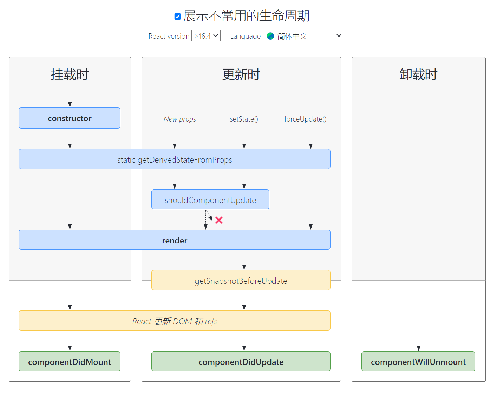

# 一、react项目创建

## vite搭建

### 1、创建项目

```
pnpm create vite music-web --template react-ts
```

其中，`react-demo` 是当前项目根目录的文件名，可自行定义。

### 2、下载依赖包

```
cd react-demoyarn
```

### 3、启动项目

```
yarn dev# 或npm run dev
```

##  CRA搭建

React 官方基于 webpack 发布了一个脚手架工具 Create React App（简称 CRA），用来搭建 React 项目。

### 1、创建项目

```
npx create-react-app react-project
```

通过以上命令创建的 React 项目，会自动将项目所需的所有依赖包都下载下来。

### 2、启动项目

```
yarn start# 或npm start
```


# 二、JSX语法

JSX 语法：允许将HTML 语法直接加入到 JavaScript 代码中，再通过翻译器转换到纯 JavaScript 后由浏览器执行。在实际开发中，JSX 在产品打包阶段都已经编译成纯 JavaScript，不 会带来任何副作用，反而会让代码更加直观并易于维护。


## 语法基础

在标签内部可以使用`{}` 写js代码

### 1、根节点

JSX 中要求每一个组件必须有一个根节点，通常情况下，我们可以使用空标签来作为组件的根节点：

```js
export default class App extends Component {
    // 渲染组件
    render() {
        return (
            <>
                <h1>你好</h1>
                <HelloWorld></HelloWorld>
            </>
        )
    }
}
```

### 2、渲染动态数据

```js
let name = '张三';
export default class MyComponent extends Component {
    render() {
        return (
            <div>
                <h1>你好，{name}</h1>
            </div>
        )
    }
}
```

### 3、渲染动态属性

```js
let key = 'username';
export default class MyComponent extends Component {
    render() {
        return (
            <div>
                <input type="text" name={key} />
            </div>
        )
    }
}
```

### 4、数学运算

```js
et num1 = 100;
let num2 = 20;
export default class MyComponent extends Component {
    render() {
        return (
            <div>
                <h1>{num1 + num2}</h1>
            </div>
        )
    }
}
```

### 5、三元运算符

```js
let age = 20;
export default class MyComponent extends Component {
    render() {
        return (
            <div>
                <h1>{age >= 20 ? '成年' : '未成年'}</h1>
            </div>
        )
    }
}
```

### 6、函数的调用

```js
function isAge() {
    if (age >= 18) {
        return '成年'
    }
    return '未成功'
}
export default class MyComponent extends Component {
    render() {
        return (
            <div>
                <h1>{isAge()}</h1>
            </div>
        )
    }
}
```

## 特殊属性

```html
<div className='box'></div>
<label htmlFor="username"></label>
```

## 列表渲染

保证{}内是数组就可以

```js
let arr = ['张三', '李四', '王五'];
export default class MyComponent extends Component {
    render() {
        return (
            <div>
                <ul>
                    {
                        arr.map((item, index) => {
                            return <li key={index}>{item}</li>
                        })
                    }
                </ul>
            </div>
        )
    }
}
```


# 三、组件

React 中根据组件的形式分为两种组件：

1. 类组件：用的 ES6 中 class 的语法来创建组件
2. 函数组件：用的函数的语法来创建组件

## 类组件

### 1、创建类组件

```js
import React, { Component } from 'react'
export default class App extends Component {
    // 渲染组件
    render() {
        return (
            <h1>你好</h1>
        )
    }
}
```

快捷键：rcc

### 2、嵌套组件

```js
import React, { Component } from 'react'
import HelloWorld from './components/helloWorld/HelloWorld'
export default class App extends Component {
    // 渲染组件
    render() {
        return (
            <div>
                <h1>你好</h1>
                <HelloWorld></HelloWorld>
            </div>
        )
    }
}
```


## 组件样式

### 1 内联样式

```js
<h1 style={{ color: 'red', backgroundColor: '#eee' }}>你好</h1>
```

### 2 外部样式

#### ① 全局样式

外部的全局样式文件，对于文件名没有特殊要求，按照常规的样式文件后缀名（例如：`.css`、`.scss`、`.less`）即可。

在任意一个组件中通过 `import` 引入后，都会作用于当前项目中所有的组件。

```js
import './index.css';

```

#### ② 局部样式

外部的局部样式文件，需要满足以下几个条件：

1. 文件名必须以 `.module.css`、`.module.scss` 等为结尾；
2. 样式选择器只能使用 class 类选择器；

在引入局部样式文件时，需要通过 `import ... from` 来引入：

```js
import styles from './index.module.css';

```

使用时，将类选择器作为 `styles` 身上的一个属性来使用：

```js
<h1 className={styles.bgColor}>hello</h1>

```


# 类组件状态

快捷键：rce

## 一、定义类组件的状态

这是一个语法糖，真正写全是定义在  construct里面

```js
export default class StateComponent extends Component {
    state = {
        count: 10,
        msg: 'hello'
    }
    render() {
        return (
            <div>StateComponent</div>
        )
    }
}
```

## 二、访问类组件的状态

推荐解构

```js
export default class StateComponent extends Component {
    state = {
        count: 10,
        msg: 'hello'
    }
    render() {
        const { count, msg } = this.state;
        return (
            <div>
                <h1>{this.state.count}</h1>
                <h2>{count}</h2>
                <h1>{this.state.msg}</h1>
                <h1>{msg}</h1>
            </div>
        )
    }
}
```

## 三、修改类组件的状态

 使用this.setState()

```js
export default class StateComponent extends Component {
    state = {
        count: 10,
        msg: 'hello'
    }
    render() {
        const { count, msg } = this.state;
        return (
            <div>
                <h1>{this.state.count}</h1>
                <h2>{count}</h2>
                <h1>{this.state.msg}</h1>
                <h1>{msg}</h1>
                <button onClick={() => {
                    // 修改state数据
                    this.setState({
                        msg: '你好',
                        count: count + 1
                    });
                }}>修改 msg</button>
            </div>
        )
    }
}
```

## 四、setState 的扩展

### 1、setState 是异步方法

如果要查看修改后的数据，可以通过 setState 的第二个参数 —— 回调函数，来输出查看：

```js
this.setState({
    msg: '你好',
    count: count + 1
}, () => {
    console.log(this.state.msg, this.state.count);
});
```

### 2、setState 会触发 render

更新组件状态：setState 修改完数据后，会重新触发 render 方法的执行，让组件重新渲染，更新页面。

合并更新：setState方法并不会立即改变组件的状态，而是将要更新的状态合并到当前状态中，然后在下一个自然渲染周期中应用这些状态的变化。这样做是为了优化性能，防止频繁的重新渲染。

# 类组件中的事件

## 一、绑定事件

最好都写一层箭头函数 (e)=>{}，但得注意组件刷新函数地址会变动，有些隐患。

```js
export default class EventComponent extends Component {
    render() {
        return (
            <div>
                <button onClick={() => {
                    console.log('事件绑定成功');
                }}>按钮</button>
            </div>
        )
    }
}
```

## 二、事件方法

```js
export default class EventComponent extends Component {
    sayHello = () => {
        console.log('hello');
    }
    render() {
        return (
            <div>
                <button onClick={this.sayHello}>按钮</button>
            </div>
        )
    }
}
```

## 三、事件传参

```js
export default class EventComponent extends Component {
    sayHello = (name) => {
        console.log('hello', name);
    }
    render() {
        return (
            <div>
                <button onClick={() => {
                    this.sayHello('张三');
                }}>张三</button>
                <button onClick={() => this.sayHello('李四')}>李四</button>
            </div>
        )
    }
}
```

## 四、事件对象

是合成对象，但有target

```js
export default class EventComponent extends Component {
    render() {
        return (
            <div>
                <button onClick={(event) => {
                    event.preventDefault();
                    event.stopPropagation();
                }}>按钮</button>
            </div>
        )
    }
}
```

# createRef 的使用

## 一、调用 createRef

React 中提供了一个 `createRef` 的方法，用来注册绑定节点：

```js
import React, { Component, createRef } from 'react'
export default class TodoList extends Component {
    // 调用 createRef，得到一个 ref 对象
    inputRef = createRef();
    render() {
        return (
            <>
                <div>
                    {/* 通过 ref 属性，绑定 ref 对象 */}
                    <input type="text" ref={this.inputRef} />
                    <button>新增</button>
                </div>
            </>
        )
    }
}
```

## 二、通过 ref 获取节点

当节点身上通过 ref 属性绑定了 createRef 的对象后，后续我们就可以通过 createRef 的对象来获取对应节点：

```js
import React, { Component, createRef } from 'react'
export default class TodoList extends Component {
    inputRef = createRef();
    addTodo = () => {
        // 获取 input 节点
        console.log(this.inputRef.current);
    }
    render() {
        return (
            <>
                <div>
                    <input type="text" ref={this.inputRef} />
                    <button onClick={this.addTodo}>新增</button>
                </div>
            </>
        )
    }
}
```

## 三、使用ref存储数据

可以使用他的current存储数据，但是这个数据更新不会触发页面更新。当数据变动不需要页面更新的时候可以使用。

# 类组件生命周期



## 一 常用生命周期

### 1、render

render 方法，会在组件首次渲染和组件更新时执行。作用是：用于渲染首次挂载的虚拟节点，以及后续每次数据更新后，渲染新的虚拟节点。这里能获取数据，在渲染器更改数据。

### 2、componentDidMount

componentDidMount 方法，会在组件挂载完成后执行。作用是：用来发送网络请求。

### 3、componentWillUnmount

componentWillUnmount 方法，会在组件卸载前执行。作用是：清除组件中的计时器。

### 4、示例代码

```jsx
export default class ClassLifecycle extends Component {    
    componentDidMount() {        console.log('componentDidMount 组件挂载完成');    }   
    componentWillUnmount() {        console.log('componentWillUnmount 组件卸载前');    }   
    render() {       
        console.log('render')        
        return ( <div>ClassLifecycle</div>        )    
    }
}
```

## 二、类组件性能优化

### 1、shouldComponentUpdate

在 React 中，类组件是否更新，不是取决于数据是否发生改变，而是看是否调用了 `setState()` 方法。一旦 `setState()` 方法被调用，`render()` 方法就会重新执行，然后重新渲染组件。

这样的处理方式，会导致出现很多没有必要的 `render` 渲染。因此，为了解决这个问题，我们就可以借助 `shouldComponentUpdate` 生命周期函数。

在该函数中，可以通过参数获取到变化后的 state，以及变化的前的 state。通过对两个 state 进行比较，来返回一个布尔值，决定 render 是否要执行。

```js
import React, { Component } from 'react'
export default class LifeCycle extends Component {
    state = {
        count: 1
    }
    shouldComponentUpdate(props, state) {
         if(state.count == this.state.count) {
             return false;
         }
         return true;
    }
    render() {
        return (
            <div>
                <button onClick={() => {
                    this.setState({
                        count: 1
                    });
                }}>按钮</button>
            </div>
        )
    }
}
```

### 2、PureComponent

PureComponent 纯组件内部已经将 shouldComponentUpdate 自动处理好了。`但是是对state进行的浅比较。`

```js
import React, { PureComponent } from 'react'
 export default class ClassLifeCycle extends PureComponent { 
     render() {
         return (
             <div></div>
         )
     }
 }
```


#  父子组件间的通信

## 一、父传子：props

通过属性传值

### 1、父组件传值

```js
export default class Father extends Component {
    state = {
        gender: '男'
    }
    render() {
        return (
            <div>
                Father
                <Child name="张三" age={20} gender={this.state.gender}></Child>
            </div>
        )
    }
}
```

### 2、子组件接收值

```js
export default class Child extends Component {
    // constructor(props) {
    //     super(props);
    // }
    render() {
        const { name, age, gender } = this.props;
        return (
            <div>
                <p>{name}</p>
                <p>{age}</p>
                <p>{gender}</p>
            </div>
        )
    }
}
```

注意：子组件中通过 props 接收到数据是“只读”数据，不能修改 props 的数据。

### 3、props 的默认值

```js
export default class Child extends Component {
    static defaultProps = {
        gender: '女'
    }
}

```

### 4、props 的验证

```js
import React, { Component } from 'react'
import pt from 'prop-types'
export default class Child extends Component {
    // 设置 props 的类型
    static propTypes = {
        age: pt.number,
        name:pt.oneOfType([pt.string, pt.number]) //设置多种
    }
}
```

列举几个常用的类型：

1. 字符串：`pt.string`
2. 数字：`pt.number`
3. 布尔值：`pt.bool`
4. 数组：`pt.array`
5. 对象：`pt.object`
6. 函数：`pt.func`
7. 多个类型中的任意一个：`pt.oneOfType([pt.string, pt.number, ...])`

## 二、子传父：回调函数

### 1、父组件传递函数

```js
export default class Father extends Component {
    getChildData = (data) => {
        console.log('子组件传递的数据', data);
    }
    render() {
        return (
            <div>
                Father
                <Child getChildData={this.getChildData}></Child>
            </div>
        )
    }
}
```

### 2、子组件调用函数并传值

```js
export default class Child extends Component {
    render() {
        const { getChildData } = this.props;
        return (
            <div>
                <button onClick={() => {
                    getChildData('hello');
                }}>传值</button>
            </div>
        )
    }
}
```


# 非父子组件之间的通信

## 一、兄弟组件传值：事件总线

### 1、下载插件

```
yarn add events
```

### 2、创建事件总线

我们手动创建一个 `events.js` 文件：

```js
import { EventEmitter } from 'events';
const events = new EventEmitter();
export default events;
```

### 3、监听事件

在负责**接收数据的组件**中，引入事件总线对象，并添加事件：

```js
import events from './events'
export default class ChildB extends Component {
    componentDidMount() {
        // 往 events 身上添加了一个 getData 的方法，后续谁调用该方法，就可以传值给组件B
        events.addListener('getData', (data) => {
            console.log('接收兄弟组件传递的参数', data);
        });
    }
    render() {
        return (
            <div>ChildB</div>
        )
    }
}
```

### 4、派发事件

在负责**传递数据的组件**中，引入事件总线对象，并触发事件：

```js
import events from './events'
export default class ChildA extends Component {
    render() {
        return (
            <div>
                ChildA
                <button onClick={() => {
                    // 调用 events 身上绑定的 getData 方法，并传值
                    events.emit('getData', '你好');
                }}>传值</button>
            </div>
        )
    }
}
```

## 二、多级嵌套组件传值：context

### 1、创建 Context

我们手动创建一个 context.js 文件，用来创建 Context 对象：

```js
import { createContext } from "react";
const Context = createContext();
export default Context;
```

### 2、顶层组件传值

```js
import React, { Component } from 'react'
import ChildA from './ChildA'
// 引入外部的 Context
import Context from './context'
export default class Father extends Component {
    state = {
        name: '张三'
    }
    render() {
        return (
            {/* 通过 Context.Provider 设置需要传递的数据， value 对象用来设置需要传递的数据 */}
            {/* 只要是 Context.Provider 包裹的后代都可以接收值*/}
            <Context.Provider value={{ name: this.state.name, age: 20 }}>
                <ChildA></ChildA>
            </Context.Provider>
        )
    }
}
```

### 3、内层组件接收值

这个后代组件不管是第几层都可以接收

```js
import React, { Component } from 'react'
import Context from './context'
export default class Test extends Component {
    render() {
        return (
            <Context.Consumer>
                {
                    (value) => {
                        // value 用来接收顶层组件传递的数据
                        console.log(value);
                        return (
                            <div>
                                <h1>第四层子组件</h1>
                            </div>
                        )
                    }
                }
            </Context.Consumer>
        )
    }
}
```


# React插槽

这是类似vue插槽的功能，较真的说并不是插槽。是利用props上的children而已

插槽的作用，就是父组件可以通过插槽传递节点给子组件，子组件中接收到节点后进行渲染。

## 一、父组件传递节点

我们在父组件 CouponsAdd 中，使用子组件 CoverModal，并往子组件中包裹一组标签：

```jsx
import CoverModal from './CoverModal'
export default class CouponsAdd extends Component {
    render() {
        return (
            <div>
                <CoverModal>
                    <h3>新增优惠券</h3>
                    <div>
                        <label>优惠券名称</label>
                        <input type="text" />
                    </div>
                    <div>
                        <label>优惠券面值</label>
                        <input type="text" />
                    </div>
                </CoverModal>
            </div>
        )
    }
}
```

## 二、子组件渲染节点

子组件中通过 `this.props.children` 接收到父组件传递的节点，并渲染：

```jsx
export default class CoverModal extends Component {
    render() {
        return (
            <div className='cover'>
                <div className='form'>
                    {this.props.children}
                </div>
            </div>
        )
    }
}
```


# 函数组件


快捷键：rface

在 React 16.8 版本之前，函数组件也称为“无状态组件”，函数组件没有自己的内部数据，也没有自己的生命周期函数。

从 16.8 开始，React 中专门为函数组件新增了 Hook 方法，这些方法就是用来解决函数组件没有状态、没有生命周期的问题。

## 一、useState

### 1、定义初始数据

useState 用于在函数组件内部定义数据。

```jsx
import { useState } from 'react';
const App = () => {
    const [变量, 方法] = useState(初始值);
    return (...)
}
```

说明：

- `变量`：用于接收 useState 中定义的数据；
- `方法`：调用该方法，用于修改变量的数据值，等同于类组件中的 `this.setState()`；

栗子:

```jsx
const RolesPage = () => {
    const [rolesData, setRolesData] = useState([
        { _id: 1, name: '超级管理员', createTime: '2020' },
        { _id: 2, name: '普通管理员', createTime: '2022' },
        { _id: 3, name: '财务', createTime: '2023' }
    ]);
     // 删除角色
    const deleteRole = (id) => {
        // 调用setRolesData 修改 rolesData
        setRolesData(rolesData.filter(item => item._id != id));
    }
    return (
        {/*使用rolesData */}
        <Table columns={columns} dataSource={rolesData} rowKey="_id" />
    )
}
```


## 二、 父组件调用子组件的方法

### 1、父组件创建ref绑定子组件

```jsx
import { useRef } from 'react';
const Father = () => {
    const childRef = useRef();
    return (
        <Child ref={childRef}></Child>
    )
}
```

### 2、子组件获取ref

```jsx
import { forwardRef } from 'react'
// ref 的第二个位置的形式参数
const Child = forwardRef((props, ref) => {
})
export default Child;
```

### 3、子组件暴露方法

```jsx
import { useImperativeHandle } from 'react';
const Child = (props, ref) => {
    useImperativeHandle(ref, () => {
        return {
            // 返回给父组件的数据或方法 ,方法可以有形参
            showModal(params){
                
            }
        }
    })
}
```

### 4、父组件接收子组件传递的数据或方法

```jsx
import { useRef } from 'react';
const Father = () => {
    const childRef = useRef();
    const fatherEvent = () => {
        console.log(childRef.current);  // 子组件暴露给父组件的东西 在childRef.current里面
        childRef.current.showModal();
    }
    return (
        <>
            <button onClick={fatherEvent}></button>
            <Child ref={childRef}></Child>
        </>
    )
}
```

## 三、生命周期

从 React 16.8 开始，新增了 `useEffect` 的 Hook 方法，用于在函数组件中来模拟生命周期。

`useEffect` 接收两个参数，第一个为回调函数，会在指定时机执行。第二参数为数组，当数组指定的数据发送改变便执行第一个参数传递的函数。 useEffect return 一个函数，此函数会在销毁的时候执行

### 1、没有第二个参数

```jsx
import  {useEffect } from 'react';
useEffect(() => {
    // 组件挂载完成时执行 和 组件更新时执行
})
```

### 2、第二参数为空数组

```jsx
useEffect(() => {
    // 组件挂载完成时执行
}, [])
```

### 3、第二个参数为非空数组

```jsx
useEffect(() => {
    // 组件挂载完成时执行
    // 数组中任意一条数据发生改变时执行
}, [数据1, 数据2])
```

### 4、返回新函数

```jsx
useEffect(() => {
    return () => {
        // 清除订阅
        // 组件销毁前执行
    }
}, [])
```


## 四、函数组件性能优化

### useMemo

useMemo 用来缓存数据。

```js
import { useMemo } from 'react';

const App = () => {
    
    const result = useMemo(() => {
        return 计算的结果;
    }, [依赖的数据项])
    
}
```

### React.memo()

React.memo() 用来缓存组件。

```jsx
import { memo } from 'react';

const App = () => {
    
}

export default memo(App);
```

在函数组件中，默认情况下父组件更新，子组件也会同步更新。

React.memo() 的作用可以用来缓存组件，缓存后的组件，只要组件内部的 state 或 props 没有发生改变，组件就不会更新。

### useCallback

useCallback 用来缓存方法。

函数组件中的方法，在组件更新时，所有的方法默认会重新创建。

```jsx
import { useCallback  } from 'react';

const App = () => {
    
    const sayHello = () => {}
    const sayHelloCb = useCallback(sayHello, []);
    
}
```


### immer

[官方地址](https://immerjs.github.io/immer/zh-CN/)

1. 深度拷贝，但是深拷贝的成本较高，会影响性能；
2. [ImmutableJS](https://github.com/facebook/immutable-js)，非常棒的一个不可变数据结构的库，可以解决上面的问题，但跟 Immer 比起来，ImmutableJS 有两个较大的不足：
   1. 需要使用者学习它的数据结构操作方式，没有 Immer 提供的使用原生对象的操作方式简单、易用；
   2. 它的操作结果需要通过toJS方法才能得到原生对象，这使得在操作一个对象的时候，时刻要主要操作的是原生对象还是 ImmutableJS 的返回结果，稍不注意，就会产生问题；


# react-router


## 一、下载路由插件

```bash
yarn add react-router-dom
```

## 二、配置一级路由

### 1、创建路由组件

通常，我们把参与路由配置的组件，称为“页面组件”。这些组件我们都放在 `src/pages` 目录中。

例如我们需要登录页和布局页：

```bash
src
 |--- pages
 |      |--- login
 |      |      |--- LoginPage.jsx
 |      |--- index
 |      |      |--- IndexPage.jsx
```

### 2、路由配置

路由懒加载，当用户访问当前路由时，才开始加载对应的组件。

```jsx
import React, { Suspense, lazy } from 'react';
import { HashRouter, BrowserRouter, Routes, Route } from 'react-router-dom';
// lazy 懒加载
const NotFound = lazy(() => import('./pages/404/NotFound'));
const App = () => {
    return (
        <Suspense fallback={<p>页面加载中...</p>}>
            <BrowserRouter>
                <Routes>
                    {/* path :路由地址 ， element: 组件*/}
                    <Route path="*" element={<NotFound />}></Route>
                </Routes>
            </BrowserRouter>
        </Suspense>
    )
}
```

### 3、路由出口配置

```jsx
import { Outlet } from 'react-router-dom'; 
{/* 配置二级路由出口 */}
<Outlet></Outlet>
```


## 三、 路由跳转

### 1、Link 标签跳转

```jsx
import { Link } from 'react-router-dom'
const LoginPage = () => {
    return (
        <div>
            <Link to="/">去首页</Link>
            <Link to="/register">没有账号？去注册</Link>
        </div>
    )
}
```

### 2、事件跳转

```jsx
import { useNavigate } from 'react-router-dom'
const LoginPage = () => {
    const navigate = useNavigate();
    return (
        <div>
            <button onClick={() => {
                // 跳转到 IndexPage
                navigate('/');
                // 跳转后不保留记录
                navigate('/', { replace: true });
            }}>登录</button>
        </div>
    )
}
```

## 四、二级路由

二级路由，是直接嵌套在一级路由的配置中。

```js
import IndexPage from '@p/index/IndexPage';
import UsersPage from '@p/index/users/UsersPage';
const App = () => {
    return (
        <BrowserRouter>
            <Routes>
                <Route path="/" element={<IndexPage />}>
                    {/* 配置 IndexPage 的子路由 */}
                    <Route path="users" element={<UsersPage />}></Route>
                </Route>
            </Routes>
        </BrowserRouter>
    )
}
```

配置二级路由出口

我们在一级路由对应的组件中，通过 <Outlet/>配置子路由的出口：

```jsx
// 引入路由出口组件
import { Outlet } from 'react-router-dom';
const IndexPage = () => {
    return (
        <Layout className={styles.indexLayout}>     
            <Layout>
                <Content>
                    <div>
                        {/* 配置二级路由出口 */}
                        <Outlet></Outlet>
                    </div>
                </Content>
            </Layout>
        </Layout>
    )
}
```

## 五 路由传参

### 1、动态路由传参

我们可以将需要传递的参数拼接到路由的路径中，来实现动态路由的传参。

```jsx
<Link to={`/goods/update/${value}`}>修改</Link>

```

其中，`value` 是我们要传递的动态参数的变量名。

### 2、配置动态路由

在配置路由时，动态路由的配置和普通路由也有区别：

```jsx
<Route path="goods/update/:id" element={<GoodsUpdate />}></Route>

```

`:id` 中的 `id` 是任意变量名，用来匹配路由路径中动态的部分。

### 3、组件中接收参数

在组件中，通过调用 `useParams` 来接收动态路由的参数。

```jsx
import { useParams } from 'react-router-dom'
const GoodsUpdate = () => {
    const params = useParams();
    console.log('接收到的参数', params);
    return (
        <div>GoodsUpdate</div>
    )
}

```

# 状态机 Redux

## 一、安装 redux

```jsx
yarn add redux react-redux
```

## 二、仓库初始化

### 1、创建配置文件

```bash
src
 |--- store
 |      |--- index.js  # 主仓库的配置文件
```

### 2、创建仓库对象

```jsx
import { legacy_createStore } from 'redux'
const store = legacy_createStore();
export default store;
```

### 3、全局挂载仓库

在项目的入口文件 `main.jsx` 或者 `index.js` 中添加以下代码：

```jsx
import { Provider } from 'react-redux';
import store from './store';
const root = ReactDOM.createRoot(document.getElementById('root'));
root.render(
    <Provider store={store}>
        <App />
    </Provider>
);
```

## 三、配置仓库模块

我们以角色模块为例。

### 1、创建模块文件

```bash
src
 |--- store
 |      |--- roles
 |      |      |--- reducer.js
```

### 2、定义初始数据

```jsx
import { SET_ROLE } from "../actionsConfig";
const initData = []; //初始化默认数据
export const rolesReducer = (state = initData, actions) => {
    switch (actions.type) {
        case SET_ROLE:
            return actions.payload;
            break;
        default:
            return state;
            break;
    }
};
```

### 3、合并 reducer

在仓库的主文件中，引入 reducer 函数，通过 combineReducers 方法，将所有的 reducer 函数合并在一起，最后添加到仓库中：

```jsx
import { legacy_createStore, combineReducers } from 'redux'
// 引入角色的 reducer
import { rolesReducer } from './roles/reducer';
// 合并 reducer
const allReducers = combineReducers({
    roles: rolesReducer
})
const store = legacy_createStore(allReducers);
```

### 4、组件中获取仓库数据

```jsx
import { useSelector } from 'react-redux';
const RolesPage = () => {
    const roles = useSelector((state) => {
        return state.roles;
    });
    console.log(roles);
}
```

当仓库中的数据发生改变时，useSelector 会自动重新获取最新的数据。

### 5、组件中触发 reducer

```jsx
import { useDispatch } from 'react-redux';
const RolesPage = () => {
    const dispatch = useDispatch();
    // 删除角色
    const deleteRole = (id) => {
        // 删除仓库中的数据
        dispatch({ type: 'deleteOne', payload: { id } });
    }
}
```

## 四、处理异步方法，一般用于提取网络请求

目前处理 Redux 异步操作的中间件主要有两种：

1. redux-thunk
2. redux-saga：基于 ES6 中 generator（生成器）语法

## 一、下载 redux-thunk

```
yarn add redux-thunk
```

## 二、配置中间件

```jsx
//  store/index.js
import { applyMiddleware } from 'redux'
import thunk from 'redux-thunk';
const store = legacy_createStore(allReducers, applyMiddleware(thunk));
```

中间件配置成功后，我们的 redux 中，就可以处理公共的异步方法了。

## 三、处理公共的异步方法

### 1、创建文件

```bash
src
 |--- store
 |      |--- users
 |      |      |--- actions.js   # 异步方法  和reducer同级
 |      |      |--- reducer.js
```

### 2、提取公共异步方法

```jsx
import roles from '@/apis/roles';
import { SET_ROLE } from '../actionsConfig';

// 手动设置状态机数据
export const setRolesAsync = () => {
    return async (dispatch) => {
        const res = await roles.findRoles();
        if (1 == res.code) {
            dispatch({ type: SET_ROLE, payload: res.data });
        }
    };
};
// 从后台获取数据
export const getRolesAsync = () => {
    return async (dispatch,id) => {
        const res = await roles.findRoleById({ roleId: id});
        if (1 == res.code) {
            dispatch({ type: SET_ROLE, payload: res.data });
        }
        return res.code;
    };
};
export default { setRolesAsync,getRolesAsync };
```

### 3、组件调用仓库的异步方法

```jsx
import { useDispatch, useSelector } from 'react-redux';
import actionsRole from '../../store/roles/actions';
const loadData = () => {
    const dispatch = useDispatch();
    // 获取角色数据
    const getUsers = async () => {
        // 调用仓库中公共的异步方法
        dispatch(actionsRole.setRolesAsync())
    }
}
```


## 五 、自定义 Hook

更高级的异步/网络请求分离

## 一、基本语法

自定义 Hook，实际上就是自己创建一个函数。但是 Hook 函数和普通函数的区别在于：

1. Hook 函数命名时必须以 use 开头；
2. Hook 函数可以使用其他的 Hook 方法，但是普通函数中不行；

```jsx
const useRequest = () => {}
```

## 二、应用场景

可以将状态机中所有公共的异步方法封装到自定义 Hook 中，来代替 thunk 中间件的使用。

### 1、创建 Hook 目录

```jsx
src
 |--- hooks
 |      |--- useRequest.js
```

### 2、封装自定义 Hook

感觉像是装饰器，过一遍之后返回处理好的(或者实际需要的函数)

```jsx
import { useDispatch, useSelector } from 'react-redux';
import roles from '@/apis/roles';
import { SET_ROLE } from '../store/actionsConfig';
const useRequest = () => {
    const dispatch = useDispatch();
    const rolesStore = useSelector((state) => state.roles);
    const setRolesAsync = async () => {
        const res = await roles.findRoles();
        if (1 == res.code) {
            dispatch({ type: SET_ROLE, payload: res.data });
        }
    };
    const getRolesAsync = async (id) => {
        const res = await roles.findRoleById({ roleId: id });
        if (1 == res.code) {
            dispatch({ type: SET_ROLE, payload: res.data });
        }
        return res.code;
    };
    return { rolesStore, setRolesAsync,getRolesAsync };
};

export default useRequest;

```

### 3、组件中调用自定义 Hook

```jsx
import useRequest from '../../hooks/useRequest';
const RoleClass = () => {
    //rolesStore ：状态机数据
    const { rolesStore, setRolesAsync, getRolesAsync } = useRequest();
    const loadData = async () => {
        setRolesAsync();
    };
    useEffect(() => {
        loadData();
    }, []);
}

```

# 高阶组件，HOC

## 一、概念

高阶组件，HOC。

高阶组件本质上是一个函数，它和普通的区别在于：

1. 该函数需要接收一个组件作为参数
2. 最终需要返回一个功能增强的组件

## 二、处理按钮权限

### 1、创建目录

```bash
src
 |--- hoc
 |     |--- withAuth.jsx
 |     |--- AuthButton.jsx
```

### 2、封装按钮组件

在 `AuthButton.jsx` 组件中，对 antd 的 Button 组件做进一步的封装：

```jsx
import React from 'react'
import { Button } from 'antd'
const AuthButton = (props) => {
    return (
        <Button {...props}>{props.children}</Button>
    )
}
export default AuthButton
```

### 3、封装 HOC

在 `withAuth.jsx` 文件中封装 HOC：

```jsx
const withAuth = (Component) => (props) => {
    const { role } = JSON.parse(localStorage.userInfo || '{}');
    if (role.name == '超级管理员') {
        return <Component {...props} />
    }
    // return null;  // 不显示按钮
    // 显示禁用按钮
    return <Component disabled={true} {...props} />
}
export default withAuth;
---------------------------------------
import { getLogin } from '@/utils/utils';
const withAuth = (Component) => {
    return (props, ref) => {
        const login = getLogin();
        const userPower = login ? login.userInfo.role.name : '';
        if ('超级管理员' === userPower) {
            return <Component {...props}></Component>;
        } else {
            return <Component disabled {...props}></Component>;
        }
    };
};
export default withAuth;

```

### 4、使用 HOC处理自定义组件

封装好 HOC 后，需要将 AuthButton 传给 HOC 进行处理：

```jsx
import React, { memo } from 'react';
import { Button } from 'antd';
import withAuth from '../withAuth';
const AuthButton = (props) => {
    console.log("AuthButton 执行")
    return <Button {...props}> {props.children} </Button>;
};
export default memo(withAuth(AuthButton)) ;
```

### 5、页面使用权限按钮

因为我们的 AuthButton 是基于 antd 的 Button 封装的，所以 Button 的属性都可以设置在 AuthButton 上：

```jsx
import AuthButton from '../../../hoc/button/AuthButton';
<AuthButton danger onClick={singleton(delData,record._id,record._id)}>
    删除
</AuthButton>
```

singleton 函数为一个自定义的装饰器,配合React.memo()

```js
/**
 * 场景：子组件为按钮，当父组件更新时由于onclick每次都会产生新函数，导致按钮刷新
 * 伪单件模式，为每个按钮提前生成执行函数，避免父组件刷新的时候产生新函数，导致子组件渲染
 * 牺牲空间换性能，更具场景取舍
 */
let instantiate = []; //将函数处理为单件模式，刷新的时候不需要生成新的事件函数,同种类型的
export function singleton(fn, key, ...param) {
    if (!instantiate[key]) {
        instantiate[key] = () => {
            fn(...param);
            instantiate[key] = ''; // 执行过就清空了，不要这行只能执行一次
            return;
        };
    }
    return instantiate[key];
}
```

## 6 逻辑复用

自定义hook

```js
import { useDispatch, useSelector } from 'react-redux';
import { SET_SYS_THEME } from '../store/actionsConfig';
const useSystem = () => {
    const dispatch = useDispatch();
    const systemStore = useSelector((state) => state.system);
    const setSystemTheme = (type) => {
        dispatch({ type: SET_SYS_THEME, payload: type });
    };
    return { systemStore, setSystemTheme };
};

export default useSystem;

```

# React 中使用 Echarts

## 一、下载

```bash
yarn add echarts echarts-for-react
```

## 二、使用 echarts

### 1、引入

```bash
import ReactEcharts from 'echarts-for-react'
```

### 2、定义图表数据

- 推荐使用数据集，dataset。ECharts 4 开始支持

```jsx
const option = {
    title: {
        text: 'ECharts 入门示例',
    },
    legend: {},
    // 工具栏
    toolbox: {
        show: true,
        orient: 'vertical',
        right: 0,
        top: 0,
        iconStyle: { borderColor: '#000' }, //图形描边颜色，就设置这个
        feature: {
            //开启对应工具按钮
            // dataView: { readOnly: false },
            // restore: {}, //配置还原
            saveAsImage: { title: '下载' },
        },
    },
    tooltip: {},
    dataset: {
        // 用 dimensions 指定了维度的顺序。直角坐标系中，如果 X 轴 type 为 category，
        // 默认把第一个维度映射到 X 轴上，后面维度映射到 Y 轴上。
        // 如果不指定 dimensions，也可以通过指定 series.encode
        // 完成映射，参见后文。
        dimensions: ['product', '2015', '2016', '2017'],
        source: [
            { product: 'Matcha Latte', 2015: 43.3, 2016: 85.8, 2017: 93.7 },
            { product: 'Milk Tea', 2015: 83.1, 2016: 73.4, 2017: 55.1 },
            { product: 'Cheese Cocoa', 2015: 86.4, 2016: 65.2, 2017: 82.5 },
            { product: 'Walnut Brownie', 2015: 72.4, 2016: 53.9, 2017: 39.1 },
        ],
    },
    xAxis: {
        type: 'category',
    },
    yAxis: {},
    series: [
        {
            type: 'line',
        },
        {
            type: 'line',
        },
        {
            type: 'line',
        },
    ],
};
```

### 3、渲染图表

```jsx
const Home = () => {
    return <ReactEcharts option={option} style={{ width: '600px' }}></ReactEcharts>;
};
```


