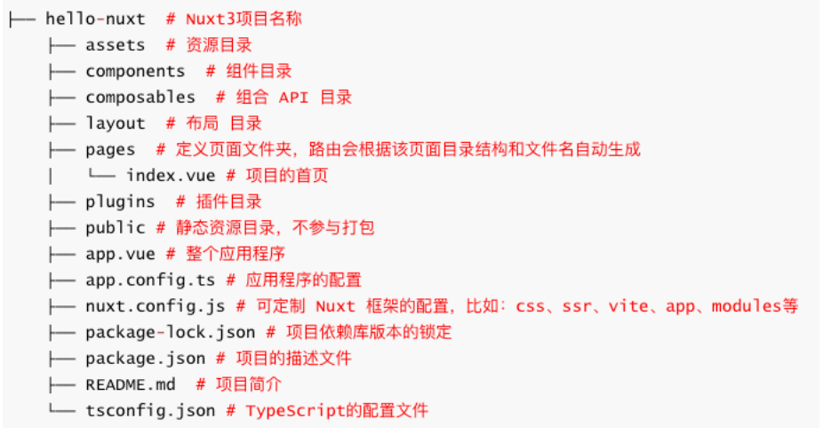
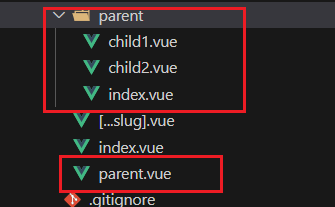
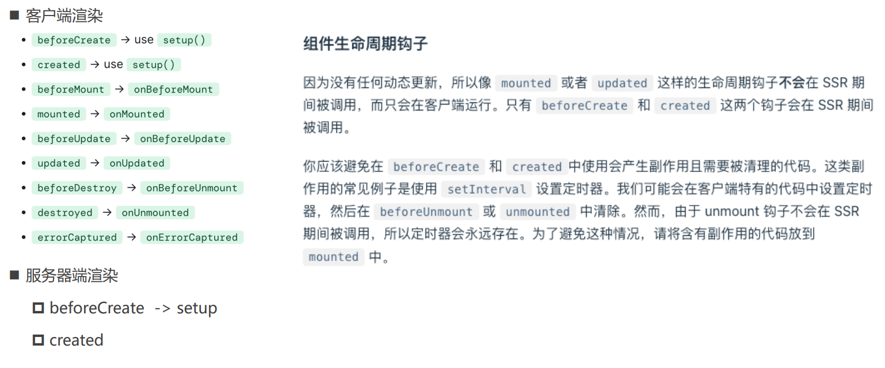

---

title: Nuxt
order: 2
group:
  title: SSR

---

# Nuxt

[Nuxt](https://nuxt.com.cn/docs/getting-started/introduction)


## Nuxt3 环境搭建

pnpm dlx nuxi@latest init <project-name>

### 报错

[starter](https://github.com/nuxt/starter/blob/templates/templates/v3.json)

[v3模版](https://codeload.github.com/nuxt/starter/tar.gz/refs/heads/v3)

## 目录



## Nuxt配置 nuxt.config.ts

```ts
export default defineNuxtConfig({
  runtimeConfig: {
    // 只在服务器端可用的私有键
    apiSecret: '123',
    // public中的键也可以在客户端使用
    public: {
      apiBase: '/api'
    }
  },
   app: {
    // 给app所有的页面的head添加的配置(SEO, 添加外部的资源)
    head: {
      title: "shop",
      charset: "UTF-8",
      viewport:
        "width=device-width, initial-scale=1.0, maximum-scale=1.0, minimum-scale=1.0,user-scalable=no",
      meta: [
        {
          name: "keywords",
          content: "弘源科教 hykj",
        },
        {
          name: "description",
          content: "手机商城 hykj",
        },
      ],
    },
  },
    css: [
      // Load a Node.js module directly (here it's a Sass file).
      'bulma',
      // CSS file in the project
      '~/assets/css/main.css',
      // SCSS file in the project
      '~/assets/css/main.scss'
    ]

})
// 这些变量通过useRuntimeConfig()组合函数暴露给应用程序的其余部分。
```

## 应用程序配置 app.config.ts

```ts
export default defineAppConfig({
  title: 'Hello Nuxt',
  theme: {
    dark: true,
    colors: {
      primary: '#ff0000'
    }
  }
})
// 这些变量通过useAppConfig组合函数暴露给应用程序的其余部分。
```

## Nuxt3 内置组件

1. SEO组件： Html、Body、Head、Title、Meta、Style、Link、NoScript、Base

2. NuxtWelcome：欢迎页面组件

3. NuxtLayout：是 Nuxt 自带的页面布局组件

4. NuxtPage：是 Nuxt 自带的页面占位组件(是对 router-view 的封装)

5.  ClientOnly：该组件中的默认插槽的内容只在客户端渲染

   而fallback 指定在服务器端渲染的内容。

6. NuxtLink：是 Nuxt 自带的页面导航组件

## 全局样式

在assets中编写全局样式，比如：globel.scss; 接着在nuxt.config中的css选项中配置


```scss
// /assets/styles/global.scss
$color: blue;

.global-style2 {
  color: $color;
  // @include border();
}

export default defineNuxtConfig({
  	...
    css: [
        // CSS file in the project
        "@/assets/styles/main.css",
        // SCSS file in the project
        "@/assets/styles/global.scss",
    ],
    vite: {
    css: {
      preprocessorOptions: {
        scss: {
            // 全局变量
          // 自动的给  scss 模块首行添加额外的数据:@use "@/assets/styles/variables.scss" as *;
          additionalData: '@use "@/assets/styles/variables.scss" as *;',
        },
      },
    },
  },
})
```

## 资源的导入

### public目录

目录用于提供网站的静态资源。

```bash
-| public/
---| favicon.ico
---| og-image.png
---| robots.txt

```

```vue
// 在静态 URL 中可用 /img/nuxt.png
<script setup>
useSeoMeta({
  ogImage: '/og-image.png'
})
</script>

```

### assets目录

assets经常用于存放如样式表、字体或 SVG的资产

可以使用 ~/assets/ 路径引用位于assets目录中的资产文件


### 字体图标

将字体图标存放在assets目录下;

 字体文件可以使用 ~/assets/ 路径引用;

在nuxt.config配置文件中导入全局样式;

在页面中就可以使用字体图标了

```ts
// https://nuxt.com/docs/api/configuration/nuxt-config
export default defineNuxtConfig({
  css: [
    "@/assets/cus-font/iconfont.css", // 自定字体图标
  ],
  },
});
```

## 新建页面

Nuxt项目中的页面是在 pages目录 下创建的.

在pages目录创建的页面，Nuxt会根据该页面的目录结构和其文件名来自动生成对应的路由.

### 命令快速创建页面

```cmd
npx nuxi add page home # 创建home页面
npx nuxi add page detail/[id] # 创建detail页面
npx nuxi add page user-[role]/[id] # 创建user页面
```

## 组件导航

### NuxtLink

是Nuxt内置组件，是对 RouterLink 的封装，用来实现页面的导航。

- `to`：任意 URL 或 Vue Router 的 [路由位置对象](https://router.vuejs.org/api/interfaces/RouteLocation.html)
- `href`：`to` 的别名。如果与 `to` 一起使用，将忽略 `href`
- `target`：链接上要应用的 `target` 属性值

### 编程导航：navigateTo 

navigateTo是一个帮助函数，用于以编程方式导航用户。

```vue
<script setup lang="ts">
// 将'to'作为字符串传递
await navigateTo('/search')

// ... 或者作为路由对象传递
await navigateTo({ path: '/search' })

// ... 或者作为带有查询参数的路由对象传递
await navigateTo({
  path: '/search',
  query: {
    page: 1,
    sort: 'asc'
  }
})
</script>
```

### useRouter

useRouter 组合函数返回路由实例。

```vue
<script setup>
const router = useRouter()

router.back()
router.forward()
router.go(3)
router.push({ path: "/home" })
router.replace({ hash: "#bio" })

router.addRoute({ name: 'home', path: '/home', component: Home })
router.removeRoute('home')
router.getRoutes()
router.hasRoute('home')
router.resolve({ name: 'home' })
</script>


```

## 动态路由

动态路由是根据目录结构和文件的名称自动生成。

pages/detail/[id].vue -> /detail/:id 

pages/detail/user-[id].vue -> /detail/user-:id 

pages/detail/[role]/[id].vue -> /detail/:role/:id 

pages/detail-[role]/[id].vue -> /detail-:role/:id


## 路由参数

```vue
<script setup lang="ts">
const route = useRoute()

// 当访问/posts/1时，route.params.id将为1
console.log(route.params.id)
    
// 当访问/detail?name=wl 时，route.params.id将为1
console.log(route.query.id)
</script>
```

## 404page

```bash
-| page
--| [...slug].vue
```

```vue
<template>
  <div>404 Page slug={{ slug }}</div>
</template>
<script lang="ts" setup>
const route = useRoute();
const { slug } = route.params;
</script>
<style scoped></style>

```

## 嵌套路由

1. 创建一个一级路由，如：parent.vue
2. 创建一个与一级路由同名同级的文件夹，如： parent
3. 在parent文件夹下，创建一个嵌套的二级路由



## 路由中间件(类似导航守卫)

有三种类型的路由中间件：

1. 匿名（或内联）路由中间件，直接在使用它们的页面中定义。
2. 命名路由中间件，放置在[`middleware/`](https://nuxt.com.cn/docs/guide/directory-structure/middleware)目录中，当在页面中使用时，会通过异步导入自动加载。（**注意**：路由中间件名称会转换为短横线分隔命名，因此`someMiddleware`会变成`some-middleware`。）
3. 全局路由中间件，放置在[`middleware/`目录](https://nuxt.com.cn/docs/guide/directory-structure/middleware)中（使用`.global`后缀），将在每次路由更改时自动运行。

### 组件内

```vue
<script lang="ts" setup>
definePageMeta({
  // 路由中间件( 监听路由 )
  middleware: [
    // 第一个中间件
    function (to, from) {
      // console.log(from);
      // console.log(to);
      console.log("index 第一个中间件");
      // 如果返回的是 "" null, 或 没有返回语句,name就会执行下一个中间件
      // 如果返回的是 navigateTo, 直接导航到新的页面
      // return navigateTo("/detail02");
    },
  ],
});
</script>
```

### middleware下

```ts
// middleware/home.ts
export default defineNuxtRouteMiddleware((to, from) => {
  // isAuthenticated()是一个验证用户是否已经认证的示例方法
  if (isAuthenticated() === false) {
    return navigateTo('/login')
  }
})

// 组件内引入
definePageMeta({
  middleware: 'home'
})
```

### 使用.global后缀

```ts
// 这个优先级别是比较高的
export default defineNuxtRouteMiddleware((to, from) => {
  const isLogin = false;
  console.log("index 第三个中间件 auth.global.ts");
  console.log(to);
  // if (!isLogin && to.fullPath !== "/login") {
  //   return navigateTo("/login");
  // }
});
```

## 路由验证

Nuxt通过每个要验证的页面中的[`definePageMeta()`](https://nuxt.com.cn/docs/api/utils/define-page-meta)的`validate`属性提供路由验证。

`validate`属性接受`route`作为参数。您可以返回一个布尔值来确定是否将此路由视为有效路由以渲染此页面。如果返回`false`，并且找不到其他匹配项，这将导致404错误。您还可以直接返回一个带有`statusCode`/`statusMessage`的对象以立即响应错误（其他匹配项将不会被检查）。

如果您有更复杂的用例，可以使用匿名路由中间件代替。

```ts
<script setup lang="ts">
definePageMeta({
  validate: async (route) => {
    // 检查id是否由数字组成
    return /^\d+$/.test(route.params.id)
  }
})
</script>

```

## 布局（Layout）

### 默认布局

在layouts目录下新建默认的布局组件，比如：layouts/default.vue

然后在app.vue中通过内置组件来使用

### 自定义布局（Custom Layout）

继续在layouts文件夹下新建 Layout 布局组件，比如: layouts/custom-layout.vue

然后在app.vue中给内置组件 指定name属性 的值为：custom-layout

也支持在页面中使用 definePageMeta 宏函数来指定 layout 布局

## Nuxt插件（Plugins）

直接使用 useNuxtApp() 中的 provide(name, vlaue) 方法直接创建，比如：可在App.vue中创建

```ts
// 方式一:创建插件
const nuxtApp = useNuxtApp();
nuxtApp.provide("formData", () => {
  return "2020-12-14";
});
nuxtApp.provide("version", "1.0.0");
```

在 plugins 目录中创建插件（推荐）

- 顶级和子目录index文件写的插件会在创建Vue应用程序时会自动加载和注册
- .server 或 .client 后缀名插件，可区分服务器端或客户端，用时需区分环境

```ts
// plugins/1.price.client.ts
export default defineNuxtPlugin((nuxtApp) => {
  return {
    provide: {
      // 自定义的插件，格式化价格的插件 （创建Vue实例时就会自动注册好）
      formPrice: (price: number) => {
        return price.toFixed(2);
      },
      // ....
      // key: string ; value: any
    },
  };
});

// 然后在组件中使用 useNuxtApp() 来拿到插件中的方法

const nuxtApp = useNuxtApp();
console.log(nuxtApp.$formPrice(100.78987));
```

## App Lifecycle Hooks

[应用生命周期](https://nuxt.com.cn/docs/api/advanced/hooks#nitro-app-hooks-runtime-server-side)

插件形式

```ts
// plugins/lifecycle.ts
export default defineNuxtPlugin((nuxtApp) => {
  // 监听App的生命周期
  // // Server & Client
  // nuxtApp.hook("app:created", (vueApp) => {
  //   console.log("app:created");
  // });
  // // Client
  // nuxtApp.hook("app:beforeMount", (vueApp) => {
  //   console.log("app:beforeMount");
  // });
  // // Server & Client
  // nuxtApp.hook("vue:setup", () => {
  //   console.log("vue:setup");
  // });
  // // Server
  // nuxtApp.hook("app:rendered", (renderContext) => {
  //   console.log("app:rendered");
  // });
  // // Client
  // nuxtApp.hook("app:mounted", (vueApp) => {
  //   console.log("app:mounted");
  // });
});

```


但是，如在组件中编写hooks来监听，那 create和setup hooks就监听不了，因为这些hooks已经触发完了监听。

```ts
const nuxtApp = useNuxtApp();
// Server & Client 无法触发
nuxtApp.hook("app:created", (vueApp) => {
  // console.log("app:created");
});
// Client 无法触发
nuxtApp.hook("app:beforeMount", (vueApp) => {
  // console.log("app:beforeMount");
});

// Server & Client
nuxtApp.hook("vue:setup", () => {
  // console.log("vue:setup");
});

// Server
nuxtApp.hook("app:rendered", (renderContext) => {
  // console.log("app:rendered");
});

// Client
nuxtApp.hook("app:mounted", (vueApp) => {
  // console.log("app:mounted");
});
```

## 组件生命周期




## 获取数据

useAsyncData :  专门解决异步获取数据的函数，会阻止页面导航,发起异步请求需用到 $fetch 全局函数;

useFetch: 用于获取任意的URL地址的数据，会阻止页面导航;

useLazyFetch : 用于获取任意URL数据，不会阻止页面导航; 本质和 useFetch 的 lazy 属性设置为 true 一样

useLazyAsyncData:  专门解决异步获取数据的函数。 不会阻止页面导航; 本质和useAsyncData的lazy属性设置为true一样


### useFetch的封装

```ts
import type { AsyncData, UseFetchOptions } from "nuxt/dist/app/composables";

const BASE_URL = "/api/";
type Methods = "GET" | "POST";

export interface IResultData<T> {
  code: number;
  data: T;
}

class HYRequest {
  request<T = any>(
    url: string,
    method: Methods,
    data?: any,
    options?: UseFetchOptions<T>
  ): Promise<AsyncData<T, Error>> {
    return new Promise((resolve, reject) => {
      const newOptions: UseFetchOptions<T> = {
        baseURL: BASE_URL,
        method: method,
        ...options,
      };

      if (method === "GET") {
        newOptions.query = data; // query -> params
      }
      if (method === "POST") {
        newOptions.body = data;
      }
      useFetch<T>(url, newOptions as any)
        .then((res) => {
          // res => { data:T, pending, refresh, error ... } => AsyncData
          resolve(res as AsyncData<T, Error>);
        })
        .catch((error) => {
          reject(error);
        });
    });
  }

  get<T = any>(url: string, params?: any, options?: UseFetchOptions<T>) {
    return this.request(url, "GET", params, options);
  }

  post<T = any>(url: string, data?: any, options?: UseFetchOptions<T>) {
    return this.request(url, "POST", data, options);
  }
}

export default new HYRequest();

```

## Server API

Nuxt3 提供了编写后端服务接口的功能，编写服务接口可以在server/api目录下编写.

编写一个 /api/homeinfo 接口

```ts
// homeinfo.ts
export default defineEventHandler((event) => {
  let { req, res } = event.node;

  console.log(req.method);
  console.log(req.url);

  return {
    code: 200,
    data: {
      name: "wl",
      age: 18,
    },
  };
});

```

```ts
// /api/login.post.ts
export default defineEventHandler(async (event) => {
  const query = getQuery(event);
  const method = getMethod(event);
  const body = await readBody(event);
  const bodyRaw = await readRawBody(event);

  console.log(query);
  console.log(method);
  console.log(body);
  console.log(bodyRaw);

  // 连接数据库 ...
  // mock
  return {
    code: 200,
    data: {
      name: "wl",
      age: 18,
      token: "aabbcc",
    },
  };
});

```

## 全局状态共享

### useState

1. 在 composables 目录下创建一个模块，如： composables/states.ts
2. 在states.ts中使用 useState 定义需全局共享状态，并导出
3. 在组件中导入 states.ts 导出的全局状态
4. useState 只能用在 setup 函数 和 Lifecycle Hooks 中

```ts
// composables/useCounter.ts
export default function () {
  return useState("counter", () => 100); // Ref
}

// 使用 

const counter = useCounter();
console.log("counter=>", counter);
function addCounter() {
  counter.value++;
  loginInfo.value.age++;
}
```

## Nuxt3 集成 Pinia

```bash
1. pnpm install @pinia/nuxt –-save

2. 在nuxt.config 配置
export default defineNuxtConfig({
  // 这里是配置Nuxt3的扩展的库
  modules: ["@pinia/nuxt"],
});
```

### Pinia 使用步骤

1. 在store文件夹中定义一个模块，比如：store/counter.ts
2. 在 store/counter.ts 中使用defineStore函数来定义 store 对象
3. 在组件中使用定义好的 store对象

```ts
// store/home
import { defineStore } from "pinia";

export interface IState {
  counter: number;
  homeInfo: any;
}

export const useHomeStore = defineStore("home", {
  state: (): IState => {
    return {
      counter: 0,
      homeInfo: {},
    };
  },
  actions: {
    increment() {
      this.counter++;
    },
    async fetchHomeData() {
      const url = "http://codercba.com:9060/juanpi/api/homeInfo";
      const { data } = await useFetch<any>(url);
      console.log(data.value.data);
      this.homeInfo = data.value.data;
    },
  },
});

```

组件中使用

```vue
<script setup lang="ts">
import { storeToRefs } from "pinia";
import { useHomeStore } from "~/store/home";

const homeStore = useHomeStore();
const { counter } = storeToRefs(homeStore);
function addCounter() {
  homeStore.increment();
}
</script>
```


