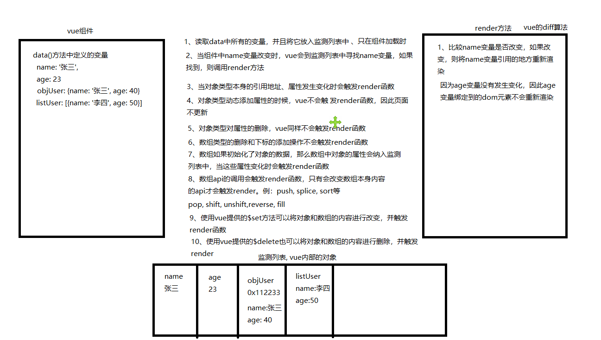
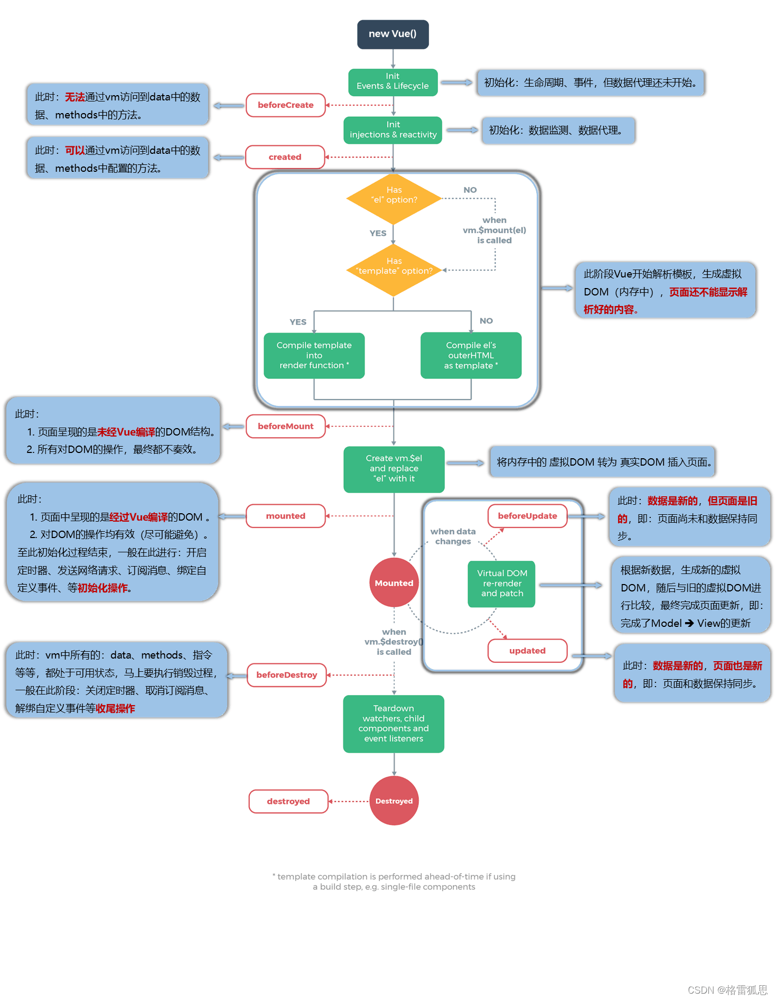

# Vue2框架的使用

## 一、使用方式

1. 使用cdn的方式引用vue源程序
2. 使用脚手架搭建项目

## 二、脚手架搭建项目

1. 安装脚手架

```bash
//全局安装脚手架命令
npm install -g @vue/cli
```

2. 创建项目

```bash
//创建项目的命令 vue create 项目
vue create project1
```

- 选项（空格选择，回车确认）

  1. Please pick a preset: (Use arrow keys), 选择一个预加载的模板，我们选择自定义

```bash
  Vue CLI v5.0.8
  ? Please pick a preset:
    Default ([Vue 3] babel, eslint)  --vue3的项目
    Default ([Vue 2] babel, eslint)  --vue2的项目，里面包含了babel, esling两个插件> 
  > Manually select features	       --自定义创建项目，用户自已选择创建的选项
```

    2. 选择要安装的插件

```bash
  Check the features needed for your project: (Press <space> to select, <a> to toggle all, <i> to invert selection, and<enter> to proceed)
  (*) Babel            --编译vue文件用的插件>
  ( ) TypeScript            --使用ts开发vue 
  ( ) Progressive Web App (PWA) Support  --技术集合，可以在移动，h5上运行的一系列的技术 
  ( ) Router                --vue路由 
  ( ) Vuex                --状态机 
  ( ) CSS Pre-processors        --sass 
  ( ) Linter / Formatter        --语法检查插件 
  ( ) Unit Testing            --单元测试插件
  ( ) E2E Testing            --单元测试插件
```

    3. 选择vue的版本

```bash
  ? Choose a version of Vue.js that you want to start the project with  
  3.x
  > 2.x
```

    4. 选择以上插件的配置是否独立一个文件

```bash
  ? Where do you prefer placing config for Babel, ESLint, etc.? (Use arrow keys)
  > In dedicated config files            --独立的配置文件  
  In package.json                --所有配置都放在这一个文件中
```


## 三、vue组件

### 1 组件的基本组成

- template-用于编写html的代码
- script-用于编写js代码
- style-用于编写css代码

vscode安装vue插件之后可以使用快捷键vb生成组件结构

### 2 组件的使用步聚

1. 导入组件

```vue
<script>
    //第一步导入我们要使用的组件
    import Hello from '@/components/Hello';
</script>
```

2. 注册组件

```vue
<script>
    export default {
        //设置组件的名称，名称是可以忽略的
        name: 'App',
        //components 注册组件
        components: {
            Hello: Hello
        }
    }
</script>
```

3. 使用组件

```vue
<template> 
	<Hello/>
</template>
```

## 四、变量的使用

### 1 定义变量

```vue
<script>
    export default {
        //data 用于配置页面中使用的数据,且必须是return 一个新对象
        data() {
            return {
                msg: "hello world"
            }
        }
    }
</script>
```

data 必须return 一个新对象，是为了保证组件被多个地方调用时的数据隔离。

### 2 使用变量 - mustache语法

```vue
<template> 
	{{ msg }}
</template>
```

## 五、指令

### 1 v-for 循环指令

功能：可以循环一个变量。变量的类型可以是数组、字符串、数字、对象

栗子：

```vue
<template> 
	<div v-for="(item, index) in listMsg" v-bind:key="item">
    {{item}}-{{index}}
    </div>
</template>
<script>
    export default {
        data() {
            return {
                listMsg: ['a', 'b', 'c']
            }
        }
    }
</script>
```

### 2 v-bind 绑定属性

功能：v-bind绑定标签的属性

栗子：

```vue
<template>
    //第一种语法
    
    //第二语法  省略 v-bind
    
    //可以使用变量
    
</template>

```

####   实战-动态改变样式

1. 动态改变class ，class变量支持字符串、对象、数组形式

```vue
<template>
	<!-- 字符串 -->
	<div class="tab_item" :class="str" >商品</div>
	<!-- 对象形式 为true表示生效 -->
	<div class="tab_item" :class="{tab_active: true,tab_active2: false}" >商品</div>
	<!-- 数组形式 -->
	<div class="tab_item" :class="arr" >商品</div>
</template>
<script>
    export default {
        data() {
            return {
                str: "tab_active tab_active2",//字符串
                arr: ["tab_active","tab_active2"], //数组
            }
        }
    }
</script>
<style>
    .tab_active {
        color: #1890ff;
    }
    .tab_active2 {
        color: #1890ff;
    }
</style>
```

2. 动态改变style ，style变量支持字符串、对象

```vue
<template>
    <!-- 字符串形式的绑定, tab1为字符串类型 -->
    <div class="tab" :style="str">全部</div>
    <!-- 对象类型的绑定，tab2为一个对象类型 -->
    <div class="tab" :style="obj" >订单</div>
</template>
<script>
    export default {
        data() {
            return {
                str: "color:red",//字符串
                obj: {color:'red'}, //对象
            }
        }
    }
</script>
```


### 3 v-on 绑定事件

功能：v-on绑定标签的事件

栗子：

```vue
<template> 
    //绑定事件
    <button class="btn_common" v-on:click="exportData">导出</button>
    // @ 绑定事件简写语法
    <button class="btn_common" @click="exportData">导出</button>
</template>

<script>
    export default {
        // methods 编写事件响应函数
        methods: {
            exportData(e) {
                console.log(e)
            }
        }
    }
</script>
```

### 4  v-if/v-show 显示控制指令

#### 1 v-if

功能： 可以控制元素节点是否渲染或删除，为true时渲染，为false删除。

```vue
<template> 
    <GroupGoods v-if="curPage == 'GroupGoods'"></GroupGoods>
    <StyleSwitch v-else-if="curPage == 'StyleSwitch'"></StyleSwitch>
	<ClassSwitch v-else></ClassSwitch>
</template>

```

#### 2 v-show

v-show的值控制元素的显示与否，为true时显示，为false时不显示。节点一直在，利用css控制是否显示

```js
<template> 
    <GroupGoods v-show="curPage == 'GroupGoods'"></GroupGoods>
    <StyleSwitch v-show="curPage == 'StyleSwitch'"></StyleSwitch>
    <ClassSwitch v-show="curPage == 'ClassSwitch'"></ClassSwitch>
</template>

```

### 5 使用template解决v-if与v-for的冲突

template可以将一组元素包裹起来，然后统一控制元素的显示与否。并且不会额外给浏览器渲染节点。

```vue
<template v-if="showDetail" >
    <div v-for="(item, index) in listMsg" v-bind:key="item">
        {{item}}-{{index}}
    </div>
</template>

```

### 6 v-text/v-html 内容渲染指令

```vue
<template v-if="showDetail" >
	<td>
    <span v-text="goods.splusCount  + '个'"> </span>
    </td>
<td>
    <span v-html="goods.limitCount + '个'"></span>
    </td>
</template>

```

### 7 v-model 表单数据双向绑定

功能：v-model 实现双向绑定的机制是绑定表单的 :value 属性，这样表单就可以接收数据；当表单值改变的时候触发input事件，通过此事件改变数据变量，这便是双向通信。

栗子

```vue
<template> 
//绑定事件
<input v-model="username"  />
</template>

<script>
    export default {
        data(){
            return {
                username:'xiaowang'
            }
        }
    }
</script>

```


## 六、计算属性

功能：用于计算数据，得到计算结果。

栗子：

```vue
<script>
    export default {
        // computed 编写计算属性
        computed: {
            sumJoin(){
                let total = 0;
                for (let goods of this.listGoods) {
                    total = total + goods.joinCount
                }
                console.log("sumJoin执行")
                return total;
            }
        }
    }
</script>

```

计算属性拥有缓存机制，计算属性的更新时机为：它所依赖（引用，包含）的变量的值发生改变，计算属性就会触发更新。

## 七、侦听器

功能：侦听变量的变化，去执行配置的侦听器函数

栗子：

```vue
<script>
    export default {
        data(){
            return {
                objUser：{name:'xiaozhang'}
            }
        },
        // 对象语法
        watch: {
            objUser: { //与被侦听的变量名一致
                handler(nv, ov) {
                    console.log("objUser, handler侦听器",nv, ov)
                },
                deep: true, //深度侦听对象的属性值
                immediate: true // 首次加载时，侦听器立即执行
            }
        }
    }
</script>

```

## 八、过滤器 

功能： 对要显示的数据进行转换或是格式化

栗子：

```vue
<template>
    <!-- 在mustache语法中使用过滤器 -->
    {{ goods.overTime | formartDate('yyyy-MM') }}
</template>
<script>
    export default {
        filters: {
            formartDate(par, formatType) {
                let arrDate = par.split("-");
                let result = arrDate[0] + "年" + arrDate[1] + "月" + arrDate[2] + "日";
                console.log("formatDate", par, formatType)
                return result;
            }
        }
    }
</script>

```

全局filter ,在main.js中注册过滤器

```js
//定义全局的过滤器
Vue.filter("formartDate", (par, formatType) => {
    console.log("全局过滤器", par, formatType);
    let arrDate = par.split("-");
    let result = arrDate[0] + "年" + arrDate[1] + "月" + arrDate[2] + "日";
    return result;
})

```

## 九、ref标记节点

功能： 通过ref可以获取到dom元素

栗子：

```vue
<template>
<!-- 定义ref -->
<input ref="txtDate" style="margin-left: 10px;" />

</template>
<script>
    export default {
        methods: {
            getRef() {
                //获取dom元素
                //获取文本框的值 
                let val = this.$refs.txtDate.value;
            }
        }
    }
</script>

```

## 十、插槽

### 插槽分类

- 匿名插槽， slot
- 具名插槽
- 作用域插槽

```vue
<!-- 定义匿名插槽 -->
 <slot></slot>

<!-- 父组件使用匿名插槽 -->
 <template>
    <span>hello </span>
    <span>5月4号</span>
</template>

<!-- 定义具名插槽 -->
 <slot name="tow"></slot>

<!-- 父组件使用具名插槽 -->
 <template slot="tow">
    <span>hello </span>
    <span>5月4号</span>
</template>

<!-- 定义作用域插槽 -->
<!-- 作用域插槽 是子组件向父组件传参使用-->
 <slot name="tow" :c="name"></slot>

<!-- 父组件使用作用域插槽 -->
 <template slot="tow" slot-scope="gg">
    <span>5月4号 {{gg.c}}</span>
</template>

```

# vue2进阶

## 一、组件通信

- 父传子 自定义属性

```vue
<template>
<!-- 父组件中对子组件绑定 msg属性，  objGoods是父组件的一个变量 -->
	<GroupGoods  v-bind:msg="objGoods"></GroupGoods>
</template>
<script>
    export default {
        //子组件中使用props接收信息
        props: {
            msg: {
                //该属性的数据类型
                type: String,
                //父组不传递的情况，该属性的默认值
                default: 'hello msg'
            },
        }
    }
</script>
```


- 子传父 自定义事件

```vue
//子组件中使用 $emit 传递信息
<script>
    export default {

        methods: {
            //子组件定义响应事件，该事件向父组件发送信息
            goAdd() {
                this.$emit("jumpPage", "addGoods");//jumpPage，事件名称 addGoods，事件的参数
            }
        }
    }
</script>

//父组件接收信息
<template>
<!-- 子组件身上响应事件 goPage 是父组件中定义的响应事件 -->
<GroupGoods  @jumpPage="goPage"></GroupGoods> 
</template>

<script>
    export default {
        //在父组件中编写事件响应函数
        methods: {
            goPage(par, par1, par2, par3, par4) {
                console.log("goPage", par, par1, par2, par3, par4);
            }
        }
    }
</script>

```


- v-model 可以父传子， 子传父
- 事件总线 父传子，子传父， 兄弟组件之间传递
- $parent 父传子
- $children 子传父
- $liseteners 子传父， 可以取得父组件绑定到子组件身上的事件
- $attr 父传孙， 可以取得父组件绑定到子组件身上的属性
- 作用域插槽


## 二、vue数据监测

### 概述

1. 字符串、数字、布尔类型进行监测时，变量的变化会立即影响到页面的渲染
2. 对引用数据类型（对象，数组）的增删，不会改变页面渲染，除非地址发生改变。
   1. 解决方案

```js
数组、使用数组的api来增删元素
this.listUser.pop();
this.listUser.splice(0, 1);
this.listUser.push({name: '李四', age: 20});

数组与对象 使用this.$set方法来添加属性 使用this.$delete删除对象属性
this.$set(this.listUser, 1, {name: '李四', age: 20})
this.$delete(this.listUser, 0);

this.$set(this.objUser, "sex", '男');
this.$delete(this.objUser, "sex");
```


### 图栗




## 三、生命周期

### 一个组件生命周期有四个阶段

beforeCreate() 组件创建之前，此时无法获取  \$data 和 \$el

`开辟组件空间，初始化数据监测、数据代理`

created() 组件创建完毕，此时无法获取  \$data 和 \$el

`解析模板，在内存中生成虚拟DOM`

breforeMount():组件挂载之前，无法获取页面节点

`将内存中的虚拟DOM转为真实DOM插入页面`

mounted():组件挂载之后,就能在Vue中获取页面节点

beforeUpdate()：组件数据更新之前,此时数据是新的页面是旧的

`根据新数据生成新的虚拟DOM，随后新旧虚拟DOM进行比较，最终完成页面更新`

updated()：组件数据更新过后。此时页面与数据都是新的

beforeDestroy():销毁之前，此时 data、methods、指令都是处于可用状态

destroyed()：销毁后，此时真实DOM可用

### 图例





## 四、动态组件

```js
//is这个属性后面的变量，名字是哪个组件，动态显示这个组件
<component :is="currentTab"></component>
import TabA from "./TabA";
import TabB from "./TabB";
data(){
    return{
        currentTab:"TabA"
    }
}
```

实现原理：

1. 采用v-if来动态渲染节点。一旦切换组件，之前的组件就会被销毁。
2. 页面开始加载的时候，不会把所有组件加载一遍。


## 五、keep-alive 缓存组件

### keep-alive的使用

```js
<keep-alive include="TabAVue">
    <component :is="currentTab"></component>
</keep-alive>
```

include：值为字符串或者正则表达式，只有名字匹配的组件才能被缓存（白名单）

exclude: 值为字符串或者正则表达式，当匹配到组件名字，代表这个组件不被缓存（黑名单）

max：设置当前组件缓存的做大值，keep-alive能够缓存最多几个组件max来决定

include值为字符串：

```js
<keep-alive include="TabAVue,TabCVue"> 
	<component :is="currentTab"></component>
</keep-alive>
```

include值为正则表达式

```js
<keep-alive :include="/TabAVue|TabCVue/">
    <component :is="currentTab"></component>
</keep-alive>
```

还可以写一个数组

```js
<keep-alive :include="['TabAVue','TabCVue']">
	<component :is="currentTab"></component>
</keep-alive>
```

###  keep-alive的生命周期钩子函数。

```js
//必须要被keep-alive缓存后这个组件才能使用这个生命周期
//当你进入这个组件的是执行
    activated(){
        console.log("进入TabA组件");
    },
        
    //当你离开这个组件的会被执行的函数
    deactivated(){
        console.log("离开TabA组件");
    },
```


## 六 mvvm设计模式

什么是mvvm:

- m: module，即模型层，也叫数据的结构以及数据的处理。例：对象里属性的构成
- v: view, 即视图层，也是vue中template部份的代码；可以理为用户可以看到的内容
- vm: viewModule，即视图模型转换功能，可以理解为vue中的v-model指令。该指令将数据绑到视图上，当数据变化时页面变化，当页面变化时，数据会随着一起变化。这样的功能就称为viewModule。


## 七、mixin

功能：可以将组件中通用 的代码进行复用。

使用场景：代码通用性必须非常强，页面中有90%以上代码雷同的，可以放入混入。

1、在src目录下新建mixin文件夹，新建pageMixin.js文件

```js
export default {
    data() {
        return {
            dialogInfo: "",
            curPage: 1,
            pageSize: 10
        }
    },
    methods: {
        changePageInfo(curPage, pageSize) {
        },
        // 查询事件，带条件
        search() { },
        //删除
        del(id) { },
    },
}
```

2、在需要混入的组件中，配置mixins

```js
import pageMixin from '@/mixin/pageMixin';
export default {   
	mixins: [pageMixin],
}
```

说明：混入中除了生命周期函数之外，其它所有的配置项中，父组件定义的内容会覆盖掉mixins中定义的内容。生命周期不会覆盖，它会先执行混入中的生命周期，再执行父组件中的生命周期。

## 八、自定义指令

```js
// 全局自定义指令
Vue.directive("btnPower", {
    inserted: function (el, binding, vnode, oldVnode) {
        const path = vnode.context.$route.path;
        //  判断是否有权限，1表示有权限，0表示没有
        if (0 == judgeBtnPower(path, binding.value)) {
            el.remove();
        }
    }
})
// 局部自定义指令
directives: {
    //指令名字bgcolor，以后使用v-bgcolor
    //内部提供生命周期函数
    bgcolor: {
        //这个生命周期函数是指令生命周期函数，inserted一旦被执行，使用这个指令的标签已经被挂载父节点中
        //el代表获取节点，obj代表指令传递回来值
        inserted(el, obj){
            console.log("自定义指令", el);
            console.log("指定指令传值", obj);
            //原生JS操作
            el.style.background = obj.value
        }
    }
}
```

## 九、事件修饰符

### v-model修饰符

修饰符的功能：可以将v-model中绑定的数据做转换

- .number 将绑定的数据转换成number类型
- .trim 将绑定的数据两边的空格去掉
- .lazy 廷迟将数据设置到变量中


### v-on

[事件修饰符](https://cn.vuejs.org/guide/essentials/event-handling.html#event-modifiers)

在处理事件时调用 `event.preventDefault()` 或 `event.stopPropagation()` 是很常见的。尽管我们可以直接在方法内调用，但如果方法能更专注于数据逻辑而不用去处理 DOM 事件的细节会更好。

为解决这一问题，Vue 为 `v-on` 提供了**事件修饰符**。修饰符是用 `.` 表示的指令后缀，包含以下这些：

- `.stop`
- `.prevent`
- `.self`
- `.capture`
- `.once`
- `.passive`

栗子

```vue
<!-- 单击事件将停止传递 -->
<a @click.stop="doThis"></a>

<!-- 提交事件将不再重新加载页面 -->
<form @submit.prevent="onSubmit"></form>

<!-- 修饰语可以使用链式书写 -->
<a @click.stop.prevent="doThat"></a>

<!-- 也可以只有修饰符 -->
<form @submit.prevent></form>

<!-- 仅当 event.target 是元素本身时才会触发事件处理器 -->
<!-- 例如：事件处理器不来自子元素 -->
<div @click.self="doThat">...</div>
```


# VueRouter

注意搭建项目的时候需勾选路由

## 1 配置路由与使用

将路由文件单独用一个router文件夹下index.js，在此文件进行配置，实现结构化项目

```js
import Vue from 'vue'
import Login from '@/views/Login'
const routes = [
    {
        // 404 界面
        name: "notFound",
        path: '*',
        component: () => import("@/views/NotFound")//懒加载
    },
    {
        name: "login",
        path: '/login',
        component: Login
    },
    {
        name: "main",
        path: '/',
        component: Main,
        redirect:"order", //重定向
        children: [ //嵌套路由 ， 不写/， 在子路由前面加上父级路由地址便是完整地址
            {
                name: "order",
                path: "order",
                component: () => import("@/views/Order")
            },
            {// 文章管理
                name: "articleManager",
                path: "sysManager/articleManager",
                component: () => import("@/views/ArticleManager"),
            }
        ]
    }
]
//创建路由     
const router = new VueRouter({
    routes
})
export default router
```

然后再main.js进行引入

```js
import App from './App.vue'
import router from './router'
new Vue({
    axios,
    router, //这里就是引入路由
    store,
    render: h => h(App)
}).$mount('#app')
```

配置路由出口，即路由显示的位置

```vue
<!-- 路由出口 -->
<router-view></router-view>
```

验证，在浏览器输入项目地址加上路由地址，能成功访问便是配置成功

## 2 路由跳转

### api跳转

```js
//通过path跳页面
this.$router.push("/layout/admin")
//通过path跳页面
this.$router.push({
    path: "/layout/admin"
})
//通过名称跳转页面
this.$router.push({
    name: 'Admin'
})
```

### 通过router-link跳转页面

```js
<router-link to="/layout/order" active-class="acMenu" class="unacMenu">订单</router-link>
```

说明：

- to设置要跳转的页面路径，该路径必须在路由中配置过
- active-class设置当前路由激活状态的样式。


### ui库element-ui

使用element-ui的菜单，menu上设置 router，index就是跳往的地址

```vue
<el-menu router class="el-menu-vertical-demo" background-color="#545c64" text-color="#fff" ctive-text-color="#ffd04b">
<!-- index属性值是路由地址便可跳转对应页面  -->
<el-menu-item index="/layout/order">
    订单
</el-menu-item>
```

## 3 路由传参

### 问号传参(get传参)，优先考虑

```js
//需要传递参数的页面进行传参，
showDetail(row) {
    this.$router.push({
        path: `/layout/orderDetail?id=${row.id}`
    })
}
//在对应页面接收参数的页面
created() {
    //获取地址栏问号传参 $route.query.id
    console.log(this.$route.query.id,  333);
}
```

说明：

- 在url地址后面使用问号的方式即可传参。例：?id=1&name=2
- 通过$router.query可以取出地址栏问号传递的参数。query对象会将所有的参数名做为对象属性名称，参数值做为属性对应的值放入。

### query传参

```js
//需要传递参数的页面进行传参
this.$router.push({
    path: `/layout/orderDetail`,
    query: {
        id: row.id,
        reciveUserName: row.reciveUserName
    }
})
//在对应页面接收参数的页面
created() {
    //获取地址栏问号传参
    console.log(this.$route.query.id,  333);
}
```

说明：

- $router.push方法的参数中，可以加入query属性。该属性是一个对象类型。对象的属性名称即是参数名称，属性的值即是参数值
- query传参只是将push方法中的query对象解析到地址栏，并用问号拼接起来。它主要的作用是解决问号传参时拼接字符串时比较麻烦，当参数多的时候字符串拼接容易出错，此时可以借助query传参。

### params传参，不推荐

```js
//需要传递参数的页面进行传参
this.$router.push({
    name: "OrderDetail",// 只能使用name
    params: {
        id: row.id,
        reciveUserName: row.reciveUserName
    }
//在需要接收参数的页面
created() {
    //获取地址栏params传参
    console.log(this.$route.params.id,  333)
}
```

说明：

- params传参，只能和name跳转页面配套使用
- 取参数使用$router.params来获取参数
- params传参，页面刷新会导致参数丢失

### 动态路由传参，不推荐使用

```js
//配置动态路由
{
    //动态路由配置
    name: 'OrderDetail',
        path: 'orderDetail/:id?/:name?,
    //懒加载订单页面
    component: () => import("@/views/OrderDetail"),
        //打开属性接收参数的开关
        props: true
}

//需要传递参数的页面进行传参
this.$router.push(`/layout/orderDetail/${row.id}/${row.reciveUserName}`);
//在需要接收参数的页面
props: {
    id: {
        type: String,
            default: ""
    },
    name: {
        type: String,
                default: ""
    }
},
//也可以
created() {
    //获取地址栏params传参
    console.log(this.$route.params.id, 333)
}
```

说明：

- 在路由配置对象中，给path加上/:id来配置动态路由，其中id将会做为参数名称放入params对象中
- 在跳转页面时，使用模板之符串的形式将参数的值拼接到url路径中。该参数的值会在地址栏显示出来，并且放入params对象的属性值中。
- 在接收参数时，使用$router.params对象来获取参数。
- 在动态路由配置时，可以在参数名称后面加上问号，用来防止参数未传递的情况下，程序进入到404页面
- 动态路由也可以通过在要接收参数的页面组件中定义props来接收参数，前提需要在动态路由配置中开启props开关

## 4 使用keepalive加快页面渲染速度-使用频率不高

将keepalive放在router-view的外层包裹起来，就可以优化页面渲染速度。但是要注意数据被缓存的后果

```js
<!-- 路由出口 -->
<KeepAlive>
    <router-view></router-view>
</KeepAlive>
<!-- 利用keepalive 的生命周期处理数据缓存的后果 -->
activated() {
    this.$order.getEcomOrderById({id: this.$route.params.id}).then(res => {
        console.log("res", res);
        this.objOrder = res.data;
    })
}
```

## 5 导航守卫

功能：拦截所有的路由请求。来决定该路由地址是否放行，并且放行到哪个画面

分类：

1. 全局导航：前置守卫beforeEach，解析守卫beforeResolve，后置守卫 afterEach
2. 路由独享守卫：beforeEnter
3. 组件内守卫： 进入前beforeRouteEnter、更新前beforeRouteUpdate、离开前beforeRouteLeave

```JS
//前置守卫
//触发时机：
/*to: Route: 即将要进入的目标 路由对象
from: Route: 当前导航正要离开的路由
next: Function: 一定要调用该方法来 resolve 这个钩子
*/
// 全局前置守卫
router.beforeEach((to, from, next) => {
    let isAuthenticated = Vue.prototype.$session.getLoginInfo();
    if (to.name !== 'Login' && !isAuthenticated) {
        next({ name: 'Login' }) // 前往 login 路由地址，也可以使用 path指定路径
    }
    else {
        next() // 放行，允许通过  next(false)是不允许通过
    }
});

//全局解析守卫 参数与 前置守卫一样
//触发时机:同时在所有组件内守卫和异步路由组件被解析之后
router.beforeResolve((to, from, next) => {
    // console.log('全局解析守卫');
    next();
})
//全局后置守卫  参数没有 next()
router.afterEach((to, from) => {
    // console.log('全局后置守卫');
})
//路由独享守卫
{
    path: '/foo',
        component: Foo,
            beforeEnter: (to, from, next) => {
                // ...
            }
}
//组件内守卫
beforeRouteEnter(to, from, next) {
    // 在渲染该组件的对应路由被 confirm 前调用
    // 不！能！获取组件实例 `this`
    // 因为当守卫执行前，组件实例还没被创建
},
beforeRouteUpdate(to, from, next) {
    // 在当前路由改变，但是该组件被复用时调用
    // 举例来说，对于一个带有动态参数的路径 /foo/:id，在 /foo/1 和 /foo/2 之间跳转的时候，
    // 由于会渲染同样的 Foo 组件，因此组件实例会被复用。而这个钩子就会在这个情况下被调用。
    // 可以访问组件实例 `this`
},
beforeRouteLeave(to, from, next) {
    // 导航离开该组件的对应路由时调用
    // 可以访问组件实例 `this`
}
```

###  完整的导航解析流程

1. 导航被触发。
2. 在失活的组件里调用 `beforeRouteLeave` 守卫。
3. 调用全局的 `beforeEach` 守卫。
4. 在重用的组件里调用 `beforeRouteUpdate` 守卫 (2.2+)。
5. 在路由配置里调用 `beforeEnter`。
6. 解析异步路由组件。
7. 在被激活的组件里调用 `beforeRouteEnter`。
8. 调用全局的 `beforeResolve` 守卫 (2.5+)。
9. 导航被确认。
10. 调用全局的 `afterEach` 钩子。
11. 触发 DOM 更新。
12. 调用 `beforeRouteEnter` 守卫中传给 `next` 的回调函数，创建好的组件实例会作为回调函数的参数传入。


# 状态机

## 状态机的五大核心

### 主状态机定义

```js
import Vue from 'vue'
import Vuex from 'vuex'
Vue.use(Vuex)
// 子仓库
import userModule from './module.js/userModule';// 
import tagNavModule from './module.js/tagNavModule';// 标签导航

export default new Vuex.Store({
    // 定义数据
    state: {
        name: "qike",
        count: 1, desc: "状态机", listUser: [{ id: 1, name: "张三" }, { id: 2, name: "王五" }],
        objUser: { id: 3, name: "渣渣灰" },

    },
    //计算属性, 用于获取state中的数据，它可以在获取数据时进行计算，把计算后的值返回
    //约定使用此方法暴露数据，不要直接操作数据
    getters: {
        getName(state) {
            return state.desc + "版本号：7.0.1"
        }
    },
    //同步方法：用于获取或是设置state中的数据
    // 约定使用该方法修改数据，不然vue无法监测数据变化
    //  约定方法名全大写
    mutations: {
        ADD_COUNT(state, val) {
            state.count += val;
        }
    },
    //异步方法：用于获取或是设置state中的数据，在actions中可以执行一些异步的任务，
    // 例如调用接口，setTimeout等
    actions: {
        getName2(context, val) {
            let name = "状态机二代目" + new Date().getTime();
            setTimeout(() => {
                context.state.desc = name;
            }, 2000);
        }
    },
    //用于定义子仓库的：模块化状态机
    modules: {
        userModule, tagNavModule
    }
})
```

### 子状态机定义

```js
export default {
    // 当模块被注册后，它的所有 getter、action 及 mutation 都会自动根据模块注册的路径调整命名
    namespaced:true,
    // 
    state:{
        userInfo:{
            name:"ZS",
            id:2,
            age:18,
            hobby:['打篮球']
        }
    },
    //
    getters:{
        user_getName(state){
            return state.userInfo.name
        }
    },
    //
    mutations:{
        ADD_AGE(state,val){
            state.userInfo.age+=val;
        }
    },
    //
    actions:{
        addHobby(context,val){
            console.log(context);
            setTimeout(() => {
                context.state.userInfo.hobby.push(val)
            }, 1000); 
        }
    }
}
```

### 状态机的使用

在main.js中引入

```js
// 状态机
import store from '@/store/index.js'
const app = new Vue({
	store,
  ...App
})
```

直接使用 $store  不推介

```js
methods: {
    setTime() {
      	//组件中触发actions中的函数
        this.$store.dispatch("setCurTime", new Date().getTime());
        //在组件的js中触发mutations
        this.$store.commit("INCOME", 1);
    }
}
```

使用辅助函数

常用mapGetters, mapMutations, mapActions，一般不使用 mapState 没必要。

```js
// 导入主仓库的辅助函数
import { mapGetters, mapMutations, mapActions, createNamespacedHelpers } from 'vuex';
// 导入 userModule 子仓库的辅助函数
let {
    mapGetters: mapUserGetters,
    mapMutations: mapUserMutations,
    mapActions: mapUserActions,
} = createNamespacedHelpers('userModule');

computed: {
     	// 计算属性的辅助函数
        ...mapGetters(['getName']),
        //获取子仓库的计算属性
        ...mapUserGetters(['user_getName']),
    },
methods: {
    	// 方法的辅助函数
    	...mapMutations(['ADD_COUNT']),
        ...mapActions(['getName2']),
        //子仓库
        ...mapUserMutations(['ADD_AGE']),
        ...mapUserActions(['addHobby']),
}
```


## end