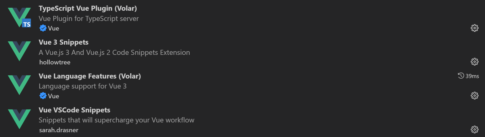

# vue3项目搭建

## 一、使用Vite搭建

首先确保已安装vite，未安装需到官网按说明文档安装。

### 1、创建项目

vue+ts

```bash
yarn create vite chitu-project --template vue-ts
```

## 二、VSCode 插件下载



# vue3基础

## 一、setup语法

历史版本：

```vue
<script>
export default {
    setup() {
        
        return {}
    }
}
</script>
```

```vue
<script>
import { defineComponent } from 'vue'
export default defineComponent({
    setup() {
        
        return {}
    }
})
</script>
```

最新版：

```vue
<script setup>

</script>
```

## 二、引入组件

Vue3 中渲染子组件，只需要通过 import 引入后，直接渲染即可：

```vue
<template>
  	<HelloWorld />
</template>

<script setup lang="ts">
	import HelloWorld from './components/HelloWorld.vue'
</script>
```

## 三、定义组件内部数据

ref：可以用来定义任意类型的数据，但是在 script 范围内使用时，必须通过 `.value`；

reactive：只能用来定义引用类型的数据，定义好的数据，在后续修改时不能修改引用地址；

```vue
<template>
<h1>{{ count }}</h1>
<h1>{{ state.name }}</h1>
</template>

<script setup lang="ts">
    import { reactive, ref } from 'vue';

    // ref 定义组件内部数据
    const count = ref(0);
    // ref 定义的数据，在 script 范围内使用时，都必须 .value
    console.log(count.value);
	// reactive
    const state = reactive({
        name: '张三'
    })
    console.log(state.name);

</script>
```


## 四、事件绑定

方法直接在setup里面写即可

```vue
<template>
	<div>
		<button @click="sayHello">按钮</button>
	</div>
</template>

<script setup lang="ts">
// 定义组件内部方法
const sayHello = () => {
	console.log('hello');
}
</script>
```

## 五、计算属性

```vue
<template>
<h1>{{ result }}</h1>
</template>

<script setup lang="ts">
    import { computed, ref } from 'vue';

    const count = ref(0);
	// 直接使用 computed
    const result = computed(() => {
        return count.value + 100;
    });

</script>
```


## 六、侦听器

### watch

侦听一个或多个响应式数据源，并在数据源变化时调用所给的回调函数。

```vue
<script setup lang="ts">
    import { ref, watch } from 'vue';
    const count = ref(0);


    watch(() => count.value, (newValue, oldValue) => {
        console.log(newValue, oldValue);
    }, {
        deep: true,   // 深度侦听
        immediate: true   // 立即侦听
    });
</script>
```

### watchEffect

立即运行一个函数，同时响应式地追踪其依赖，并在依赖更改时重新执行。

```vue
<script setup lang="ts">
import { watchEffect } from 'vue';

watchEffect(() => {
	console.log('watchEffect', count.value, state.name);
})
</script>
```

- watch 和 watchEffect 的简单区别

1. watch 需要指定要侦听的数据，watchEffect 会自动侦听内部用到的所有数据；
2. 默认情况下，watch 不会立即侦听，watchEffect 会；
3. watch 可以通过参数获取到变化前后的值，watchEffect 不行；

## 七、生命周期

| Vue2          | Vue3            |
| ------------- | --------------- |
| beforeCreate  | 无              |
| created       | 无              |
| beforeMount   | onBeforeMount   |
| mounted       | onMounted       |
| beforeUpdate  | onBeforeUpdate  |
| updated       | onUpdated       |
| beforeDestroy | onBeforeUnmount |
| destroyed     | onUnmounted     |

代码语法：

```vue
<script setup lang="ts">
import { computed, onMounted, reactive, ref, watchEffect } from 'vue';

onMounted(() => {
	console.log('组件挂载完成');
}) 
</script>
```

## 一、组件通信

### 1 props 父传子

父组件传值

```vue
<template>
<Child name="张三" :age="20" :gender="gender"></Child>
</template>

<script setup lang="ts">
    import { ref } from 'vue';
    import Child from './Child.vue';
    const gender = ref('男');
</script>
```

子组件接收值

```vue
<template>
<h1>子组件</h1>
<h2>{{ name }}</h2>
<h2>{{ age }}</h2>
<h2>{{ gender }}</h2>
</template>

<script setup lang="ts">
    
    const props = defineProps<{
        name: string,
        age: number,
        gender: string
    }>()

    console.log(props.age);

</script>
```

### 2 emit子传父-回调函数-闭包利用

### 1、绑定自定义事件

```vue
<template>
    <Child @getChildData="getChildData"></Child>
</template>

<script setup lang="ts">

const getChildData = (data: any) => {
    console.log('子组件传递的数据', data);
}
</script>
```

### 2、子组件触发自定义事件

```vue
<template>
    <h1>子组件</h1>
    <button @click="dataToFather">传值</button>
</template>

<script setup lang="ts">
const emit = defineEmits(['getChildData'])
const dataToFather = () => {
    emit('getChildData', 'hello');
}
</script>
```

# 路由

## 一、下载路由插件

```bash
yarn add vue-router
```

## 二、路由配置

### 1、创建配置文件

```bash
src
 |--- router
 |      |--- index.ts
```

### 2、路由初始化

```ts
import { createRouter, createWebHashHistory, createWebHistory } from 'vue-router'
import LoginPage from '../views/login/LoginPage.vue';

const routes = [
    {
        path: '/login',
        component: LoginPage
    }
]

const router = createRouter({
    routes,
    history: createWebHistory()    // history 模式
    // history: createWebHashHistory()   // hash 模式
});

export default router;
```

### 3、路由全局挂载

在 `main.ts` 中：

```ts
import router from './router'

const app = createApp(App);
app.use(router);
app.mount('#app');

// createApp(App).use(router).mount('#app');
```

## 三、路由出口

```vue
<template>
  	<router-view></router-view>
</template>
```

## 四、路由跳转

```vue
<template>
    <div>
        <h1>登录</h1>
        <router-link to="/home">首页</router-link>
        <button @click="toHome">跳转</button>
    </div>
</template>

<script setup lang="ts">
import { useRouter } from 'vue-router';
// this.$router
const router = useRouter();

const toHome = () => {
    router.push('/home');
}
</script>
```

## 五、路由信息对象

```vue
<script setup lang="ts">
    import { useRoute } from 'vue-router';
    // this.$route
    const route = useRoute();
    console.log('route', route);
</script>
```


## 动态路由注册

- 本案例使用本地存储“userMenu”，将权限存入“userMenu” ，在需要的地方引入并调用即可
- 解决刷新问题，最好是在 路由注册的index里调用。

```js
//loadRouter.js
import session from "@/tool/session"
export default {
    loaderRouter(router, routes) {
        // router 动态加载路由，
        // routes 避免刷新没了
        // console.log("封装的动态加载路由，避免刷新没了");
        const mainArr = {
            name: "main",
            path: '/main',
            component: () => import('@/views/Main'),
            meta:{
            name:"主页"
        }
        }
    let userMenu = session.getLocal("userMenu");
mainArr.children = getPath(userMenu)
if (router) {
    // 登录成功之后触发
    //加路由配置放入路由配置数组中
    router.options.routes.push(mainArr);
    //让路由实例加载新的路由项
    router.addRoute(mainArr);
} else {
    // 路由重载
    routes.push(mainArr)
}

// 获取main 下的二级路由 ，先写二级循环解决
function getPath(userMenu) {
    let tempArr = [];
    // console.log("userMenu",userMenu);
    for (let i = 0; i < userMenu.length; i++) {
        const element = userMenu[i].children;
        for (let index = 0; index < element.length; index++) {
            const item = element[index];
            tempArr.push({
                path: item.path ? item.path : "",
                component: () => import("@/views" + item.component),
                meta:{
                name:item.name
            }
                         })
        }
    }
    return tempArr;
}
}
}
```

index，处理刷新问题

```js
import loadRouter from "@/router/loadRouter"
//  动态加载路由，避免刷新没了
loadRouter.loaderRouter("",routes)
```

login.vue,处理登录成功动态加载用户路由

```js
this.$session.updateLocal('userMenu', this.navData);  // 更新路由
loadRouter.loaderRouter(this.$router, this.$route); // 加载路由
```


# Pinia 状态机

## 一、下载 pinia

```bash
yarn add pinia
```

## 二、配置 pinia

### 1、全局挂载

```ts
import { createPinia } from 'pinia'

const app = createApp(App);

app.use(createPinia())

app.mount('#app');
```

### 2、创建模块文件

```bash
src
 |--- store
 |      |--- global.ts
 |      |--- users.ts
 |      |--- ...
```

### 3、配置模块

```ts
import { defineStore } from 'pinia';
import { getMenusApi } from '../api/user';

export const useGlobal = defineStore('global', {
    state: () => ({
        menusData: []
    }),
    getters: {},
    actions: {
        async getMenusAsync() {
            const res = await getMenusApi()
            this.menusData = res;
        }
    }
})
```

### 4、组件操作状态机

#### （1）获取状态机数据

```ts
import { useGlobal } from '../../store/global';
// 获取仓库模块对象
const globalStore = useGlobal();
console.log(globalStore.menusData);
```

#### （2）调用状态机方法

```ts
import { onMounted } from 'vue'
import { useGlobal } from '../../store/global';

const globalStore = useGlobal();

onMounted(() => {
    globalStore.getMenusAsync();
})
```

## end

