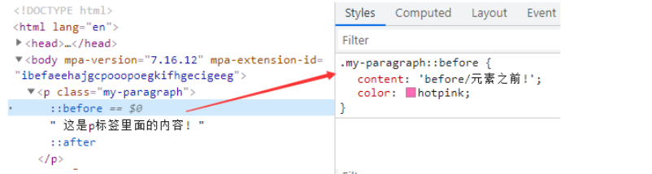

## 样式的来源

注意：所有的html标签默认是没有样式

### 浏览器默认的样式

- 所有的html标签默认没有样式，但是a、h标签等默认是浏览器添加的样式

### 浏览器用户自定义的样式

- 用户可以在浏览器中更改标签默认的样式

### 内联样式

-  在标签上添加style属性，在属性值中书写css样式代码 
-  语法： 

```css
<p style="css属性1：css属性值1; css属性2：css属性值2；">

</p>
```

-  好处：
  哪里需要样式写在哪儿 
-  缺点：
  多个元素有相同的样式时，需要重复书写 

### 内部样式

-  在head标签中添加style标签，再通过选择器来书写css样式代码 
-  语法： 

```css
<head>
<style>
选择器{
  css属性1：css属性值1；
  css属性2：css属性值2；
}
</style>
</head>
```

-  好处 

- - 结构和样式分离
  - 结构清晰，利于后期代码维护
  - 可以批量设置选中的标签样式

-  缺点： 

- - 结构和样式未完全分离，目前还在一个文件中

### 外部样式

-  先创建一个后缀名为 .css文件，再里面通过选择器书写css样式代码，再在head标签中通过link标签引入css样式文件 
-  语法： 

```css
<head>
<link rel="stylesheet" href="连接css样式文件">
</head>
```

-  好处： 

- - 样式和结构代码完全分离
  - 以后维护代码，可以一处处处改
  - 以后我们可以将外部css文件进行压缩，减少文件体积

-  注意：优先级（权重大小）：内联权重最大，相同选择器，内部和外部采用就近原则，离标签越近的优先作用 

## 选择器

相同选择器，后面的样式会盖住前面的样式

### 标签选择器

-  通过标签名找到指定的标签，没有指定范围，找到页面中所有的满足条件的标签 
-  语法： 

```css
标签名{
    css属性1：css属性值1；
    css属性2：css属性值2;
}
```

### 类选择器

-  又称为class选择器，通过标签上的class名找到满足条件的标签，多个标签可以共享一个class名，提取公共样式 
-  语法： 

```css
.class名{
    css属性1：css属性值1；
    css属性2：css属性值2;
}
```

-  注意： 

- -  标签上可以作用多个class名，中间使用空格隔开 
  -  如果选择器多个组合在一起，中间没有空格，代表并且的意思 

```css
找到页面中class名中即有op又有oa的标签
.op.oa{
    css样式代码
}
```

### id选择器

-  id是标签上定义的属性，id唯一，找到页面中唯一的一个标签，精准定位。 
-  通过标签上的id名找到满足条件的标签 
-  id命名规则： 

- - 以数字、字母、-和_构成
  - 不能以数字开头
  - 不能包含特殊符号

-  语法： 

```css
#id名{
    css样式代码
}
```

-  注意：id是唯一，以后通过js会操作标签上id名，id选择器慎用。 

###  伪类选择器 

- - -  根据用户鼠标的行为来改变标签的样式 
    -  分类 

- - - - `a:link`:超链接专属，页面一打开超链接就有的样式，旧属性
      - `a:visited`:超链接专属,超链接被访问之后的样式，
      - `:hover`:鼠标悬停到标签上时标签使用的样式
      - `:active`:鼠标点击标签不释放时使用的样式
      - `:focus`:当标签获取鼠标焦点时使用的样式。比如点击输入框

### 伪元素选择器

```javascript
:before  伪元素被插入到与选择器匹配的元素内容之前或之后
:after

.icon-qrCode .show-qrCode-box::before{
    content: "";
    border: 5px solid transparent;
    border-bottom-color: #c02222;
    display: block;
    position: absolute;
    top: 16px;
    left: 10px;
}
```



注意：

before和after里面必须搭配conten使用

content：可以是文本，也可以是图片

before和after是行内标签，无法作用宽高设置，需要转换为块级或者行内块设置

before和after渲染的是标签中的子元素

没有 :nth-first-child()

```javascript
所有元素中选择
:first-child   第一个子元素
:last-child    最后一个子元素
:nth-child()   选中第n个元素
:nth-last-child()

关于:nth-child()的特殊值
        n   第n个   n的范围0到正无穷（全选）
        even或2n    选中偶数位的元素
        odd或2n+1   选中奇数位得到元素

下面都是在相同元素中选择
:first-of-type  第一个子元素
:last-of-type   最后一个子元素
:nth-of-type()    选中第n个元素
```

实例

```javascript
:nth-child和:nth-of-type都是找对应元素父元素内子元素
比如
th:nth-child(1){
  width: 50px;
}
 th:nth-of-type(1){
     width: 50px;
}
都是作用在th上的样式
亦可
tr :nth-child(1){
  width: 50px;
}
tr :nth-of-type(1){
     width: 50px;
}

偶数行表格的下划线样式更改，这个样式是作用在{}左边的第一个选择器
tr:nth-of-type(2n) td{
      border-bottom: 2px dashed red;
  }
```

### 超链接

-  给a标签添加样式 
-  语法： 

```css
/* 向未被访问过的超链接添加样式 */
a:link {
   css代码样式代码
}

/* 向访问过的超链接添加样式 */
a:visited {
    css代码样式代码
}


/* 鼠标移入超链接时添加到样式 */
/* :hover 必须放在:link和:visited之后 */
a:hover {
    css代码样式代码
}

/* 鼠标点击不放时添加的样式 */
/* :active必须放在:hover之后 */
a:active {
   css代码样式代码
}
```

-  注意：`:hover`必须放在`:link`和`:visited`之后，`:active`必须放在`:hover`之后，顺序：L-V-H-A 

```css
a:link{
    css属性名1: 属性值1;
}
a:visited{
    css属性名1: 属性值1;
}
非伪类选择器:hover{
    css属性名1: 属性值1;
}
非伪类选择器:active{
    css属性名1: 属性值1;
}
非伪类选择器:focus{
    css属性名1: 属性值1;
}
```

### 组合选择器

### 后代选择器 

- 中间使用空格隔开
- 找到某个标签里面的所有的后代，会找到儿子、孙子等等

```css
找到class名为box的标签里面的所有后代p标签
.box  p{
    
}
```

### 子元素选择器

- 中间使用>隔开，只找儿子不找孙子

```css
找到class名为box的标签里面的所有子代p标签
.box >p{
    
}
```

### 兄弟选择器

- 中间使用+隔开，找后第一个兄弟元素

```css
找到class名为box的标签的所有兄弟p标签
.box +p{
    
}
```

### 后续兄弟选择器

- 中间使用~隔开，找后所有兄弟元素

```css
找到class名为box的标签后方的兄弟p标签
.box ~p{
    
}
```

### 并集选择器

```javascript
逗号隔开
p,.calss{
  
}
```

### 交集选择器，同时包含触发

```javascript
中间不含任何字符
p标签且calss1以及class2的才触发
p.calss1.class2{
  
}
```

### 属性选择器

- E[attr=value]

```javascript
选择所有p标签class属性值为color-blue的元素
p[class='color-blue']{
    font-size: 30px;
}
```

- E[attr^=value]

```javascript
选择所有p标签class以co字符串开头的元素
p[class^='co']{
    font-size: 30px;
}
```

- E[attr$=value]

```javascript
选择所有p标签class以co字符串结束的元素
p[class$='co']{
    font-size: 30px;
}
```

- E[attr~=value]

```javascript
选择所有p标签class有color属性值的元素,空格隔开
p[class^='color']{
    font-size: 30px;
}
比如 <p class="color blue"></p>
```

- E[attr|=value]

```javascript
选择所有p标签class以co字符串属性值，以 - 隔开的
p[class$='co']{
    font-size: 30px;
}
比如 <p class="co-blue"></p>
```

- E[attr*=value]

```javascript
选择所有p标签class以co字符串属性值模糊匹配
p[class*='co']{
    font-size: 30px;
}
比如 <p class="bluecoclor"></p>
```


### 优先级

- 相同选择器，内联样式权重最大，内部样式和外部样式采用就近原则
- 相同的选择器同时作用在一个标签上，后面的样式会盖住前面的样式
- 选择器权重（优先级）：id选择器>类选择器>标签选择器

## 背景样式

-  `background-color`:设置背景颜色 

- - 单词
  - \#十六进制
  - rgb(0~255,,0~255,0~255,0~1) 第四个参数位透明度 0表示完全透明 亦可用 opacity

-  `background-image`：设置背景图片 

```css
background-image:url(连接背景图片的文件路径);
```

- - 背景图片默认从盒子左上角开始铺设，如果铺不满，默认重复铺设
  - 注意：如果背景颜色和背景图片同时存在，图片盖住背景颜色

-  `background-repeat`:设置背景图片是否平铺 

- - `repeat`:默认值，x轴和y轴都平铺
  - `repeat-x`:x轴方向上进行平铺
  - `repeat-y`：y轴方向上进行平铺
  - `no-repeat`:不平铺
  - 应用：可以实现1px渐变背景平铺，减少图片的体积，从而优化网页

-  `background-position`:设置背景图片的显示位置 

- - x轴  y轴：  这个是坐标，定位起点，想象坐标轴

- - - 单词：left  right  center  top 上  bottom 下  两两搭配使用
    - 固定像素：默认左上角 0px 0px
    - 百分比：50%  50% 相当于center center

-  `background-size`:设置背景图片的大小，css3提出 

- - `contain`:一边铺满，另一边不管
  - `cover`:两边都铺满，超出部分隐藏
  - `x轴 y轴`：宽度  高度   

- - - 同时设置两个值，背景图片可能变形，只设置一个值，代表图片的宽度
    - %号 为父盒子长宽 50% 50% 表示父盒子的一半长宽

-  `background-attachment`:设置背景图片是否固定（css3） 

- - `scroll`:默认值，图片会随着滚动条滚动
  - `fixed`:背景图片固定在页面上

-  `backgroud`:复合属性 

```css
 background: pink url(img/img-3.jpg) no-repeat 50% 50% /100px 100px fixed;
```

- - /前面代表图片显示位置，/后面是背景图片的大小

## 文本样式

- `color`:设置文本的颜色
- `text-align`：设置文本的对齐方式 

- - left：左对齐
  - center：居中
  - right：右对齐
  - 注意：可以控制标签中文本在水平方向的对齐方式，对行级标签同样有效

- `line-height`:设置文本的行高 

- - 像素
  - 百分比和数字：是参考字体的大小，相当于字体的倍数
  - 注意： 

- - - 一行里面的文本在垂直方向上居中
    - 针对**单行文本**水平垂直居中，可以设置text-align:center;  line-height等于盒子的高度

- `text-decoration`:设置文本修饰 

- - `none`:无
  - `underline`:下划线
  - `line-through`:中划线，删除线
  - `overline`:上划线

- `letter-spacing`:设置字符间距，一个中文就是一个字符，一个英文字母就是一个字符
- `word-spacing`:设置字间距，以文本中空格来区分，一般对英文使用。
- `text-indent`:设置首行缩进
- `text-transform`:设置英文字母的大小写 

- - none：无
  - capitalize：首字母大写
  - uppercase:全大写
  - lowercase: 全小写

## 字体样式

### font-family

-  设置字体的类型，每种系统默认指代的字体不一致。 
-  语法： 

```css
font-family:"宋体"；
font-family: 'Franklin Gothic Medium', 'Arial Narrow', Arial, sans-serif;
```

-  注意： 

- - 如果设置多种字体，中间使用逗号隔开，先从系统中找第一种字体，如果有则使用，如果没有则找第二种字体，依次类推，最终找到最后一种字体serif，serif代表通用字体
  - 如果字体名为中文或者多个单词，需要使用引号包裹，可以是单引号，可以是双引号
  - 多种字体的风格一般类似

### font-size

-  设置字体的大小 ，字号 
-  语法： 

```css
font-size:大小；
```

- - 数字越大，字号越大

### font-weight

- 设置字体的加粗效果
- 取值： 

- - 100~900：数字越大，加粗效果越好，不能带单位
  - normal：正常
  - lighter：更细
  - bold：加粗
  - bolder：更粗

### font-style

- 设置字体的风格
- 取值： 

- - narmal：正常
  - italic：斜体
  - oblique：倾斜

### 字体引用技术

-  将字体文件引入到代码，方便代码渲染时以字体文件的字体渲染，目的就是为了不同的系统都能正常显示 
-  语法： 

```css
@font-face{
    font-family：字体名称；
    src:url(字体文件格式1的文件路径) format()，url(字体文件格式2的文件路径);
}
```

-  注意： 

- - 需要将字体文件一起放在项目中
  - 为了不同浏览器的都能正常渲染，可以引入多种字体格式的文件，之间使用逗号隔开。

### 字体图标

- 字体是以图标的形式显示，设计师在设计字体的时候，字体形状就是图标
- 字体的相关样式都可以作用在字体图标
- fontawesone 官网：https://fontawesome.dashgame.com/
- 页面中引入字体图标的css文件，通过不同的class名作用不同的图标或者样式


## 列表样式

- 可以更改列表项标志的样式
- `list-style-type`：设置列表项标志类型 

- - `none`:无

- `list-style-position`：设置列表项标志的显示位置 

- - `outside`:将标志放在li标签内容区域以外
  - `inside`:将标志放在li标签内容区域里面

- `list-style-image`:将图片作为列表项标志，不常用，无法通过css控制图片的大小，只能更改图片文件本身大小，不如在li里面包含一个img标签
- `list-style`：复合属性 list-style-type|list-style-image|list-style-position 

- - `none`:无

## 表格样式

- 更改表格的样式
- `border-spacing`:设置单元格之间的间距
- `border-collapse`:设置表格的边框合并为一 

## link和[@import ]() 

这两种方式都可以引入css文件，本质上linl为整个网页服务，@import是css服务

### link

-  语法： 

```html
 <link rel="stylesheet" href="css文件路径">
```

### [@import ]() 

-  语法： 

```html
<style>
    /* 通过css语法引入css文件 */
    @import url(css文件路径);
</style>
```

### 区别

1.  link是一种标签，@import是一种语法 
2.  link不仅仅可以引入css文件，还可以引入其他文件格式，@import只能引入css文件 
3.  加载时间：link是随着页面的加载而加载，@import等页面加载完成之后再加载 
4.  兼容问题：link的兼容比@import好 
5.  link可以被js控制，@import不能被js控制 